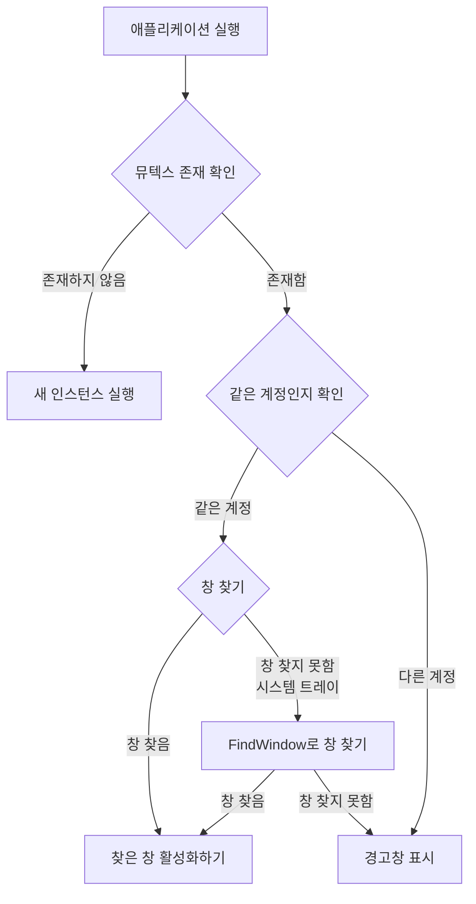

# flutter_alone
## Project Structure

```
flutter_alone/
├── example/
    ├── integration_test/
    │   └── plugin_integration_test.dart
    ├── lib/
    │   └── main.dart
    └── test/
    │   └── widget_test.dart
├── lib/
    ├── src/
    │   └── models/
    │   │   ├── config.dart
    │   │   ├── exception.dart
    │   │   └── message_config.dart
    ├── flutter_alone.dart
    ├── flutter_alone_method_channel.dart
    └── flutter_alone_platform_interface.dart
├── test/
    ├── flutter_alone_method_channel_test.dart
    └── flutter_alone_test.dart
├── windows/
    ├── include/
    │   └── flutter_alone/
    │   │   └── flutter_alone_plugin_c_api.h
    ├── test/
    │   └── flutter_alone_plugin_test.cpp
    ├── CMakeLists.txt
    ├── flutter_alone_plugin.cpp
    ├── flutter_alone_plugin.h
    ├── flutter_alone_plugin_c_api.cpp
    ├── icon_utils.cpp
    ├── icon_utils.h
    ├── message_utils.cpp
    ├── message_utils.h
    ├── mutex_utils.cpp
    ├── mutex_utils.h
    ├── process_utils.cpp
    ├── process_utils.h
    ├── window_utils.cpp
    └── window_utils.h
├── plan.md
└── scenario.md
```

## example/integration_test/plugin_integration_test.dart
```dart
// example/integration_test/plugin_integration_test.dart
import 'dart:io';

import 'package:flutter/services.dart';
import 'package:flutter_alone/flutter_alone.dart';
import 'package:flutter_test/flutter_test.dart';
import 'package:integration_test/integration_test.dart';

void main() {
  IntegrationTestWidgetsFlutterBinding.ensureInitialized();

  // Ensure tests only run on Windows platform
  if (!Platform.isWindows) {
    group('Flutter Alone Plugin on non-Windows platforms', () {
      test('Tests are skipped on non-Windows platforms', () {
        // Skip tests on non-Windows platforms
      });
    });
    return;
  }

  group('Flutter Alone Plugin Integration Tests on Windows', () {
    late FlutterAlone flutterAlone;
    const channel = MethodChannel('flutter_alone');

    // Shared test configuration data
    final testConfig = FlutterAloneConfig(
      mutexConfig: const MutexConfig(
        packageId: 'com.test.integration',
        appName: 'IntegrationTestApp',
      ),
      duplicateCheckConfig: const DuplicateCheckConfig(
        enableInDebugMode: true,
      ),
      messageConfig: const EnMessageConfig(),
    );

    setUpAll(() {
      TestDefaultBinaryMessengerBinding.instance.defaultBinaryMessenger
          .setMockMethodCallHandler(channel, (MethodCall methodCall) async {
        switch (methodCall.method) {
          case 'checkAndRun':
            return true;
          case 'dispose':
            return null;
          default:
            throw PlatformException(
              code: 'unimplemented',
              message: 'Method not implemented',
            );
        }
      });
    });

    setUp(() {
      flutterAlone = FlutterAlone.instance;
    });

    tearDown(() async {
      try {
        await flutterAlone.dispose();
      } catch (e) {
        // Ignore errors during cleanup
      }
    });

    tearDownAll(() {
      TestDefaultBinaryMessengerBinding.instance.defaultBinaryMessenger
          .setMockMethodCallHandler(channel, null);
    });

    test('Basic functionality test - successful mutex creation', () async {
      final result = await flutterAlone.checkAndRun(config: testConfig);
      expect(result, true,
          reason: 'Verify successful mutex creation on platform');
    });

    test('Error handling test - handles platform exceptions properly',
        () async {
      // Replace with handler that throws an exception
      TestDefaultBinaryMessengerBinding.instance.defaultBinaryMessenger
          .setMockMethodCallHandler(channel, (MethodCall methodCall) async {
        throw PlatformException(
          code: 'mutex_error',
          message: 'Failed to create mutex',
          details: 'Simulated error for testing',
        );
      });

      // Catch exception and verify type
      expect(
        () async => await flutterAlone.checkAndRun(config: testConfig),
        throwsA(isA<AloneException>()
            .having((e) => e.code, 'error code', 'mutex_error')),
        reason:
            'Ensure platform exception is properly converted to AloneException',
      );

      // Restore original handler after test
      TestDefaultBinaryMessengerBinding.instance.defaultBinaryMessenger
          .setMockMethodCallHandler(channel, (MethodCall methodCall) async {
        switch (methodCall.method) {
          case 'checkAndRun':
            return true;
          case 'dispose':
            return null;
          default:
            throw PlatformException(code: 'unimplemented');
        }
      });
    });

    // Additional test: Verify that configuration parameters are correctly passed
    test('Configuration parameters are correctly passed to platform', () async {
      bool configVerified = false;

      TestDefaultBinaryMessengerBinding.instance.defaultBinaryMessenger
          .setMockMethodCallHandler(channel, (MethodCall methodCall) async {
        if (methodCall.method == 'checkAndRun') {
          final args = methodCall.arguments as Map<dynamic, dynamic>;
          configVerified = args['packageId'] == 'com.test.integration' &&
              args['appName'] == 'IntegrationTestApp' &&
              args['enableInDebugMode'] == true &&
              args['type'] == 'en';
          return true;
        }
        return null;
      });

      await flutterAlone.checkAndRun(config: testConfig);
      expect(configVerified, true,
          reason:
              'Verify configuration parameters are passed to platform correctly');
    });

    test('Test with all configuration options', () async {
      final fullConfig = FlutterAloneConfig(
        mutexConfig: const MutexConfig(
          packageId: 'com.test.integration',
          appName: 'IntegrationTestApp',
          mutexSuffix: 'integration_test',
        ),
        windowConfig: const WindowConfig(
          windowTitle: 'Integration Test Window',
        ),
        duplicateCheckConfig: const DuplicateCheckConfig(
          enableInDebugMode: true,
        ),
        messageConfig: const CustomMessageConfig(
          customTitle: 'Integration Test',
          customMessage: 'Integration test message',
          showMessageBox: false,
        ),
      );

      Map<String, dynamic>? capturedArguments;

      TestDefaultBinaryMessengerBinding.instance.defaultBinaryMessenger
          .setMockMethodCallHandler(channel, (MethodCall methodCall) async {
        if (methodCall.method == 'checkAndRun') {
          capturedArguments =
              Map<String, dynamic>.from(methodCall.arguments as Map);
          return true;
        }
        return null;
      });

      await flutterAlone.checkAndRun(config: fullConfig);

      expect(capturedArguments, isNotNull);
      expect(capturedArguments!['packageId'], 'com.test.integration');
      expect(capturedArguments!['appName'], 'IntegrationTestApp');
      expect(capturedArguments!['mutexSuffix'], 'integration_test');
      expect(capturedArguments!['windowTitle'], 'Integration Test Window');
      expect(capturedArguments!['enableInDebugMode'], true);
      expect(capturedArguments!['type'], 'custom');
      expect(capturedArguments!['customTitle'], 'Integration Test');
      expect(capturedArguments!['customMessage'], 'Integration test message');
      expect(capturedArguments!['showMessageBox'], false);
    });
  });
}

```
## example/lib/main.dart
```dart
import 'dart:io';

import 'package:flutter/material.dart';
import 'package:flutter_alone/flutter_alone.dart';
import 'package:system_tray/system_tray.dart';
import 'package:window_manager/window_manager.dart';

void main() async {
  WidgetsFlutterBinding.ensureInitialized();
  await windowManager.ensureInitialized();

  WindowOptions windowOptions = const WindowOptions(
    size: Size(500, 800),
    center: true,
    title: 'Tray App Example',
  );
  windowManager.waitUntilReadyToShow(windowOptions, () async {
    await windowManager.show();
    await windowManager.focus();
  });

  if (Platform.isWindows) {
    final config = FlutterAloneConfig(
      // 뮤텍스 설정
      mutexConfig: const MutexConfig(
        packageId: 'com.example.myapp',
        appName: 'MyFlutterApp',
        mutexSuffix: 'production',
      ),

      // 창 관리 설정
      windowConfig: const WindowConfig(
        windowTitle: 'Tray App Example',
      ),

      // 디버그 모드 설정
      duplicateCheckConfig: const DuplicateCheckConfig(
        enableInDebugMode: true, // 디버그 모드에서도 중복 실행 검사 활성화
      ),

      // 메시지 설정
      messageConfig: const CustomMessageConfig(
        customTitle: 'Example App',
        customMessage: 'Application is already running in another account',
        showMessageBox: true,
      ),
    );

    if (!await FlutterAlone.instance.checkAndRun(config: config)) {
      exit(0);
    }
  }

  runApp(const MyApp());
}

class MyApp extends StatefulWidget {
  const MyApp({super.key});

  @override
  State<MyApp> createState() => _MyAppState();
}

class _MyAppState extends State<MyApp> {
  final SystemTray _systemTray = SystemTray();

  @override
  void initState() {
    super.initState();
    _initSystemTray();
  }

  @override
  void dispose() {
    FlutterAlone.instance.dispose();
    super.dispose();
  }

  Future<void> _initSystemTray() async {
    String path =
        Platform.isWindows ? 'assets/app_icon.ico' : 'assets/app_icon_64.png';
    if (!await File(path).exists()) {
      debugPrint("icon file not found: $path");
    }

    await _systemTray.initSystemTray(iconPath: path);

    _systemTray.setTitle('Flutter alone example');
    _systemTray.setToolTip('Flutter alone example');

    final Menu menu = Menu();
    await menu.buildFrom([
      MenuItemLabel(
        label: 'Open',
        onClicked: (_) async {
          await windowManager.show();
          await windowManager.focus();
        },
      ),
      MenuItemLabel(
        label: 'Exit',
        onClicked: (_) async {
          await _systemTray.destroy();
          exit(0);
        },
      ),
    ]);

    await _systemTray.setContextMenu(menu);

    _systemTray.registerSystemTrayEventHandler(
      (eventName) async {
        if (eventName == kSystemTrayEventClick) {
          if (Platform.isWindows) {
            await windowManager.show();
            await windowManager.focus();
          } else {
            await _systemTray.popUpContextMenu();
          }
        } else if (eventName == kSystemTrayEventRightClick) {
          if (Platform.isWindows) {
            await _systemTray.popUpContextMenu();
          } else {
            await windowManager.show();
            await windowManager.focus();
          }
        }
      },
    );
  }

  Future<void> hideWindow() async {
    await windowManager.hide();
  }

  @override
  Widget build(BuildContext context) {
    return MaterialApp(
      home: Scaffold(
        appBar: AppBar(
          title: const Text('Flutter Alone Example'),
        ),
        body: Center(
          child: Column(
            mainAxisAlignment: MainAxisAlignment.center,
            children: [
              const Text(
                'The app ran normally.',
                style: TextStyle(fontSize: 18),
              ),
              const SizedBox(height: 20),
              const Text(
                'Prevent duplicate execution with custom mutex name:',
                style: TextStyle(fontSize: 14),
              ),
              const Text(
                'packageId: com.example.myapp',
                style: TextStyle(fontSize: 14),
              ),
              const Text(
                'appName: MyFlutterApp',
                style: TextStyle(fontSize: 14),
              ),
              const Text(
                'suffix: production',
                style: TextStyle(fontSize: 14),
              ),
              const SizedBox(height: 20),
              ElevatedButton(
                onPressed: hideWindow,
                child: const Text('hide window'),
              ),
            ],
          ),
        ),
      ),
    );
  }
}

```
## example/test/widget_test.dart
```dart
// This is a basic Flutter widget test.
//
// To perform an interaction with a widget in your test, use the WidgetTester
// utility in the flutter_test package. For example, you can send tap and scroll
// gestures. You can also use WidgetTester to find child widgets in the widget
// tree, read text, and verify that the values of widget properties are correct.

import 'package:flutter/material.dart';
import 'package:flutter_test/flutter_test.dart';

import 'package:flutter_alone_example/main.dart';

void main() {
  testWidgets('Verify Platform version', (WidgetTester tester) async {
    // Build our app and trigger a frame.
    await tester.pumpWidget(const MyApp());

    // Verify that platform version is retrieved.
    expect(
      find.byWidgetPredicate(
        (Widget widget) =>
            widget is Text && widget.data!.startsWith('Running on:'),
      ),
      findsOneWidget,
    );
  });
}

```
## lib/flutter_alone.dart
```dart
import 'package:flutter/foundation.dart';
import 'package:flutter_alone/src/models/config.dart';

import 'flutter_alone_platform_interface.dart';

export 'src/models/config.dart';
export 'src/models/exception.dart';
export 'src/models/message_config.dart';

/// Main class for the Flutter Alone plugin
class FlutterAlone {
  static final FlutterAlone _instance = FlutterAlone._();
  FlutterAlone._();

  static FlutterAlone get instance => _instance;

  /// Checks for duplicate instances and initializes the application
  ///
  /// This method ensures only one instance of the application runs by creating a system mutex.
  /// When a duplicate instance is detected, it either activates the existing window
  /// or displays a message to the user.
  ///
  /// Parameters:
  /// - config: Configuration object containing all settings including:
  ///   * Message display settings (messageConfig)
  ///   * Mutex configuration (mutexConfig)
  ///   * Debug mode settings (duplicateCheckConfig)
  ///   * Window management settings (windowConfig)
  ///
  /// In debug mode, duplicate check is skipped unless enableInDebugMode is set to true
  /// in the duplicateCheckConfig.
  ///
  /// Returns:
  /// - true: Application can start (no duplicate instance found)
  /// - false: Another instance is already running
  Future<bool> checkAndRun({required FlutterAloneConfig config}) async {
    try {
      // Skip duplicate check in debug mode unless explicitly enabled
      if (kDebugMode && !config.duplicateCheckConfig.enableInDebugMode) {
        return true;
      }

      final result = await FlutterAlonePlatform.instance.checkAndRun(
        config: config,
      );
      return result;
    } catch (e) {
      debugPrint('Error checking application instance: $e');
      rethrow;
    }
  }

  /// Clean up resources when application closes
  Future<void> dispose() async {
    try {
      await FlutterAlonePlatform.instance.dispose();
    } catch (e) {
      debugPrint('Error cleaning up resources: $e');
      rethrow;
    }
  }
}

```
## lib/flutter_alone_method_channel.dart
```dart
import 'package:flutter/services.dart';

import 'flutter_alone_platform_interface.dart';
import 'src/models/config.dart';
import 'src/models/exception.dart';

/// Platform implementation using method channel
class MethodChannelFlutterAlone extends FlutterAlonePlatform {
  /// Method channel for platform communication
  final MethodChannel _channel = const MethodChannel('flutter_alone');

  @override
  Future<bool> checkAndRun({required FlutterAloneConfig config}) async {
    try {
      // Convert config to map
      final map = config.toMap();

      // Remove null values
      map.removeWhere((key, value) => value == null);

      final result = await _channel.invokeMethod<bool>(
        'checkAndRun',
        map,
      );
      return result ?? false;
    } on PlatformException catch (e) {
      throw AloneException(
        code: e.code,
        message: e.message ?? 'Error checking application instance',
        details: e.details,
      );
    }
  }

  @override
  Future<void> dispose() async {
    try {
      await _channel.invokeMethod<void>('dispose');
    } on PlatformException catch (e) {
      throw AloneException(
        code: e.code,
        message: e.message ?? 'Error disposing resources',
        details: e.details,
      );
    }
  }
}

```
## lib/flutter_alone_platform_interface.dart
```dart
import 'package:flutter_alone/src/models/config.dart';
import 'package:plugin_platform_interface/plugin_platform_interface.dart';

import 'flutter_alone_method_channel.dart';

/// Platform interface for the plugin
/// Defines the interface that all platform implementations must follow
abstract class FlutterAlonePlatform extends PlatformInterface {
  /// Constructs a FlutterAlonePlatform
  FlutterAlonePlatform() : super(token: _token);

  static final Object _token = Object();

  /// Current platform implementation instance
  static FlutterAlonePlatform _instance = MethodChannelFlutterAlone();

  /// Platform implementation instance getter
  static FlutterAlonePlatform get instance => _instance;

  /// Platform implementation setter
  static set instance(FlutterAlonePlatform instance) {
    PlatformInterface.verifyToken(instance, _token);
    _instance = instance;
  }

  /// Check if application can run and perform initialization
  ///
  /// Parameters:
  /// - config: Combined configuration object
  ///
  /// Returns:
  /// - true: Application can start
  /// - false: Another instance is already running
  Future<bool> checkAndRun({required FlutterAloneConfig config}) {
    throw UnimplementedError('checkAndRun() has not been implemented.');
  }

  /// Clean up resources
  Future<void> dispose() {
    throw UnimplementedError('dispose() has not been implemented.');
  }
}

```
## lib/src/models/config.dart
```dart
import 'message_config.dart';

enum ConfigJsonKey {
  enableInDebugMode,
  packageId,
  appName,
  mutexSuffix,
  windowTitle,
  ;

  String get key => toString().split('.').last;
}

/// Base configuration interface
abstract class AloneConfig {
  /// Convert to map for MethodChannel communication
  Map<String, dynamic> toMap();
}

/// Configuration for duplicate execution check
class DuplicateCheckConfig implements AloneConfig {
  /// Whether to enable duplicate check in debug mode
  /// Defaults to false
  final bool enableInDebugMode;

  /// Constructor
  const DuplicateCheckConfig({
    this.enableInDebugMode = false,
  });

  @override
  Map<String, dynamic> toMap() {
    return {
      ConfigJsonKey.enableInDebugMode.key: enableInDebugMode,
    };
  }
}

/// Configuration for mutex naming and identification
class MutexConfig implements AloneConfig {
  /// Package identifier for mutex name generation
  /// Required for mutex name generation
  final String packageId;

  /// Application name for mutex name generation
  /// Required for mutex name generation
  final String appName;

  /// Optional suffix for mutex name
  final String? mutexSuffix;

  /// Constructor
  const MutexConfig({
    required this.packageId,
    required this.appName,
    this.mutexSuffix,
  });

  @override
  Map<String, dynamic> toMap() {
    final map = <String, dynamic>{
      ConfigJsonKey.packageId.key: packageId,
      ConfigJsonKey.appName.key: appName,
    };

    if (mutexSuffix != null) {
      map[ConfigJsonKey.mutexSuffix.key] = mutexSuffix;
    }

    return map;
  }
}

/// Configuration for window management
class WindowConfig implements AloneConfig {
  /// Window title for window identification
  final String? windowTitle;

  /// Constructor
  const WindowConfig({
    this.windowTitle,
  });

  @override
  Map<String, dynamic> toMap() {
    final map = <String, dynamic>{};

    if (windowTitle != null) {
      map[ConfigJsonKey.windowTitle.key] = windowTitle;
    }

    return map;
  }
}

/// Combined configuration for flutter_alone plugin
class FlutterAloneConfig implements AloneConfig {
  /// Configuration for duplicate check behavior
  final DuplicateCheckConfig duplicateCheckConfig;

  /// Configuration for mutex naming
  final MutexConfig mutexConfig;

  /// Configuration for window management
  final WindowConfig windowConfig;

  /// Configuration for message display
  final MessageConfig messageConfig;

  /// Constructor
  const FlutterAloneConfig({
    this.duplicateCheckConfig = const DuplicateCheckConfig(),
    required this.mutexConfig,
    this.windowConfig = const WindowConfig(),
    required this.messageConfig,
  });

  @override
  Map<String, dynamic> toMap() {
    final map = <String, dynamic>{};
    map.addAll(duplicateCheckConfig.toMap());
    map.addAll(mutexConfig.toMap());
    map.addAll(windowConfig.toMap());
    map.addAll(messageConfig.toMap());
    return map;
  }
}

```
## lib/src/models/exception.dart
```dart
class AloneException implements Exception {
  /// error code
  final String code;

  /// error message
  final String message;

  /// additional details
  final dynamic details;

  AloneException({
    required this.code,
    required this.message,
    this.details,
  });

  @override
  String toString() => 'AloneException($code): $message';
}

```
## lib/src/models/message_config.dart
```dart
// ignore_for_file: public_member_api_docs, sort_constructors_first

import 'config.dart';

enum MessageConfigJsonKey {
  type,
  showMessageBox,
  customTitle,
  customMessage,
  ;

  String get key => toString().split('.').last;
}

/// Base abstract class for message configuration
abstract class MessageConfig implements AloneConfig {
  /// Whether to show message box
  final bool showMessageBox;

  /// Constructor
  const MessageConfig({
    this.showMessageBox = true,
  });
}

/// Korean message configuration
class KoMessageConfig extends MessageConfig {
  /// Constructor
  const KoMessageConfig({
    super.showMessageBox,
  });

  @override
  Map<String, dynamic> toMap() {
    return {
      MessageConfigJsonKey.type.key: 'ko',
      MessageConfigJsonKey.showMessageBox.key: showMessageBox,
    };
  }
}

/// English message configuration
class EnMessageConfig extends MessageConfig {
  /// Constructor
  const EnMessageConfig({
    super.showMessageBox,
  });

  @override
  Map<String, dynamic> toMap() {
    return {
      MessageConfigJsonKey.type.key: 'en',
      MessageConfigJsonKey.showMessageBox.key: showMessageBox,
    };
  }
}

/// Custom message configuration
class CustomMessageConfig extends MessageConfig {
  /// Custom title for the message box
  final String customTitle;

  /// Message template string
  final String customMessage;

  /// Constructor
  const CustomMessageConfig({
    required this.customTitle,
    required this.customMessage,
    super.showMessageBox,
  });

  @override
  Map<String, dynamic> toMap() {
    return {
      MessageConfigJsonKey.type.key: 'custom',
      MessageConfigJsonKey.customTitle.key: customTitle,
      MessageConfigJsonKey.customMessage.key: customMessage,
      MessageConfigJsonKey.showMessageBox.key: showMessageBox,
    };
  }
}

```
## plan.md
```md

### macOS 구현 단계별 목표

**1단계: 기본 중복 실행 감지 (NSRunningApplication 활용)**
- 목표: 동일한 번들 ID를 가진 다른 프로세스 감지
- 작업:
  - NSRunningApplication API를 사용해 현재 실행 중인 같은 앱 찾기
  - 현재 프로세스 ID와 비교해서 다른 인스턴스 확인
  - 테스트: 앱을 두 번 실행해서 두 번째 실행이 감지되는지 확인

**2단계: 창 활성화 기능**
- 목표: 이미 실행 중인 앱의 창을 활성화
- 작업:
  - NSRunningApplication의 activate 메서드 사용
  - 앱을 포그라운드로 가져오기
  - 테스트: 이미 실행 중인 앱이 있을 때 새 인스턴스 실행 시 기존 앱이 활성화되는지 확인

**3단계: 메시지 설정 구현**
- 목표: Windows와 동일한 메시지 설정 지원
- 작업:
  - NSAlert를 사용해 알림 창 표시
  - 메시지 타입별(영어/한국어/커스텀) 텍스트 설정
  - 테스트: 다양한 메시지 설정으로 알림이 제대로 표시되는지 확인

**4단계: 디버그 모드 지원**
- 목표: 디버그 모드에서 중복 검사 설정 지원
- 작업:
  - 디버그 모드 감지
  - enableInDebugMode 플래그 처리
  - 테스트: 디버그 모드에서 설정에 따라 동작이 달라지는지 확인

**5단계: 리소스 정리 및 정리 기능**
- 목표: 앱 종료 시 리소스 정리
- 작업:
  - dispose 메서드 구현
  - 테스트: 메모리 누수 없이 정리되는지 확인

**6단계: Dart 인터페이스 연결**
- 목표: Dart 코드와 플랫폼 코드 연결
- 작업:
  - 메서드 채널 구현
  - 예외 처리 적용
  - 테스트: Dart에서 호출 시 정상 작동하는지 확인

```
## scenario.md
```md
## Senario



```
## test/flutter_alone_method_channel_test.dart
```dart
// test/flutter_alone_method_channel_test.dart
import 'package:flutter/services.dart';
import 'package:flutter_alone/flutter_alone.dart';
import 'package:flutter_alone/flutter_alone_method_channel.dart';
import 'package:flutter_test/flutter_test.dart';

void main() {
  TestWidgetsFlutterBinding.ensureInitialized();

  group('MethodChannelFlutterAlone Tests', () {
    late MethodChannelFlutterAlone platform;
    late List<MethodCall> log;

    // Set up test method channel
    const channel = MethodChannel('flutter_alone');

    setUp(() {
      platform = MethodChannelFlutterAlone();
      log = <MethodCall>[];

      // Configure method channel handler
      TestDefaultBinaryMessengerBinding.instance.defaultBinaryMessenger
          .setMockMethodCallHandler(channel, (MethodCall methodCall) async {
        log.add(methodCall);

        switch (methodCall.method) {
          case 'checkAndRun':
            return true;
          case 'dispose':
            return null;
          default:
            throw PlatformException(
              code: 'not_implemented',
              message: 'Method not implemented',
              details: 'Method: ${methodCall.method}',
            );
        }
      });
    });

    tearDown(() {
      // Reset handler after test
      TestDefaultBinaryMessengerBinding.instance.defaultBinaryMessenger
          .setMockMethodCallHandler(channel, null);
      log.clear();
    });

    test('checkAndRun with Korean message config', () async {
      const config = FlutterAloneConfig(
        mutexConfig: MutexConfig(
          packageId: 'com.test.integration',
          appName: 'IntegrationTest',
        ),
        messageConfig: KoMessageConfig(
          showMessageBox: true,
        ),
      );

      final result = await platform.checkAndRun(config: config);

      expect(log, hasLength(1));
      final methodCall = log.first;
      expect(methodCall.method, 'checkAndRun');
      expect(methodCall.arguments['type'], 'ko');
      expect(methodCall.arguments['showMessageBox'], true);
      expect(methodCall.arguments['packageId'], 'com.test.integration');
      expect(methodCall.arguments['appName'], 'IntegrationTest');

      expect(result, true);
    });

    test('checkAndRun with English message config', () async {
      const config = FlutterAloneConfig(
        mutexConfig: MutexConfig(
          packageId: 'com.test.integration',
          appName: 'IntegrationTest',
        ),
        messageConfig: EnMessageConfig(
          showMessageBox: false,
        ),
      );

      final result = await platform.checkAndRun(config: config);

      expect(log, hasLength(1));
      final methodCall = log.first;
      expect(methodCall.method, 'checkAndRun');
      expect(methodCall.arguments['type'], 'en');
      expect(methodCall.arguments['showMessageBox'], false);
      expect(methodCall.arguments['packageId'], 'com.test.integration');
      expect(methodCall.arguments['appName'], 'IntegrationTest');

      expect(result, true);
    });

    test('checkAndRun with custom message config', () async {
      const config = FlutterAloneConfig(
        mutexConfig: MutexConfig(
          packageId: 'com.test.integration',
          appName: 'IntegrationTest',
        ),
        messageConfig: CustomMessageConfig(
          customTitle: 'Notice',
          customMessage: 'Program is already running',
          showMessageBox: true,
        ),
      );

      final result = await platform.checkAndRun(config: config);

      expect(log, hasLength(1));
      final methodCall = log.first;
      expect(methodCall.method, 'checkAndRun');
      expect(methodCall.arguments['type'], 'custom');
      expect(methodCall.arguments['customTitle'], 'Notice');
      expect(
          methodCall.arguments['customMessage'], 'Program is already running');
      expect(methodCall.arguments['showMessageBox'], true);
      expect(methodCall.arguments['packageId'], 'com.test.integration');
      expect(methodCall.arguments['appName'], 'IntegrationTest');

      expect(result, true);
    });

    test('dispose method call', () async {
      await platform.dispose();

      expect(log, hasLength(1));
      expect(log.first, isMethodCall('dispose', arguments: null));
    });

    test('checkAndRun platform error handling', () async {
      // Change to error-throwing handler
      TestDefaultBinaryMessengerBinding.instance.defaultBinaryMessenger
          .setMockMethodCallHandler(channel, (MethodCall methodCall) async {
        throw PlatformException(
          code: 'error',
          message: 'Error checking for duplicate execution',
          details: 'Failed to access system resources',
        );
      });

      const config = FlutterAloneConfig(
        mutexConfig: MutexConfig(
          packageId: 'com.test.integration',
          appName: 'IntegrationTest',
        ),
        messageConfig: EnMessageConfig(
          showMessageBox: false,
        ),
      );

      expect(
        () => platform.checkAndRun(config: config),
        throwsA(
          isA<AloneException>()
              .having((e) => e.code, 'code', 'error')
              .having(
                (e) => e.message,
                'message',
                'Error checking for duplicate execution',
              )
              .having(
                (e) => e.details,
                'details',
                'Failed to access system resources',
              ),
        ),
      );
    });

    test('checkAndRun with full configuration', () async {
      const config = FlutterAloneConfig(
        mutexConfig: MutexConfig(
          packageId: 'com.test.integration',
          appName: 'IntegrationTest',
          mutexSuffix: 'test',
        ),
        windowConfig: WindowConfig(
          windowTitle: 'Test Window Title',
        ),
        duplicateCheckConfig: DuplicateCheckConfig(
          enableInDebugMode: true,
        ),
        messageConfig: CustomMessageConfig(
          customTitle: 'Notice',
          customMessage: 'Program is already running',
          showMessageBox: true,
        ),
      );

      final result = await platform.checkAndRun(config: config);

      expect(log, hasLength(1));
      final methodCall = log.first;
      expect(methodCall.method, 'checkAndRun');

      // Check all configuration parameters
      expect(methodCall.arguments['packageId'], 'com.test.integration');
      expect(methodCall.arguments['appName'], 'IntegrationTest');
      expect(methodCall.arguments['mutexSuffix'], 'test');
      expect(methodCall.arguments['windowTitle'], 'Test Window Title');
      expect(methodCall.arguments['enableInDebugMode'], true);
      expect(methodCall.arguments['type'], 'custom');
      expect(methodCall.arguments['customTitle'], 'Notice');
      expect(
          methodCall.arguments['customMessage'], 'Program is already running');
      expect(methodCall.arguments['showMessageBox'], true);

      expect(result, true);
    });

    test('dispose platform error handling', () async {
      // Change to error-throwing handler
      TestDefaultBinaryMessengerBinding.instance.defaultBinaryMessenger
          .setMockMethodCallHandler(channel, (MethodCall methodCall) async {
        throw PlatformException(
          code: 'error',
          message: 'Error while cleaning up resources',
          details: 'Failed to release system mutex',
        );
      });

      expect(
        () => platform.dispose(),
        throwsA(
          isA<AloneException>()
              .having((e) => e.code, 'code', 'error')
              .having(
                (e) => e.message,
                'message',
                'Error while cleaning up resources',
              )
              .having(
                (e) => e.details,
                'details',
                'Failed to release system mutex',
              ),
        ),
      );
    });

    test('invalid method call', () async {
      TestDefaultBinaryMessengerBinding.instance.defaultBinaryMessenger
          .setMockMethodCallHandler(channel, (MethodCall methodCall) async {
        throw PlatformException(
          code: 'not_implemented',
          message: 'Method not implemented',
        );
      });

      expect(
        () => channel.invokeMethod<void>('invalidMethod'),
        throwsA(isA<PlatformException>()),
      );
    });
  });
}

```
## test/flutter_alone_test.dart
```dart
// test/flutter_alone_test.dart
import 'package:flutter/foundation.dart';
import 'package:flutter_alone/flutter_alone.dart';
import 'package:flutter_alone/flutter_alone_platform_interface.dart';
import 'package:flutter_test/flutter_test.dart';
import 'package:plugin_platform_interface/plugin_platform_interface.dart';

class MockFlutterAlonePlatform
    with MockPlatformInterfaceMixin
    implements FlutterAlonePlatform {
  // Record mock method calls
  bool checkAndRunCalled = false;
  bool disposeCalled = false;
  Map<String, dynamic>? lastArguments;

  @override
  Future<bool> checkAndRun({required FlutterAloneConfig config}) async {
    try {
      // Skip duplicate check in debug mode unless explicitly enabled
      if (kDebugMode && !config.duplicateCheckConfig.enableInDebugMode) {
        return true;
      }

      final result = await FlutterAlonePlatform.instance.checkAndRun(
        config: config,
      );
      return result;
    } catch (e) {
      debugPrint('Error checking application instance: $e');
      rethrow;
    }
  }

  @override
  Future<void> dispose() async {
    disposeCalled = true;
  }
}

void main() {
  late FlutterAlone flutterAlone;
  late MockFlutterAlonePlatform mockPlatform;

  setUp(() {
    mockPlatform = MockFlutterAlonePlatform();
    FlutterAlonePlatform.instance = mockPlatform;
    flutterAlone = FlutterAlone.instance;
  });

  group('Configuration tests', () {
    test('Basic MutexConfig should be created correctly', () {
      const config = MutexConfig(
        packageId: 'com.test.app',
        appName: 'TestApp',
      );
      final map = config.toMap();

      expect(map[ConfigJsonKey.packageId.key], 'com.test.app');
      expect(map['appName'], 'TestApp');
      expect(map.containsKey('mutexSuffix'), false);
    });

    test('MutexConfig with suffix should be created correctly', () {
      const config = MutexConfig(
        packageId: 'com.test.app',
        appName: 'TestApp',
        mutexSuffix: 'production',
      );
      final map = config.toMap();

      expect(map['packageId'], 'com.test.app');
      expect(map['appName'], 'TestApp');
      expect(map['mutexSuffix'], 'production');
    });

    test('WindowConfig should be created correctly', () {
      const config = WindowConfig(
        windowTitle: 'Test Window',
      );
      final map = config.toMap();

      expect(map['windowTitle'], 'Test Window');
    });

    test('DuplicateCheckConfig should be created correctly', () {
      const config = DuplicateCheckConfig(
        enableInDebugMode: true,
      );
      final map = config.toMap();

      expect(map['enableInDebugMode'], true);
    });

    test('Default DuplicateCheckConfig should have enableInDebugMode=false',
        () {
      const config = DuplicateCheckConfig();
      final map = config.toMap();

      expect(map['enableInDebugMode'], false);
    });

    test('EnMessageConfig should be created correctly', () {
      const config = EnMessageConfig();
      final map = config.toMap();

      expect(map['type'], 'en');
      expect(map['showMessageBox'], true);
    });

    test('KoMessageConfig should be created correctly', () {
      const config = KoMessageConfig();
      final map = config.toMap();

      expect(map['type'], 'ko');
      expect(map['showMessageBox'], true);
    });

    test('CustomMessageConfig should be created correctly', () {
      const config = CustomMessageConfig(
        customTitle: 'Test Title',
        customMessage: 'Test Message',
        showMessageBox: false,
      );
      final map = config.toMap();

      expect(map['type'], 'custom');
      expect(map['customTitle'], 'Test Title');
      expect(map['customMessage'], 'Test Message');
      expect(map['showMessageBox'], false);
    });
  });

  group('FlutterAloneConfig tests', () {
    test('Combined config should include all components', () {
      const config = FlutterAloneConfig(
        mutexConfig: MutexConfig(
          packageId: 'com.test.app',
          appName: 'TestApp',
          mutexSuffix: 'test',
        ),
        windowConfig: WindowConfig(
          windowTitle: 'Test Window',
        ),
        duplicateCheckConfig: DuplicateCheckConfig(
          enableInDebugMode: true,
        ),
        messageConfig: CustomMessageConfig(
          customTitle: 'Test Title',
          customMessage: 'Test Message',
          showMessageBox: false,
        ),
      );

      final map = config.toMap();

      // Check mutex config
      expect(map['packageId'], 'com.test.app');
      expect(map['appName'], 'TestApp');
      expect(map['mutexSuffix'], 'test');

      // Check window config
      expect(map['windowTitle'], 'Test Window');

      // Check duplicate check config
      expect(map['enableInDebugMode'], true);

      // Check message config
      expect(map['type'], 'custom');
      expect(map['customTitle'], 'Test Title');
      expect(map['customMessage'], 'Test Message');
      expect(map['showMessageBox'], false);
    });
  });

  group('Plugin functionality tests', () {
    test('checkAndRun should pass correct config to platform', () async {
      const config = FlutterAloneConfig(
        mutexConfig: MutexConfig(
          packageId: 'com.test.app',
          appName: 'TestApp',
        ),
        duplicateCheckConfig: DuplicateCheckConfig(
          enableInDebugMode: true,
        ),
        messageConfig: EnMessageConfig(),
      );

      final result = await flutterAlone.checkAndRun(config: config);

      expect(result, true);
      expect(mockPlatform.checkAndRunCalled, true);

      final args = mockPlatform.lastArguments;
      expect(args, isNotNull);
      expect(args!['packageId'], 'com.test.app');
      expect(args['appName'], 'TestApp');
      expect(args['type'], 'en');
    });

    test('dispose should be called correctly', () async {
      await flutterAlone.dispose();
      expect(mockPlatform.disposeCalled, true);
    });
  });

  group('Integration tests', () {
    test('Full configuration with all options', () async {
      const config = FlutterAloneConfig(
        mutexConfig: MutexConfig(
          packageId: 'com.test.app',
          appName: 'TestApp',
          mutexSuffix: 'production',
        ),
        windowConfig: WindowConfig(
          windowTitle: 'Test Window',
        ),
        duplicateCheckConfig: DuplicateCheckConfig(
          enableInDebugMode: true,
        ),
        messageConfig: CustomMessageConfig(
          customTitle: 'Test Title',
          customMessage: 'Test Message',
          showMessageBox: true,
        ),
      );

      await flutterAlone.checkAndRun(config: config);

      final args = mockPlatform.lastArguments;
      expect(args, isNotNull);
      expect(args!['packageId'], 'com.test.app');
      expect(args['appName'], 'TestApp');
      expect(args['mutexSuffix'], 'production');
      expect(args['windowTitle'], 'Test Window');
      expect(args['enableInDebugMode'], true);
      expect(args['type'], 'custom');
      expect(args['customTitle'], 'Test Title');
      expect(args['customMessage'], 'Test Message');
      expect(args['showMessageBox'], true);
    });
  });
}

```
## windows/CMakeLists.txt
```txt
# The Flutter tooling requires that developers have a version of Visual Studio
# installed that includes CMake 3.14 or later. You should not increase this
# version, as doing so will cause the plugin to fail to compile for some
# customers of the plugin.
cmake_minimum_required(VERSION 3.14)

# Project-level configuration.
set(PROJECT_NAME "flutter_alone")
project(${PROJECT_NAME} LANGUAGES CXX)

# Explicitly opt in to modern CMake behaviors to avoid warnings with recent
# versions of CMake.
cmake_policy(VERSION 3.14...3.25)

# This value is used when generating builds using this plugin, so it must
# not be changed
set(PLUGIN_NAME "flutter_alone_plugin")

# Any new source files that you add to the plugin should be added here.
list(APPEND PLUGIN_SOURCES
  "flutter_alone_plugin.cpp"
  "flutter_alone_plugin.h"
  "process_utils.cpp"
  "process_utils.h"
  "message_utils.cpp"
  "message_utils.h"
  "window_utils.cpp"
  "window_utils.h"
  "icon_utils.cpp"
  "icon_utils.h"
  "mutex_utils.cpp"
  "mutex_utils.h"
)

# Define the plugin library target. Its name must not be changed (see comment
# on PLUGIN_NAME above).
add_library(${PLUGIN_NAME} SHARED
  "include/flutter_alone/flutter_alone_plugin_c_api.h"
  "flutter_alone_plugin_c_api.cpp"
  ${PLUGIN_SOURCES}
)

# Apply a standard set of build settings that are configured in the
# application-level CMakeLists.txt. This can be removed for plugins that want
# full control over build settings.
apply_standard_settings(${PLUGIN_NAME})

# Symbols are hidden by default to reduce the chance of accidental conflicts
# between plugins. This should not be removed; any symbols that should be
# exported should be explicitly exported with the FLUTTER_PLUGIN_EXPORT macro.
set_target_properties(${PLUGIN_NAME} PROPERTIES
  CXX_VISIBILITY_PRESET hidden)
target_compile_definitions(${PLUGIN_NAME} PRIVATE FLUTTER_PLUGIN_IMPL SECURITY_WIN32)

# Source include directories and library dependencies. Add any plugin-specific
# dependencies here.
target_include_directories(${PLUGIN_NAME} INTERFACE
  "${CMAKE_CURRENT_SOURCE_DIR}/include")
target_link_libraries(${PLUGIN_NAME} PRIVATE flutter flutter_wrapper_plugin)

# List of absolute paths to libraries that should be bundled with the plugin.
# This list could contain prebuilt libraries, or libraries created by an
# external build triggered from this build file.
set(flutter_alone_bundled_libraries
  ""
  PARENT_SCOPE
)
```
## windows/flutter_alone_plugin.cpp
```cpp
#include "flutter_alone_plugin.h"

// This must be included before many other Windows headers.
#include <windows.h>

// For getPlatformVersion; remove unless needed for your plugin implementation.
#include <VersionHelpers.h>

#include <flutter/method_channel.h>
#include <flutter/plugin_registrar_windows.h>
#include <flutter/standard_method_codec.h>
#include "window_utils.h"
#include "icon_utils.h"
#include "mutex_utils.h"

#include <memory>
#include <sstream>
#include <string>
#include <codecvt>
#include <locale>

namespace flutter_alone {

// static
void FlutterAlonePlugin::RegisterWithRegistrar(
    flutter::PluginRegistrarWindows *registrar) {
  // create method channel
  auto channel =
      std::make_unique<flutter::MethodChannel<flutter::EncodableValue>>(
          registrar->messenger(), "flutter_alone",
          &flutter::StandardMethodCodec::GetInstance());
  // create plugin
  auto plugin = std::make_unique<FlutterAlonePlugin>();
  // set method call handler
  channel->SetMethodCallHandler(
      [plugin_pointer = plugin.get()](const auto &call, auto result) {
        plugin_pointer->HandleMethodCall(call, std::move(result));
      });
  // add plugin
  registrar->AddPlugin(std::move(plugin));
}
// constructor
FlutterAlonePlugin::FlutterAlonePlugin() : mutex_handle_(NULL) {}

// destructor
FlutterAlonePlugin::~FlutterAlonePlugin() {
  CleanupResources();
}

// Display running process information in MessageBox
void FlutterAlonePlugin::ShowAlreadyRunningMessage(
    const std::wstring& title,
    const std::wstring& message,
    bool showMessageBox) {
    
    MessageBoxInfo info;
    info.title = title;
    info.message = message;
    info.showMessageBox = showMessageBox;
    info.hIcon = IconUtils::GetAppIcon();

    ShowMessageBox(info);
}

void FlutterAlonePlugin::ShowMessageBox(const MessageBoxInfo& info) {
   if(!info.showMessageBox) {
       return;
   }
   
   HICON hIcon = ProcessUtils::GetExecutableIcon();
   
   static HHOOK g_hook = NULL;
   static HICON g_icon = hIcon;

   // Hook when creating message box window
   g_hook = SetWindowsHookEx(
       WH_CBT, 
       [](int nCode, WPARAM wParam, LPARAM lParam) -> LRESULT {
           if (nCode == HCBT_ACTIVATE && g_icon) {
               // Set window icon
               SendMessage((HWND)wParam, WM_SETICON, ICON_SMALL, (LPARAM)g_icon);
               SendMessage((HWND)wParam, WM_SETICON, ICON_BIG, (LPARAM)g_icon);
               UnhookWindowsHookEx(g_hook);
           }
           return CallNextHookEx(g_hook, nCode, wParam, lParam);
       },
       NULL, 
       GetCurrentThreadId()
   );
   
   MessageBoxW(
       NULL,
       info.message.c_str(),
       info.title.c_str(),
       MB_OK | MB_ICONINFORMATION
   );

   if (hIcon) {
       DestroyIcon(hIcon);
   }
}


std::wstring FlutterAlonePlugin::GetMutexName(const MutexConfig& config) {
    // Use MutexUtils to generate mutex name
    return MutexUtils::GenerateMutexName(
        config.packageId,
        config.appName,
        config.suffix
    );
}

ProcessCheckResult FlutterAlonePlugin::CheckRunningInstance(const std::wstring& mutexName, const std::wstring& windowTitle) {
    ProcessCheckResult result;
    result.canRun = true;
    
    // Check for global mutex using the provided name
    HANDLE existingMutex = OpenMutexW(MUTEX_ALL_ACCESS, FALSE, mutexName.c_str());

    if (existingMutex != NULL) {
        OutputDebugStringW((L"[DEBUG] Existing mutex found: " + mutexName + L"\n").c_str());
        CloseHandle(existingMutex);
        result.canRun = false;
        
        // Find existing process - To check if it's the same user
        auto existingProcess = ProcessUtils::FindExistingProcess();
        if (existingProcess.has_value()) {
            OutputDebugStringW(L"[DEBUG] Existing process window found\n");
            result.existingWindow = existingProcess->windowHandle;
        }
        
        // Try finding by window title if the existing window is not found
        if (result.existingWindow == NULL && !windowTitle.empty()) {
            OutputDebugStringW((L"[DEBUG] Attempting to find window by title: " + windowTitle + L"\n").c_str());
            
            HWND hwnd = FindWindowW(NULL, windowTitle.c_str());
            if (hwnd != NULL) {
                OutputDebugStringW(L"[DEBUG] Window found by title\n");
                result.existingWindow = hwnd;
            } else {
                OutputDebugStringW(L"[DEBUG] Window NOT found by title\n");
            }
        }
    }

    return result;
}


std::wstring StringToWideString(const std::string& str) {
    if (str.empty()) {
        return std::wstring();
    }
    
    // UTF-8 to UTF-16
    int size_needed = MultiByteToWideChar(CP_UTF8, 0, str.c_str(), 
        static_cast<int>(str.length()), NULL, 0);
    
    std::wstring result(size_needed, 0);
    MultiByteToWideChar(CP_UTF8, 0, str.c_str(), 
        static_cast<int>(str.length()), &result[0], size_needed);
    
    return result;
}

std::string WideStringToString(const std::wstring& wstr) {
    if (wstr.empty()) {
        return std::string();
    }
    
    // UTF-16 to UTF-8
    int size_needed = WideCharToMultiByte(CP_UTF8, 0, wstr.c_str(), 
        static_cast<int>(wstr.length()), NULL, 0, NULL, NULL);
    
    std::string result(size_needed, 0);
    WideCharToMultiByte(CP_UTF8, 0, wstr.c_str(), 
        static_cast<int>(wstr.length()), &result[0], size_needed, NULL, NULL);
    
    return result;
}

// Check for duplicate instance function with custom mutex name
bool FlutterAlonePlugin::CheckAndCreateMutex(const MutexConfig& config) {
    if (mutex_handle_ != NULL) {
      // Mutex already created
      return false;
    }
  
    // Generate mutex name
    current_mutex_name_ = GetMutexName(config);
    
    OutputDebugStringW((L"[DEBUG] Creating mutex with name: " + current_mutex_name_ + L"\n").c_str());
  
    // Set security attributes - Allow access all user
    SECURITY_ATTRIBUTES sa;
    sa.nLength = sizeof(SECURITY_ATTRIBUTES);
    sa.bInheritHandle = TRUE;
    
    SECURITY_DESCRIPTOR sd;
    InitializeSecurityDescriptor(&sd, SECURITY_DESCRIPTOR_REVISION);
    SetSecurityDescriptorDacl(&sd, TRUE, NULL, FALSE);
    sa.lpSecurityDescriptor = &sd;
  
    // Try to create global mutex with the generated name
    mutex_handle_ = CreateMutexW(
        &sa,     // security attribute
        TRUE,    // request init
        current_mutex_name_.c_str()  // custom mutex name
    );
  
    if (mutex_handle_ == NULL) {
      return false;
    }
  
    if (GetLastError() == ERROR_ALREADY_EXISTS) {
      CleanupResources();
      return false;
    }
  
    return true;
  }

// Resource cleanup function
void FlutterAlonePlugin::CleanupResources() {
    if (mutex_handle_ != NULL) {
        ReleaseMutex(mutex_handle_);  // release mutex
        CloseHandle(mutex_handle_);   // close handle
        mutex_handle_ = NULL;
    }
}

// Method call handler function
void FlutterAlonePlugin::HandleMethodCall(
    const flutter::MethodCall<flutter::EncodableValue> &method_call,
    std::unique_ptr<flutter::MethodResult<flutter::EncodableValue>> result) {
    if (method_call.method_name().compare("checkAndRun") == 0) {  
        const auto* arguments = std::get_if<flutter::EncodableMap>(method_call.arguments());

        // Get Window title
        std::wstring windowTitle;
        auto windowTitleIt = arguments->find(flutter::EncodableValue("windowTitle"));
        if (windowTitleIt != arguments->end() && !windowTitleIt->second.IsNull()) {
            windowTitle = MessageUtils::Utf8ToWide(
                std::get<std::string>(windowTitleIt->second));
        }
        
        // get showmessage box
        bool showMessageBox = true;
        auto showMessageBoxIt = arguments->find(flutter::EncodableValue("showMessageBox"));
        if (showMessageBoxIt != arguments->end() && !showMessageBoxIt->second.IsNull()) {
            showMessageBox = std::get<bool>(showMessageBoxIt->second);
        }

        // get message tpye
        std::string typeStr = std::get<std::string>(arguments->at(flutter::EncodableValue("type")));
        MessageType type;
        if(typeStr == "ko") type = MessageType::ko;
        else if(typeStr == "en") type = MessageType::en;
        else type = MessageType::custom;
        
        std::wstring customTitle, customMessage;
        if (type == MessageType::custom) {
            auto customTitleIt = arguments->find(flutter::EncodableValue("customTitle"));
            if (customTitleIt != arguments->end() && !customTitleIt->second.IsNull()) {
                customTitle = MessageUtils::Utf8ToWide(
                    std::get<std::string>(customTitleIt->second));
            }
            
            auto customMessageIt = arguments->find(flutter::EncodableValue("customMessage"));
            if (customMessageIt != arguments->end() && !customMessageIt->second.IsNull()) {
                customMessage = MessageUtils::Utf8ToWide(
                    std::get<std::string>(customMessageIt->second));
            }
        }

        // Get mutex configuration
        MutexConfig mutexConfig;

        // Check if packageId is provided
        auto packageIdIt = arguments->find(flutter::EncodableValue("packageId"));
        if (packageIdIt != arguments->end() && !std::get<std::string>(packageIdIt->second).empty()) {
            mutexConfig.packageId = MessageUtils::Utf8ToWide(std::get<std::string>(packageIdIt->second));
        }

        // Check if appName is provided
        auto appNameIt = arguments->find(flutter::EncodableValue("appName"));
        if (appNameIt != arguments->end() && !std::get<std::string>(appNameIt->second).empty()) {
            mutexConfig.appName = MessageUtils::Utf8ToWide(std::get<std::string>(appNameIt->second));
        }

        // Check if mutexSuffix is provided
        auto mutexSuffixIt = arguments->find(flutter::EncodableValue("mutexSuffix"));
        if (mutexSuffixIt != arguments->end() && mutexSuffixIt->second.IsNull() == false) {
            mutexConfig.suffix = MessageUtils::Utf8ToWide(std::get<std::string>(mutexSuffixIt->second));
        }

        // Generate mutex name
        std::wstring mutexName = GetMutexName(mutexConfig);

        // Check for running instance
        auto checkResult = CheckRunningInstance(mutexName,windowTitle);

        
        if (!checkResult.canRun) {
            // If same window - Activate window
            if (checkResult.existingWindow != NULL) {
                OutputDebugStringW(L"[DEBUG] Existing window found - activating window\n");

                BOOL isVisible = IsWindowVisible(checkResult.existingWindow);
                BOOL isIconic = IsIconic(checkResult.existingWindow);
                OutputDebugStringW((L"[DEBUG] Window state - Visible: " + std::to_wstring(isVisible) + 
                                    L", Minimized: " + std::to_wstring(isIconic) + L"\n").c_str());

                OutputDebugStringW(L"[DEBUG] Attempting to restore window\n");
                BOOL restoreResult = WindowUtils::RestoreWindow(checkResult.existingWindow);
                OutputDebugStringW((L"[DEBUG] Restore result: " + std::to_wstring(restoreResult) + L"\n").c_str());

                OutputDebugStringW(L"[DEBUG] Attempting to bring window to front\n");
                BOOL bringToFrontResult = WindowUtils::BringWindowToFront(checkResult.existingWindow);
                OutputDebugStringW((L"[DEBUG] Bring to front result: " + std::to_wstring(bringToFrontResult) + L"\n").c_str());
                
                OutputDebugStringW(L"[DEBUG] Attempting to focus window\n");
                BOOL focusResult = WindowUtils::FocusWindow(checkResult.existingWindow);
                OutputDebugStringW((L"[DEBUG] Focus result: " + std::to_wstring(focusResult) + L"\n").c_str());

            } 
            // If running in different account - Show message
            else {
                OutputDebugStringW(L"[DEBUG] No existing window - showing message\n");
                std::wstring title = MessageUtils::GetTitle(type, customTitle);
                std::wstring message = MessageUtils::GetMessage(type, customMessage);
                ShowAlreadyRunningMessage(title, message, showMessageBox);
            }
            
            result->Success(flutter::EncodableValue(false));
            return;
        }

        // Create new mutex
        bool success = CheckAndCreateMutex(mutexConfig);
        result->Success(flutter::EncodableValue(success));
    } 
    else if (method_call.method_name().compare("dispose") == 0) {
        CleanupResources();
        result->Success();
    } 
    else {
        result->NotImplemented();
    }
}

}  // namespace flutter_alone

void FlutterAlonePluginRegisterWithRegistrar(
    FlutterDesktopPluginRegistrarRef registrar) {
  flutter_alone::FlutterAlonePlugin::RegisterWithRegistrar(
      flutter::PluginRegistrarManager::GetInstance()
          ->GetRegistrar<flutter::PluginRegistrarWindows>(registrar));
}
```
## windows/flutter_alone_plugin.h
```h
#ifndef FLUTTER_PLUGIN_FLUTTER_ALONE_PLUGIN_H_
#define FLUTTER_PLUGIN_FLUTTER_ALONE_PLUGIN_H_

#include <flutter/method_channel.h>
#include <flutter/plugin_registrar_windows.h>
#include "process_utils.h"
#include "message_utils.h"
#include "mutex_utils.h"


#include <memory>

namespace flutter_alone {

struct ProcessCheckResult {
  bool canRun;        
  bool isSameUser;    
  HWND existingWindow;

  ProcessCheckResult() : canRun(true), isSameUser(false), existingWindow(NULL) {}
};

class FlutterAlonePlugin : public flutter::Plugin {
 public:
  struct MessageBoxInfo {
    std::wstring title;
    std::wstring message;
    bool showMessageBox;
    HICON hIcon;  // Added: App icon handle

    MessageBoxInfo() : showMessageBox(true), hIcon(NULL) {}
  };

  struct MutexConfig {
    std::wstring packageId;
    std::wstring appName;
    std::wstring suffix;

    MutexConfig() {}
    
    MutexConfig(const std::wstring& pkgId, const std::wstring& app, const std::wstring& sfx = L"")
        : packageId(pkgId), appName(app), suffix(sfx) {}
  };

  void ShowMessageBox(const MessageBoxInfo& info);

  static void RegisterWithRegistrar(flutter::PluginRegistrarWindows *registrar);

  FlutterAlonePlugin();

  virtual ~FlutterAlonePlugin();

  // Disallow copy and assign.
  FlutterAlonePlugin(const FlutterAlonePlugin&) = delete;
  FlutterAlonePlugin& operator=(const FlutterAlonePlugin&) = delete;

  // Called when a method is called on this plugin's channel from Dart.
  void HandleMethodCall(
      const flutter::MethodCall<flutter::EncodableValue> &method_call,
      std::unique_ptr<flutter::MethodResult<flutter::EncodableValue>> result);
	
  // Check and create mutex with specified configuration
  bool CheckAndCreateMutex(const MutexConfig& config);
  

  // Get mutex name for the application
  std::wstring GetMutexName(const MutexConfig& config);

  // show process info
  void ShowAlreadyRunningMessage(
  const std::wstring& title,
  const std::wstring& message,
  bool showMessageBox);

  // Check for duplicate instance with specified mutex name
  ProcessCheckResult CheckRunningInstance(const std::wstring& mutexName, const std::wstring& windowTitle);


  std::wstring StringToWideString(const std::string& str);
  std::string WideStringToString(const std::wstring& wstr);
  
  // cleanup resources
  void CleanupResources();


 private:
  // Store mutex handle
  HANDLE mutex_handle_;

  // Current mutex name
  std::wstring current_mutex_name_;
};

}  // namespace flutter_alone

#endif  // FLUTTER_PLUGIN_FLUTTER_ALONE_PLUGIN_H_
```
## windows/flutter_alone_plugin_c_api.cpp
```cpp
#include "include/flutter_alone/flutter_alone_plugin_c_api.h"

#include <flutter/plugin_registrar_windows.h>

#include "flutter_alone_plugin.h"

void FlutterAlonePluginCApiRegisterWithRegistrar(
    FlutterDesktopPluginRegistrarRef registrar) {
  flutter_alone::FlutterAlonePlugin::RegisterWithRegistrar(
      flutter::PluginRegistrarManager::GetInstance()
          ->GetRegistrar<flutter::PluginRegistrarWindows>(registrar));
}

```
## windows/icon_utils.cpp
```cpp
#include "icon_utils.h"

namespace flutter_alone {

HICON IconUtils::GetAppIcon() {
   std::wstring exePath = GetExecutablePath();

   // Extract icon
   HICON hIcon = ExtractIconW(
       GetModuleHandleW(NULL),  // Current process
       exePath.c_str(),         // Executable path
       0                        // First icon
   );

   return hIcon;
}

void IconUtils::DestroyAppIcon(HICON hIcon) {
   if (hIcon) {
       DestroyIcon(hIcon);
   }
}

std::wstring IconUtils::GetExecutablePath() {
   WCHAR path[MAX_PATH];
   GetModuleFileNameW(NULL, path, MAX_PATH);
   return std::wstring(path);
}

}  // namespace flutter_alone
```
## windows/icon_utils.h
```h
#ifndef FLUTTER_PLUGIN_ICON_UTILS_H_
#define FLUTTER_PLUGIN_ICON_UTILS_H_

#include <windows.h>
#include <string>

namespace flutter_alone {

class IconUtils {
public:
    // Extract icon from executable
    static HICON GetAppIcon();
    
    // Release app icon resources
    static void DestroyAppIcon(HICON hIcon);
    
private:
    // Get executable path
    static std::wstring GetExecutablePath();
};

}  // namespace flutter_alone

#endif  // FLUTTER_PLUGIN_ICON_UTILS_H_
```
## windows/include/flutter_alone/flutter_alone_plugin_c_api.h
```h
#ifndef FLUTTER_PLUGIN_FLUTTER_ALONE_PLUGIN_C_API_H_
#define FLUTTER_PLUGIN_FLUTTER_ALONE_PLUGIN_C_API_H_

#include <flutter_plugin_registrar.h>

#ifdef FLUTTER_PLUGIN_IMPL
#define FLUTTER_PLUGIN_EXPORT __declspec(dllexport)
#else
#define FLUTTER_PLUGIN_EXPORT __declspec(dllimport)
#endif

#if defined(__cplusplus)
extern "C" {
#endif

FLUTTER_PLUGIN_EXPORT void FlutterAlonePluginCApiRegisterWithRegistrar(
    FlutterDesktopPluginRegistrarRef registrar);

#if defined(__cplusplus)
}  // extern "C"
#endif

#endif  // FLUTTER_PLUGIN_FLUTTER_ALONE_PLUGIN_C_API_H_

```
## windows/message_utils.cpp
```cpp
#include "message_utils.h"
#include <windows.h>

namespace flutter_alone {

std::wstring MessageUtils::GetTitle(MessageType type, const std::wstring& customTitle) {
    switch (type) {
        case MessageType::ko:
            return GetKoreanTitle();
        case MessageType::en:
            return GetEnglishTitle();
        case MessageType::custom:
            return customTitle.empty() ? L"Error" : customTitle;
        default:
            return L"Error";
    }
}

std::wstring MessageUtils::GetMessage(
    MessageType type,
    const std::wstring& customMessage
) {
    switch (type) {
        case MessageType::ko:
            return GetKoreanMessage();
        case MessageType::en:
            return GetEnglishMessage();
        case MessageType::custom:
            return customMessage.empty() ? 
                L"Application is already running in another account" : customMessage;
        default:
            return L"Application is already running in another account";
    }
}

std::wstring MessageUtils::GetKoreanMessage() {
    return L"이미 다른 계정에서 앱을 실행중입니다.";
}

std::wstring MessageUtils::GetEnglishMessage() {
    return L"Application is already running in another account.";
}

std::wstring MessageUtils::Utf8ToWide(const std::string& str) {
    if (str.empty()) return std::wstring();
    
    int size_needed = MultiByteToWideChar(CP_UTF8, 0, str.c_str(), 
        static_cast<int>(str.length()), nullptr, 0);
    
    std::wstring result(size_needed, 0);
    MultiByteToWideChar(CP_UTF8, 0, str.c_str(), 
        static_cast<int>(str.length()), &result[0], size_needed);
    
    return result;
}

std::string MessageUtils::WideToUtf8(const std::wstring& wstr) {
    if (wstr.empty()) return std::string();
    
    int size_needed = WideCharToMultiByte(CP_UTF8, 0, wstr.c_str(), 
        static_cast<int>(wstr.length()), nullptr, 0, nullptr, nullptr);
    
    std::string result(size_needed, 0);
    WideCharToMultiByte(CP_UTF8, 0, wstr.c_str(), 
        static_cast<int>(wstr.length()), &result[0], size_needed, nullptr, nullptr);
    
    return result;
}

}  // namespace flutter_alone
```
## windows/message_utils.h
```h
#ifndef FLUTTER_PLUGIN_MESSAGE_UTILS_H_
#define FLUTTER_PLUGIN_MESSAGE_UTILS_H_

#include <string>
#include "process_utils.h"

namespace flutter_alone {

enum class MessageType {
    ko,
    en,
    custom
};

class MessageUtils {
public:
    /**
     * Get title based on message type and configuration
     */
    static std::wstring GetTitle(MessageType type, const std::wstring& customTitle = L"");

    /**
     * Get message based on message type and configuration
     */
    static std::wstring GetMessage(
        MessageType type,
        const std::wstring& customMessage = L""
    );


    /**
     * Convert string encoding between UTF-8 and UTF-16
     */
    static std::wstring Utf8ToWide(const std::string& str);
    static std::string WideToUtf8(const std::wstring& wstr);

private:
    // Default titles
    static std::wstring GetKoreanTitle() { return L"실행 오류"; }
    static std::wstring GetEnglishTitle() { return L"Execution Error"; }
    
    // Default messages
    static std::wstring GetKoreanMessage();
    static std::wstring GetEnglishMessage();
};

}  // namespace flutter_alone

#endif  // FLUTTER_PLUGIN_MESSAGE_UTILS_H_
```
## windows/mutex_utils.cpp
```cpp
#include "mutex_utils.h"
#include <algorithm>
#include <regex>

namespace flutter_alone {

// Default mutex prefix (used for global scope)
const std::wstring MutexUtils::DEFAULT_MUTEX_PREFIX = L"Global\\";

// Default app identifier used when packageId and appName are missing
const std::wstring MutexUtils::DEFAULT_APP_IDENTIFIER = L"FlutterAloneApp_UniqueId";

std::wstring MutexUtils::GenerateMutexName(
    const std::wstring& packageId,
    const std::wstring& appName,
    const std::wstring& suffix){

    // Check if required parameters are valid
    if (!ValidateMutexNameInputs(packageId, appName)) {
        return GetDefaultMutexName();
    }

    // Sanitize input strings
    std::wstring sanitizedPackageId = SanitizeNamePart(packageId);
    std::wstring sanitizedAppName = SanitizeNamePart(appName);
    std::wstring sanitizedSuffix = suffix.empty() ? L"" : L"_" + SanitizeNamePart(suffix);

    // Combine to form mutex name
    std::wstring mutexName = DEFAULT_MUTEX_PREFIX + 
                            sanitizedPackageId + L"_" + 
                            sanitizedAppName + 
                            sanitizedSuffix;

    // Check if the resulting name is too long (max 260 characters for Windows)
    if(mutexName.length() > 260){
        // OutputDebugStringW(L"[WARNING] Mutex name is too long, using truncated version");
    mutexName = mutexName.substr(0, 260);
    }

    return mutexName;
}

bool MutexUtils::ValidateMutexNameInputs(
    const std::wstring& packageId,
    const std::wstring& appName){

    // Both packageId and appName must be non-empty
    return !packageId.empty() && !appName.empty();
}

std::wstring MutexUtils::GetDefaultMutexName() {
    return DEFAULT_MUTEX_PREFIX + DEFAULT_APP_IDENTIFIER;
}

std::wstring MutexUtils::SanitizeNamePart(const std::wstring& input) {
    std::wstring result = input;

    // Remove invalid characters (only allow alphanumeric, underscore, dot, and dash)
    std::wregex invalidChars(L"[^a-zA-Z0-9_.-]");
    result = std::regex_replace(result, invalidChars, L"_");

    // Remove consecutive underscores
    std::wregex multipleUnderscores(L"_{2,}");
    result = std::regex_replace(result, multipleUnderscores, L"_");

    // Trim leading and trailing underscores
    if (!result.empty() && result[0] == L'_') {
        result = result.substr(1);
    }

    if (!result.empty() && result[result.length() - 1] == L'_') {
        result = result.substr(0, result.length() - 1);
    }

    return result;
}


}  // namespace flutter_alone
```
## windows/mutex_utils.h
```h
#ifndef FLUTTER_PLUGIN_MUTEX_UTILS_H_
#define FLUTTER_PLUGIN_MUTEX_UTILS_H_

#include <string>
#include <windows.h>

namespace flutter_alone {

class MutexUtils {
public:
    /**
     * Generate mutex name based on package id, app name and optional suffix
     * 
     * @param packageId The package identifier
     * @param appName The application name
     * @param suffix Optional suffix for the mutex name
     * @return Generated mutex name
     */
    static std::wstring GenerateMutexName(
        const std::wstring& packageId,
        const std::wstring& appName,
        const std::wstring& suffix = L"");

    /**
     * Check if input strings are valid for mutex name creation
     * 
     * @param packageId The package identifier
     * @param appName The application name
     * @return True if valid, false otherwise
     */
    static bool ValidateMutexNameInputs(
        const std::wstring& packageId,
        const std::wstring& appName);

    /**
     * Create default mutex name when required fields are missing
     * 
     * @return Default mutex name
     */
    static std::wstring GetDefaultMutexName();

private:
    // Default mutex name prefix for global scope
    static const std::wstring DEFAULT_MUTEX_PREFIX;
    
    // Default application identifier
    static const std::wstring DEFAULT_APP_IDENTIFIER;
    
    // Sanitize input string for mutex name (remove invalid characters)
    static std::wstring SanitizeNamePart(const std::wstring& input);
};

}  // namespace flutter_alone

#endif  // FLUTTER_PLUGIN_MUTEX_UTILS_H_
```
## windows/process_utils.cpp
```cpp
#include "process_utils.h"
#include "window_utils.h"
#include <windows.h>
#include <security.h>
#include <sddl.h>
#include <sspi.h>
#include <tlhelp32.h>
#include <vector>

namespace flutter_alone {

ProcessInfo ProcessUtils::GetProcessInfoById(DWORD processId) {
    ProcessInfo info;
    info.processId = processId;
    
    HANDLE hProcess = OpenProcess(PROCESS_QUERY_LIMITED_INFORMATION, TRUE, processId);
    if (hProcess) {
        info.startTime = GetProcessStartTime(hProcess);
        info.processPath = GetProcessPath(processId);
        CloseHandle(hProcess);
    }
    
    info.windowHandle = WindowUtils::FindMainWindow(processId);
    return info;
}

std::optional<ProcessInfo> ProcessUtils::FindExistingProcess() {
    DWORD currentPid = GetCurrentProcessId();
    std::wstring currentPath = GetProcessPath(currentPid);
    
    HANDLE snapshot = CreateToolhelp32Snapshot(TH32CS_SNAPPROCESS, 0);
    if (snapshot == INVALID_HANDLE_VALUE) {
        return std::nullopt;
    }

    PROCESSENTRY32W processEntry;
    processEntry.dwSize = sizeof(processEntry);

    if (Process32FirstW(snapshot, &processEntry)) {
        do {
            if (processEntry.th32ProcessID != currentPid) {
                std::wstring processPath = GetProcessPath(processEntry.th32ProcessID);
                if (IsSameExecutable(currentPath, processPath)) {
                    CloseHandle(snapshot);
                    return GetProcessInfoById(processEntry.th32ProcessID);
                }
            }
        } while (Process32NextW(snapshot, &processEntry));
    }

    CloseHandle(snapshot);
    return std::nullopt;
}

bool ProcessUtils::IsSameExecutable(const std::wstring& path1, const std::wstring& path2) {
    if (path1.empty() || path2.empty()) {
        return false;
    }
    
    WCHAR fullPath1[MAX_PATH];
    WCHAR fullPath2[MAX_PATH];
    
    if (GetFullPathNameW(path1.c_str(), MAX_PATH, fullPath1, NULL) == 0 ||
        GetFullPathNameW(path2.c_str(), MAX_PATH, fullPath2, NULL) == 0) {
        return false;
    }
    
    return _wcsicmp(fullPath1, fullPath2) == 0;
}

ProcessInfo ProcessUtils::GetCurrentProcessInfo() {
    return GetProcessInfoById(GetCurrentProcessId());
}

std::wstring ProcessUtils::GetProcessPath(DWORD processId) {
    std::wstring path;
    HANDLE hProcess = OpenProcess(PROCESS_QUERY_LIMITED_INFORMATION, FALSE, processId);
    if (hProcess) {
        WCHAR buffer[MAX_PATH];
        DWORD size = MAX_PATH;
        if (QueryFullProcessImageNameW(hProcess, 0, buffer, &size)) {
            path = std::wstring(buffer);
        }
        CloseHandle(hProcess);
    }
    return path;
}

FILETIME ProcessUtils::GetProcessStartTime(HANDLE hProcess) {
    FILETIME creation, exit, kernel, user;
    FILETIME empty = {0, 0};
    
    if (!GetProcessTimes(hProcess, &creation, &exit, &kernel, &user)) {
        return empty;
    }
    return creation;
}

HICON ProcessUtils::GetExecutableIcon() {
    WCHAR exePath[MAX_PATH];
    if (GetModuleFileNameW(NULL, exePath, MAX_PATH)) {
        return ExtractIconW(GetModuleHandleW(NULL), exePath, 0);
    }
    return NULL;
}


std::wstring ProcessUtils::GetLastErrorMessage() {
    DWORD error = GetLastError();
    LPWSTR messageBuffer = nullptr;
    
    FormatMessageW(
        FORMAT_MESSAGE_ALLOCATE_BUFFER | 
        FORMAT_MESSAGE_FROM_SYSTEM |
        FORMAT_MESSAGE_IGNORE_INSERTS,
        NULL,
        error,
        MAKELANGID(LANG_NEUTRAL, SUBLANG_DEFAULT),
        (LPWSTR)&messageBuffer,
        0,
        NULL
    );
    
    std::wstring message = messageBuffer ? messageBuffer : L"Unknown error";
    LocalFree(messageBuffer);
    
    return message;
}

}  // namespace flutter_alone
```
## windows/process_utils.h
```h
#ifndef FLUTTER_PLUGIN_PROCESS_UTILS_H_
#define FLUTTER_PLUGIN_PROCESS_UTILS_H_

#include <windows.h>
#include <string>
#include <optional>

namespace flutter_alone {

struct ProcessInfo {
    DWORD processId;
    HWND windowHandle;
    std::wstring processPath;
    FILETIME startTime;

    ProcessInfo() : processId(0), windowHandle(NULL) {
        startTime.dwLowDateTime = 0;
        startTime.dwHighDateTime = 0;
    }
};

class ProcessUtils {
public:
    /**
     * Get process info for given process ID
     */
    static ProcessInfo GetProcessInfoById(DWORD processId);
    
    /**
     * Get current process information
     */
    static ProcessInfo GetCurrentProcessInfo();
    
    /**
     * Find existing instance of our application
     */
    static std::optional<ProcessInfo> FindExistingProcess();
    
    /**
     * Get process executable path
     */
    static std::wstring GetProcessPath(DWORD processId);
    
    /**
     * Get process start time
     */
    static FILETIME GetProcessStartTime(HANDLE hProcess);
    
    static HICON GetExecutableIcon();

    /**
     * Get last error message
     */
    static std::wstring GetLastErrorMessage();

private:
    /**
     * Check if two paths point to same executable
     */
    static bool IsSameExecutable(const std::wstring& path1, const std::wstring& path2);
};

}  // namespace flutter_alone

#endif  // FLUTTER_PLUGIN_PROCESS_UTILS_H_
```
## windows/test/flutter_alone_plugin_test.cpp
```cpp
#include <flutter/method_call.h>
#include <flutter/method_result_functions.h>
#include <flutter/standard_method_codec.h>
#include <gtest/gtest.h>
#include <windows.h>

#include <memory>
#include <string>
#include <variant>

#include "flutter_alone_plugin.h"

namespace flutter_alone {
namespace test {

namespace {

using flutter::EncodableMap;
using flutter::EncodableValue;
using flutter::MethodCall;
using flutter::MethodResultFunctions;

}  // namespace

TEST(FlutterAlonePlugin, GetPlatformVersion) {
  FlutterAlonePlugin plugin;
  // Save the reply value from the success callback.
  std::string result_string;
  plugin.HandleMethodCall(
      MethodCall("getPlatformVersion", std::make_unique<EncodableValue>()),
      std::make_unique<MethodResultFunctions<>>(
          [&result_string](const EncodableValue* result) {
            result_string = std::get<std::string>(*result);
          },
          nullptr, nullptr));

  // Since the exact string varies by host, just ensure that it's a string
  // with the expected format.
  EXPECT_TRUE(result_string.rfind("Windows ", 0) == 0);
}

}  // namespace test
}  // namespace flutter_alone

```
## windows/window_utils.cpp
```cpp
#include "window_utils.h"


namespace flutter_alone {

HWND WindowUtils::FindMainWindow(DWORD processId) {
    EnumWindowsCallbackArgs args = {0};
    args.processId = processId;
    args.resultHandle = NULL;
    
    EnumWindows(EnumWindowsCallback, reinterpret_cast<LPARAM>(&args));
    return args.resultHandle;
}

bool WindowUtils::BringWindowToFront(HWND hwnd) {
    // if (!IsValidWindow(hwnd)) return false;
    
    // // get top
    // DWORD foregroundThreadId = GetWindowThreadProcessId(GetForegroundWindow(), NULL);
    // DWORD currentThreadId = GetCurrentThreadId();
    
    // if (foregroundThreadId != currentThreadId) {
    //     AttachThreadInput(currentThreadId, foregroundThreadId, TRUE);
    //     BringWindowToTop(hwnd);
    //     AttachThreadInput(currentThreadId, foregroundThreadId, FALSE);
    // } else {
    //     BringWindowToTop(hwnd);
    // }
    
    // return true;
    return SetForegroundWindow(hwnd) != 0;
}

bool WindowUtils::RestoreWindow(HWND hwnd) {
    if (!IsValidWindow(hwnd)) return false;
    
    // If the window is not visible, display it
    if (!IsWindowVisible(hwnd)) {
        OutputDebugStringW(L"[DEBUG] Window is hidden, showing it\n");
        return ShowWindow(hwnd, SW_SHOW);
    }
    
    // If the window is minimized, restore it to original size
    if (IsIconic(hwnd)) {
        OutputDebugStringW(L"[DEBUG] Window is minimized, restoring it\n");
        return ShowWindow(hwnd, SW_RESTORE);
    }
    
    return true;
}

bool WindowUtils::FocusWindow(HWND hwnd) {
    if (!IsValidWindow(hwnd)) return false;
    
    SetForegroundWindow(hwnd);
    SetFocus(hwnd);
    return true;
}

bool WindowUtils::IsValidWindow(HWND hwnd) {
    return hwnd != NULL && IsWindow(hwnd);
}

BOOL CALLBACK WindowUtils::EnumWindowsCallback(HWND handle, LPARAM lParam) {
    EnumWindowsCallbackArgs* args = reinterpret_cast<EnumWindowsCallbackArgs*>(lParam);
    
    DWORD processId = 0;
    GetWindowThreadProcessId(handle, &processId);
    
    if (processId == args->processId) {
        if (IsWindowVisible(handle)) {
            WCHAR title[256];
            if (GetWindowTextW(handle, title, 256) > 0) {
                args->resultHandle = handle;
                return FALSE;
            }
        }
    }
    return TRUE;
}

}  // namespace flutter_alone
```
## windows/window_utils.h
```h
#ifndef FLUTTER_PLUGIN_WINDOW_UTILS_H_
#define FLUTTER_PLUGIN_WINDOW_UTILS_H_

#include <windows.h>
#include <string>

namespace flutter_alone {

class WindowUtils {
public:
    // Find main window
    static HWND FindMainWindow(DWORD processId);
    
    // Bring window to front
    static bool BringWindowToFront(HWND hwnd);
    
    // Restore window
    static bool RestoreWindow(HWND hwnd);
    
    // Focus Window
    static bool FocusWindow(HWND hwnd);
    
    // Check is valid window
    static bool IsValidWindow(HWND hwnd);

    static std::wstring GetCurrentWindowTitle();

private:
    // EnumWindows struct
    struct EnumWindowsCallbackArgs {
        DWORD processId;
        HWND resultHandle;
    };

    // EnumWindows Callback
    static BOOL CALLBACK EnumWindowsCallback(HWND handle, LPARAM lParam);
};

}  // namespace flutter_alone

#endif  // FLUTTER_PLUGIN_WINDOW_UTILS_H_
```
