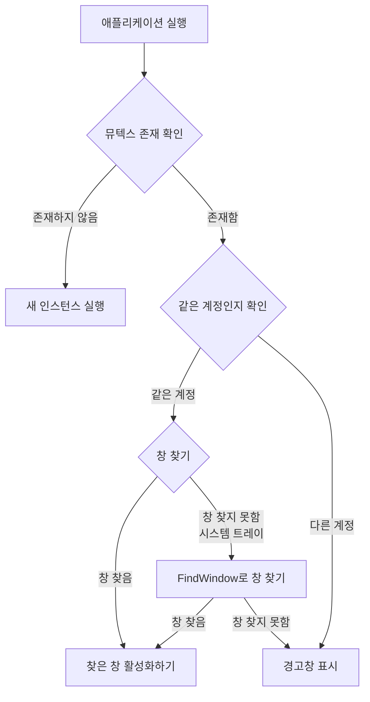

# flutter_alone
## Project Structure

```
flutter_alone/
├── example/
    ├── integration_test/
    │   └── plugin_integration_test.dart
    ├── lib/
    │   └── main.dart
    ├── macos/
    │   ├── Runner/
    │   │   ├── AppDelegate.swift
    │   │   ├── DebugProfile.entitlements
    │   │   ├── Info.plist
    │   │   ├── MainFlutterWindow.swift
    │   │   └── Release.entitlements
    │   ├── Runner.xcodeproj/
    │   │   ├── project.xcworkspace/
    │   │   │   └── xcshareddata/
    │   │   │   │   └── IDEWorkspaceChecks.plist
    │   │   ├── xcshareddata/
    │   │   │   └── xcschemes/
    │   │   │   │   └── Runner.xcscheme
    │   │   └── project.pbxproj
    │   ├── Runner.xcworkspace/
    │   │   ├── xcshareddata/
    │   │   │   └── IDEWorkspaceChecks.plist
    │   │   └── contents.xcworkspacedata
    │   └── Podfile
    └── test/
    │   └── widget_test.dart
├── lib/
    ├── src/
    │   ├── models/
    │   │   └── message_config.dart
    │   ├── exception.dart
    │   ├── flutter_alone_method_channel.dart
    │   └── flutter_alone_platform_interface.dart
    ├── flutter_alone.dart
    ├── flutter_alone_method_channel.dart
    └── flutter_alone_platform_interface.dart
├── macos/
    ├── Classes/
    │   └── FlutterAlonePlugin.swift
    ├── Resources/
    │   └── PrivacyInfo.xcprivacy
    └── flutter_alone.podspec
├── test/
    ├── flutter_alone_method_channel_test.dart
    └── flutter_alone_test.dart
├── windows/
    ├── include/
    │   └── flutter_alone/
    │   │   └── flutter_alone_plugin_c_api.h
    ├── test/
    │   └── flutter_alone_plugin_test.cpp
    ├── CMakeLists.txt
    ├── flutter_alone_plugin.cpp
    ├── flutter_alone_plugin.h
    ├── flutter_alone_plugin_c_api.cpp
    ├── icon_utils.cpp
    ├── icon_utils.h
    ├── message_utils.cpp
    ├── message_utils.h
    ├── mutex_utils.cpp
    ├── mutex_utils.h
    ├── process_utils.cpp
    ├── process_utils.h
    ├── window_utils.cpp
    └── window_utils.h
├── plan.md
└── scenario.md
```

## example/integration_test/plugin_integration_test.dart
```dart
import 'dart:io';

import 'package:flutter/services.dart';
import 'package:flutter_alone/flutter_alone.dart';
import 'package:flutter_test/flutter_test.dart';
import 'package:integration_test/integration_test.dart';

void main() {
  IntegrationTestWidgetsFlutterBinding.ensureInitialized();

  // Ensure tests only run on Windows platform
  if (!Platform.isWindows) {
    group('Flutter Alone Plugin on non-Windows platforms', () {
      test('Tests are skipped on non-Windows platforms', () {
        // Skip tests on non-Windows platforms
      });
    });
    return;
  }

  group('Flutter Alone Plugin Integration Tests on Windows', () {
    late FlutterAlone flutterAlone;
    const channel = MethodChannel('flutter_alone');

    // Shared test configuration data
    final testConfig = EnMessageConfig(
      packageId: 'com.test.integration',
      appName: 'IntegrationTestApp',
      enableInDebugMode: true,
    );

    setUpAll(() {
      TestDefaultBinaryMessengerBinding.instance.defaultBinaryMessenger
          .setMockMethodCallHandler(channel, (MethodCall methodCall) async {
        switch (methodCall.method) {
          case 'checkAndRun':
            return true;
          case 'dispose':
            return null;
          default:
            throw PlatformException(
              code: 'unimplemented',
              message: 'Method not implemented',
            );
        }
      });
    });

    setUp(() {
      flutterAlone = FlutterAlone.instance;
    });

    tearDown(() async {
      try {
        await flutterAlone.dispose();
      } catch (e) {
        // Ignore errors during cleanup
      }
    });

    tearDownAll(() {
      TestDefaultBinaryMessengerBinding.instance.defaultBinaryMessenger
          .setMockMethodCallHandler(channel, null);
    });

    test('Basic functionality test - successful mutex creation', () async {
      final result = await flutterAlone.checkAndRun(messageConfig: testConfig);
      expect(result, true,
          reason: 'Verify successful mutex creation on platform');
    });

    test('Error handling test - handles platform exceptions properly',
        () async {
      // Replace with handler that throws an exception
      TestDefaultBinaryMessengerBinding.instance.defaultBinaryMessenger
          .setMockMethodCallHandler(channel, (MethodCall methodCall) async {
        throw PlatformException(
          code: 'mutex_error',
          message: 'Failed to create mutex',
          details: 'Simulated error for testing',
        );
      });

      // Catch exception and verify type
      expect(
        () async => await flutterAlone.checkAndRun(messageConfig: testConfig),
        throwsA(isA<AloneException>()
            .having((e) => e.code, 'error code', 'mutex_error')),
        reason:
            'Ensure platform exception is properly converted to AloneException',
      );

      // Restore original handler after test
      TestDefaultBinaryMessengerBinding.instance.defaultBinaryMessenger
          .setMockMethodCallHandler(channel, (MethodCall methodCall) async {
        switch (methodCall.method) {
          case 'checkAndRun':
            return true;
          case 'dispose':
            return null;
          default:
            throw PlatformException(code: 'unimplemented');
        }
      });
    });

    // Additional test: Verify that MessageConfig parameters are correctly passed
    test('Configuration parameters are correctly passed to platform', () async {
      bool configVerified = false;

      TestDefaultBinaryMessengerBinding.instance.defaultBinaryMessenger
          .setMockMethodCallHandler(channel, (MethodCall methodCall) async {
        if (methodCall.method == 'checkAndRun') {
          final args = methodCall.arguments as Map<dynamic, dynamic>;
          configVerified = args['packageId'] == 'com.test.integration' &&
              args['appName'] == 'IntegrationTestApp';
          return true;
        }
        return null;
      });

      await flutterAlone.checkAndRun(messageConfig: testConfig);
      expect(configVerified, true,
          reason:
              'Verify configuration parameters are passed to platform correctly');
    });
  });
}

```
## example/lib/main.dart
```dart
import 'dart:io';

import 'package:flutter/material.dart';
import 'package:flutter_alone/flutter_alone.dart';
import 'package:system_tray/system_tray.dart';
import 'package:window_manager/window_manager.dart';

void main() async {
  WidgetsFlutterBinding.ensureInitialized();
  await windowManager.ensureInitialized();

  WindowOptions windowOptions = WindowOptions(
    size: Size(500, 800),
    center: true,
    title: 'Tray App Example',
  );
  windowManager.waitUntilReadyToShow(windowOptions, () async {
    await windowManager.show();
    await windowManager.focus();
  });
  if (Platform.isWindows) {
    if (!await FlutterAlone.instance.checkAndRun(
      messageConfig: CustomMessageConfig(
        customTitle: 'Example App',
        customMessage: 'Application is already running in another account',
        enableInDebugMode: true, // Enable duplicate check even in debug mode
        windowTitle: 'Tray App Example',
        packageId: 'com.example.myapp',
        appName: 'MyFlutterApp',
        mutexSuffix: 'production',
      ),
    )) {
      exit(0);
    }
  }
  runApp(const MyApp());
}

class MyApp extends StatefulWidget {
  const MyApp({super.key});

  @override
  State<MyApp> createState() => _MyAppState();
}

class _MyAppState extends State<MyApp> {
  final SystemTray _systemTray = SystemTray();

  @override
  void initState() {
    super.initState();
    _initSystemTray();
  }

  @override
  void dispose() {
    FlutterAlone.instance.dispose();
    super.dispose();
  }

  Future<void> _initSystemTray() async {
    String path =
        Platform.isWindows ? 'assets/app_icon.ico' : 'assets/app_icon_64.png';
    if (!await File(path).exists()) {
      debugPrint("icon file not found: $path");
    }

    await _systemTray.initSystemTray(iconPath: path);

    _systemTray.setTitle('Flutter alone example');
    _systemTray.setToolTip('Flutter alone example');

    final Menu menu = Menu();
    await menu.buildFrom([
      MenuItemLabel(
        label: 'Open',
        onClicked: (_) async {
          await windowManager.show();
          await windowManager.focus();
        },
      ),
      MenuItemLabel(
        label: 'Exit',
        onClicked: (_) async {
          await _systemTray.destroy();
          exit(0);
        },
      ),
    ]);

    await _systemTray.setContextMenu(menu);

    _systemTray.registerSystemTrayEventHandler(
      (eventName) async {
        if (eventName == kSystemTrayEventClick) {
          if (Platform.isWindows) {
            await windowManager.show();
            await windowManager.focus();
          } else {
            await _systemTray.popUpContextMenu();
          }
        } else if (eventName == kSystemTrayEventRightClick) {
          if (Platform.isWindows) {
            await _systemTray.popUpContextMenu();
          } else {
            await windowManager.show();
            await windowManager.focus();
          }
        }
      },
    );
  }

  Future<void> hideWindow() async {
    await windowManager.hide();
  }

  @override
  Widget build(BuildContext context) {
    return MaterialApp(
      home: Scaffold(
        appBar: AppBar(
          title: const Text('Flutter Alone Example'),
        ),
        body: Center(
          child: Column(
            mainAxisAlignment: MainAxisAlignment.center,
            children: [
              Text(
                'The app ran normally.',
                style: TextStyle(fontSize: 18),
              ),
              SizedBox(height: 20),
              Text(
                'Prevent duplicate execution with custom mutex name:',
                style: TextStyle(fontSize: 14),
              ),
              Text(
                'packageId: com.example.myapp',
                style: TextStyle(fontSize: 14),
              ),
              Text(
                'appName: MyFlutterApp',
                style: TextStyle(fontSize: 14),
              ),
              Text(
                'suffix: production',
                style: TextStyle(fontSize: 14),
              ),
              SizedBox(height: 20),
              ElevatedButton(
                onPressed: hideWindow,
                child: Text('hide window'),
              ),
            ],
          ),
        ),
      ),
    );
  }
}

```
## example/macos/Podfile
```
platform :osx, '10.14'

# CocoaPods analytics sends network stats synchronously affecting flutter build latency.
ENV['COCOAPODS_DISABLE_STATS'] = 'true'

project 'Runner', {
  'Debug' => :debug,
  'Profile' => :release,
  'Release' => :release,
}

def flutter_root
  generated_xcode_build_settings_path = File.expand_path(File.join('..', 'Flutter', 'ephemeral', 'Flutter-Generated.xcconfig'), __FILE__)
  unless File.exist?(generated_xcode_build_settings_path)
    raise "#{generated_xcode_build_settings_path} must exist. If you're running pod install manually, make sure \"flutter pub get\" is executed first"
  end

  File.foreach(generated_xcode_build_settings_path) do |line|
    matches = line.match(/FLUTTER_ROOT\=(.*)/)
    return matches[1].strip if matches
  end
  raise "FLUTTER_ROOT not found in #{generated_xcode_build_settings_path}. Try deleting Flutter-Generated.xcconfig, then run \"flutter pub get\""
end

require File.expand_path(File.join('packages', 'flutter_tools', 'bin', 'podhelper'), flutter_root)

flutter_macos_podfile_setup

target 'Runner' do
  use_frameworks!
  use_modular_headers!

  flutter_install_all_macos_pods File.dirname(File.realpath(__FILE__))
  target 'RunnerTests' do
    inherit! :search_paths
  end
end

post_install do |installer|
  installer.pods_project.targets.each do |target|
    flutter_additional_macos_build_settings(target)
  end
end

```
## example/macos/Runner/AppDelegate.swift
```swift
import Cocoa
import FlutterMacOS

@main
class AppDelegate: FlutterAppDelegate {
  override func applicationShouldTerminateAfterLastWindowClosed(_ sender: NSApplication) -> Bool {
    return true
  }

  override func applicationSupportsSecureRestorableState(_ app: NSApplication) -> Bool {
    return true
  }
}

```
## example/macos/Runner/DebugProfile.entitlements
```entitlements
<?xml version="1.0" encoding="UTF-8"?>
<!DOCTYPE plist PUBLIC "-//Apple//DTD PLIST 1.0//EN" "http://www.apple.com/DTDs/PropertyList-1.0.dtd">
<plist version="1.0">
<dict>
	<key>com.apple.security.app-sandbox</key>
	<true/>
	<key>com.apple.security.cs.allow-jit</key>
	<true/>
	<key>com.apple.security.network.server</key>
	<true/>
</dict>
</plist>

```
## example/macos/Runner/Info.plist
```plist
<?xml version="1.0" encoding="UTF-8"?>
<!DOCTYPE plist PUBLIC "-//Apple//DTD PLIST 1.0//EN" "http://www.apple.com/DTDs/PropertyList-1.0.dtd">
<plist version="1.0">
<dict>
	<key>CFBundleDevelopmentRegion</key>
	<string>$(DEVELOPMENT_LANGUAGE)</string>
	<key>CFBundleExecutable</key>
	<string>$(EXECUTABLE_NAME)</string>
	<key>CFBundleIconFile</key>
	<string></string>
	<key>CFBundleIdentifier</key>
	<string>$(PRODUCT_BUNDLE_IDENTIFIER)</string>
	<key>CFBundleInfoDictionaryVersion</key>
	<string>6.0</string>
	<key>CFBundleName</key>
	<string>$(PRODUCT_NAME)</string>
	<key>CFBundlePackageType</key>
	<string>APPL</string>
	<key>CFBundleShortVersionString</key>
	<string>$(FLUTTER_BUILD_NAME)</string>
	<key>CFBundleVersion</key>
	<string>$(FLUTTER_BUILD_NUMBER)</string>
	<key>LSMinimumSystemVersion</key>
	<string>$(MACOSX_DEPLOYMENT_TARGET)</string>
	<key>NSHumanReadableCopyright</key>
	<string>$(PRODUCT_COPYRIGHT)</string>
	<key>NSMainNibFile</key>
	<string>MainMenu</string>
	<key>NSPrincipalClass</key>
	<string>NSApplication</string>
</dict>
</plist>

```
## example/macos/Runner/MainFlutterWindow.swift
```swift
import Cocoa
import FlutterMacOS

class MainFlutterWindow: NSWindow {
  override func awakeFromNib() {
    let flutterViewController = FlutterViewController()
    let windowFrame = self.frame
    self.contentViewController = flutterViewController
    self.setFrame(windowFrame, display: true)

    RegisterGeneratedPlugins(registry: flutterViewController)

    super.awakeFromNib()
  }
}

```
## example/macos/Runner/Release.entitlements
```entitlements
<?xml version="1.0" encoding="UTF-8"?>
<!DOCTYPE plist PUBLIC "-//Apple//DTD PLIST 1.0//EN" "http://www.apple.com/DTDs/PropertyList-1.0.dtd">
<plist version="1.0">
<dict>
	<key>com.apple.security.app-sandbox</key>
	<true/>
</dict>
</plist>

```
## example/macos/Runner.xcodeproj/project.pbxproj
```pbxproj
// !$*UTF8*$!
{
	archiveVersion = 1;
	classes = {
	};
	objectVersion = 54;
	objects = {

/* Begin PBXAggregateTarget section */
		33CC111A2044C6BA0003C045 /* Flutter Assemble */ = {
			isa = PBXAggregateTarget;
			buildConfigurationList = 33CC111B2044C6BA0003C045 /* Build configuration list for PBXAggregateTarget "Flutter Assemble" */;
			buildPhases = (
				33CC111E2044C6BF0003C045 /* ShellScript */,
			);
			dependencies = (
			);
			name = "Flutter Assemble";
			productName = FLX;
		};
/* End PBXAggregateTarget section */

/* Begin PBXBuildFile section */
		331C80D8294CF71000263BE5 /* RunnerTests.swift in Sources */ = {isa = PBXBuildFile; fileRef = 331C80D7294CF71000263BE5 /* RunnerTests.swift */; };
		335BBD1B22A9A15E00E9071D /* GeneratedPluginRegistrant.swift in Sources */ = {isa = PBXBuildFile; fileRef = 335BBD1A22A9A15E00E9071D /* GeneratedPluginRegistrant.swift */; };
		33CC10F12044A3C60003C045 /* AppDelegate.swift in Sources */ = {isa = PBXBuildFile; fileRef = 33CC10F02044A3C60003C045 /* AppDelegate.swift */; };
		33CC10F32044A3C60003C045 /* Assets.xcassets in Resources */ = {isa = PBXBuildFile; fileRef = 33CC10F22044A3C60003C045 /* Assets.xcassets */; };
		33CC10F62044A3C60003C045 /* MainMenu.xib in Resources */ = {isa = PBXBuildFile; fileRef = 33CC10F42044A3C60003C045 /* MainMenu.xib */; };
		33CC11132044BFA00003C045 /* MainFlutterWindow.swift in Sources */ = {isa = PBXBuildFile; fileRef = 33CC11122044BFA00003C045 /* MainFlutterWindow.swift */; };
		48F512AA2E03B250E91D8D61 /* Pods_Runner.framework in Frameworks */ = {isa = PBXBuildFile; fileRef = 1BD06431A43DB56E0B0F464C /* Pods_Runner.framework */; };
		4C76F8AE3C8242050DF710CF /* Pods_RunnerTests.framework in Frameworks */ = {isa = PBXBuildFile; fileRef = 3740D6843D071ECBEC24667F /* Pods_RunnerTests.framework */; };
/* End PBXBuildFile section */

/* Begin PBXContainerItemProxy section */
		331C80D9294CF71000263BE5 /* PBXContainerItemProxy */ = {
			isa = PBXContainerItemProxy;
			containerPortal = 33CC10E52044A3C60003C045 /* Project object */;
			proxyType = 1;
			remoteGlobalIDString = 33CC10EC2044A3C60003C045;
			remoteInfo = Runner;
		};
		33CC111F2044C79F0003C045 /* PBXContainerItemProxy */ = {
			isa = PBXContainerItemProxy;
			containerPortal = 33CC10E52044A3C60003C045 /* Project object */;
			proxyType = 1;
			remoteGlobalIDString = 33CC111A2044C6BA0003C045;
			remoteInfo = FLX;
		};
/* End PBXContainerItemProxy section */

/* Begin PBXCopyFilesBuildPhase section */
		33CC110E2044A8840003C045 /* Bundle Framework */ = {
			isa = PBXCopyFilesBuildPhase;
			buildActionMask = 2147483647;
			dstPath = "";
			dstSubfolderSpec = 10;
			files = (
			);
			name = "Bundle Framework";
			runOnlyForDeploymentPostprocessing = 0;
		};
/* End PBXCopyFilesBuildPhase section */

/* Begin PBXFileReference section */
		1BD06431A43DB56E0B0F464C /* Pods_Runner.framework */ = {isa = PBXFileReference; explicitFileType = wrapper.framework; includeInIndex = 0; path = Pods_Runner.framework; sourceTree = BUILT_PRODUCTS_DIR; };
		2F79D1C6C3E55205F3B5315C /* Pods-Runner.release.xcconfig */ = {isa = PBXFileReference; includeInIndex = 1; lastKnownFileType = text.xcconfig; name = "Pods-Runner.release.xcconfig"; path = "Target Support Files/Pods-Runner/Pods-Runner.release.xcconfig"; sourceTree = "<group>"; };
		331C80D5294CF71000263BE5 /* RunnerTests.xctest */ = {isa = PBXFileReference; explicitFileType = wrapper.cfbundle; includeInIndex = 0; path = RunnerTests.xctest; sourceTree = BUILT_PRODUCTS_DIR; };
		331C80D7294CF71000263BE5 /* RunnerTests.swift */ = {isa = PBXFileReference; lastKnownFileType = sourcecode.swift; path = RunnerTests.swift; sourceTree = "<group>"; };
		333000ED22D3DE5D00554162 /* Warnings.xcconfig */ = {isa = PBXFileReference; lastKnownFileType = text.xcconfig; path = Warnings.xcconfig; sourceTree = "<group>"; };
		335BBD1A22A9A15E00E9071D /* GeneratedPluginRegistrant.swift */ = {isa = PBXFileReference; fileEncoding = 4; lastKnownFileType = sourcecode.swift; path = GeneratedPluginRegistrant.swift; sourceTree = "<group>"; };
		33CC10ED2044A3C60003C045 /* flutter_alone_example.app */ = {isa = PBXFileReference; explicitFileType = wrapper.application; includeInIndex = 0; path = flutter_alone_example.app; sourceTree = BUILT_PRODUCTS_DIR; };
		33CC10F02044A3C60003C045 /* AppDelegate.swift */ = {isa = PBXFileReference; lastKnownFileType = sourcecode.swift; path = AppDelegate.swift; sourceTree = "<group>"; };
		33CC10F22044A3C60003C045 /* Assets.xcassets */ = {isa = PBXFileReference; lastKnownFileType = folder.assetcatalog; name = Assets.xcassets; path = Runner/Assets.xcassets; sourceTree = "<group>"; };
		33CC10F52044A3C60003C045 /* Base */ = {isa = PBXFileReference; lastKnownFileType = file.xib; name = Base; path = Base.lproj/MainMenu.xib; sourceTree = "<group>"; };
		33CC10F72044A3C60003C045 /* Info.plist */ = {isa = PBXFileReference; lastKnownFileType = text.plist.xml; name = Info.plist; path = Runner/Info.plist; sourceTree = "<group>"; };
		33CC11122044BFA00003C045 /* MainFlutterWindow.swift */ = {isa = PBXFileReference; lastKnownFileType = sourcecode.swift; path = MainFlutterWindow.swift; sourceTree = "<group>"; };
		33CEB47222A05771004F2AC0 /* Flutter-Debug.xcconfig */ = {isa = PBXFileReference; lastKnownFileType = text.xcconfig; path = "Flutter-Debug.xcconfig"; sourceTree = "<group>"; };
		33CEB47422A05771004F2AC0 /* Flutter-Release.xcconfig */ = {isa = PBXFileReference; lastKnownFileType = text.xcconfig; path = "Flutter-Release.xcconfig"; sourceTree = "<group>"; };
		33CEB47722A0578A004F2AC0 /* Flutter-Generated.xcconfig */ = {isa = PBXFileReference; lastKnownFileType = text.xcconfig; name = "Flutter-Generated.xcconfig"; path = "ephemeral/Flutter-Generated.xcconfig"; sourceTree = "<group>"; };
		33E51913231747F40026EE4D /* DebugProfile.entitlements */ = {isa = PBXFileReference; lastKnownFileType = text.plist.entitlements; path = DebugProfile.entitlements; sourceTree = "<group>"; };
		33E51914231749380026EE4D /* Release.entitlements */ = {isa = PBXFileReference; fileEncoding = 4; lastKnownFileType = text.plist.entitlements; path = Release.entitlements; sourceTree = "<group>"; };
		33E5194F232828860026EE4D /* AppInfo.xcconfig */ = {isa = PBXFileReference; lastKnownFileType = text.xcconfig; path = AppInfo.xcconfig; sourceTree = "<group>"; };
		3740D6843D071ECBEC24667F /* Pods_RunnerTests.framework */ = {isa = PBXFileReference; explicitFileType = wrapper.framework; includeInIndex = 0; path = Pods_RunnerTests.framework; sourceTree = BUILT_PRODUCTS_DIR; };
		7AFA3C8E1D35360C0083082E /* Release.xcconfig */ = {isa = PBXFileReference; lastKnownFileType = text.xcconfig; path = Release.xcconfig; sourceTree = "<group>"; };
		9740EEB21CF90195004384FC /* Debug.xcconfig */ = {isa = PBXFileReference; fileEncoding = 4; lastKnownFileType = text.xcconfig; path = Debug.xcconfig; sourceTree = "<group>"; };
		A654B1F09DA0C1FB0D64CB95 /* Pods-Runner.debug.xcconfig */ = {isa = PBXFileReference; includeInIndex = 1; lastKnownFileType = text.xcconfig; name = "Pods-Runner.debug.xcconfig"; path = "Target Support Files/Pods-Runner/Pods-Runner.debug.xcconfig"; sourceTree = "<group>"; };
		BE7B30CE8EC5C4AD37C4263D /* Pods-RunnerTests.profile.xcconfig */ = {isa = PBXFileReference; includeInIndex = 1; lastKnownFileType = text.xcconfig; name = "Pods-RunnerTests.profile.xcconfig"; path = "Target Support Files/Pods-RunnerTests/Pods-RunnerTests.profile.xcconfig"; sourceTree = "<group>"; };
		D0B1A5A923AA27BCF91AAB01 /* Pods-Runner.profile.xcconfig */ = {isa = PBXFileReference; includeInIndex = 1; lastKnownFileType = text.xcconfig; name = "Pods-Runner.profile.xcconfig"; path = "Target Support Files/Pods-Runner/Pods-Runner.profile.xcconfig"; sourceTree = "<group>"; };
		D435C94647BDA3ADBBE9B49F /* Pods-RunnerTests.debug.xcconfig */ = {isa = PBXFileReference; includeInIndex = 1; lastKnownFileType = text.xcconfig; name = "Pods-RunnerTests.debug.xcconfig"; path = "Target Support Files/Pods-RunnerTests/Pods-RunnerTests.debug.xcconfig"; sourceTree = "<group>"; };
		EE361DFFE30B180C1F2A9A95 /* Pods-RunnerTests.release.xcconfig */ = {isa = PBXFileReference; includeInIndex = 1; lastKnownFileType = text.xcconfig; name = "Pods-RunnerTests.release.xcconfig"; path = "Target Support Files/Pods-RunnerTests/Pods-RunnerTests.release.xcconfig"; sourceTree = "<group>"; };
/* End PBXFileReference section */

/* Begin PBXFrameworksBuildPhase section */
		331C80D2294CF70F00263BE5 /* Frameworks */ = {
			isa = PBXFrameworksBuildPhase;
			buildActionMask = 2147483647;
			files = (
				4C76F8AE3C8242050DF710CF /* Pods_RunnerTests.framework in Frameworks */,
			);
			runOnlyForDeploymentPostprocessing = 0;
		};
		33CC10EA2044A3C60003C045 /* Frameworks */ = {
			isa = PBXFrameworksBuildPhase;
			buildActionMask = 2147483647;
			files = (
				48F512AA2E03B250E91D8D61 /* Pods_Runner.framework in Frameworks */,
			);
			runOnlyForDeploymentPostprocessing = 0;
		};
/* End PBXFrameworksBuildPhase section */

/* Begin PBXGroup section */
		226CD864AD25DAA729D548A4 /* Pods */ = {
			isa = PBXGroup;
			children = (
				A654B1F09DA0C1FB0D64CB95 /* Pods-Runner.debug.xcconfig */,
				2F79D1C6C3E55205F3B5315C /* Pods-Runner.release.xcconfig */,
				D0B1A5A923AA27BCF91AAB01 /* Pods-Runner.profile.xcconfig */,
				D435C94647BDA3ADBBE9B49F /* Pods-RunnerTests.debug.xcconfig */,
				EE361DFFE30B180C1F2A9A95 /* Pods-RunnerTests.release.xcconfig */,
				BE7B30CE8EC5C4AD37C4263D /* Pods-RunnerTests.profile.xcconfig */,
			);
			name = Pods;
			path = Pods;
			sourceTree = "<group>";
		};
		331C80D6294CF71000263BE5 /* RunnerTests */ = {
			isa = PBXGroup;
			children = (
				331C80D7294CF71000263BE5 /* RunnerTests.swift */,
			);
			path = RunnerTests;
			sourceTree = "<group>";
		};
		33BA886A226E78AF003329D5 /* Configs */ = {
			isa = PBXGroup;
			children = (
				33E5194F232828860026EE4D /* AppInfo.xcconfig */,
				9740EEB21CF90195004384FC /* Debug.xcconfig */,
				7AFA3C8E1D35360C0083082E /* Release.xcconfig */,
				333000ED22D3DE5D00554162 /* Warnings.xcconfig */,
			);
			path = Configs;
			sourceTree = "<group>";
		};
		33CC10E42044A3C60003C045 = {
			isa = PBXGroup;
			children = (
				33FAB671232836740065AC1E /* Runner */,
				33CEB47122A05771004F2AC0 /* Flutter */,
				331C80D6294CF71000263BE5 /* RunnerTests */,
				33CC10EE2044A3C60003C045 /* Products */,
				D73912EC22F37F3D000D13A0 /* Frameworks */,
				226CD864AD25DAA729D548A4 /* Pods */,
			);
			sourceTree = "<group>";
		};
		33CC10EE2044A3C60003C045 /* Products */ = {
			isa = PBXGroup;
			children = (
				33CC10ED2044A3C60003C045 /* flutter_alone_example.app */,
				331C80D5294CF71000263BE5 /* RunnerTests.xctest */,
			);
			name = Products;
			sourceTree = "<group>";
		};
		33CC11242044D66E0003C045 /* Resources */ = {
			isa = PBXGroup;
			children = (
				33CC10F22044A3C60003C045 /* Assets.xcassets */,
				33CC10F42044A3C60003C045 /* MainMenu.xib */,
				33CC10F72044A3C60003C045 /* Info.plist */,
			);
			name = Resources;
			path = ..;
			sourceTree = "<group>";
		};
		33CEB47122A05771004F2AC0 /* Flutter */ = {
			isa = PBXGroup;
			children = (
				335BBD1A22A9A15E00E9071D /* GeneratedPluginRegistrant.swift */,
				33CEB47222A05771004F2AC0 /* Flutter-Debug.xcconfig */,
				33CEB47422A05771004F2AC0 /* Flutter-Release.xcconfig */,
				33CEB47722A0578A004F2AC0 /* Flutter-Generated.xcconfig */,
			);
			path = Flutter;
			sourceTree = "<group>";
		};
		33FAB671232836740065AC1E /* Runner */ = {
			isa = PBXGroup;
			children = (
				33CC10F02044A3C60003C045 /* AppDelegate.swift */,
				33CC11122044BFA00003C045 /* MainFlutterWindow.swift */,
				33E51913231747F40026EE4D /* DebugProfile.entitlements */,
				33E51914231749380026EE4D /* Release.entitlements */,
				33CC11242044D66E0003C045 /* Resources */,
				33BA886A226E78AF003329D5 /* Configs */,
			);
			path = Runner;
			sourceTree = "<group>";
		};
		D73912EC22F37F3D000D13A0 /* Frameworks */ = {
			isa = PBXGroup;
			children = (
				1BD06431A43DB56E0B0F464C /* Pods_Runner.framework */,
				3740D6843D071ECBEC24667F /* Pods_RunnerTests.framework */,
			);
			name = Frameworks;
			sourceTree = "<group>";
		};
/* End PBXGroup section */

/* Begin PBXNativeTarget section */
		331C80D4294CF70F00263BE5 /* RunnerTests */ = {
			isa = PBXNativeTarget;
			buildConfigurationList = 331C80DE294CF71000263BE5 /* Build configuration list for PBXNativeTarget "RunnerTests" */;
			buildPhases = (
				A491089D5B7B619637D5A350 /* [CP] Check Pods Manifest.lock */,
				331C80D1294CF70F00263BE5 /* Sources */,
				331C80D2294CF70F00263BE5 /* Frameworks */,
				331C80D3294CF70F00263BE5 /* Resources */,
			);
			buildRules = (
			);
			dependencies = (
				331C80DA294CF71000263BE5 /* PBXTargetDependency */,
			);
			name = RunnerTests;
			productName = RunnerTests;
			productReference = 331C80D5294CF71000263BE5 /* RunnerTests.xctest */;
			productType = "com.apple.product-type.bundle.unit-test";
		};
		33CC10EC2044A3C60003C045 /* Runner */ = {
			isa = PBXNativeTarget;
			buildConfigurationList = 33CC10FB2044A3C60003C045 /* Build configuration list for PBXNativeTarget "Runner" */;
			buildPhases = (
				B53ED9C56A79BF548884C796 /* [CP] Check Pods Manifest.lock */,
				33CC10E92044A3C60003C045 /* Sources */,
				33CC10EA2044A3C60003C045 /* Frameworks */,
				33CC10EB2044A3C60003C045 /* Resources */,
				33CC110E2044A8840003C045 /* Bundle Framework */,
				3399D490228B24CF009A79C7 /* ShellScript */,
				4C66D79146D9F20027499B9B /* [CP] Embed Pods Frameworks */,
			);
			buildRules = (
			);
			dependencies = (
				33CC11202044C79F0003C045 /* PBXTargetDependency */,
			);
			name = Runner;
			productName = Runner;
			productReference = 33CC10ED2044A3C60003C045 /* flutter_alone_example.app */;
			productType = "com.apple.product-type.application";
		};
/* End PBXNativeTarget section */

/* Begin PBXProject section */
		33CC10E52044A3C60003C045 /* Project object */ = {
			isa = PBXProject;
			attributes = {
				BuildIndependentTargetsInParallel = YES;
				LastSwiftUpdateCheck = 0920;
				LastUpgradeCheck = 1510;
				ORGANIZATIONNAME = "";
				TargetAttributes = {
					331C80D4294CF70F00263BE5 = {
						CreatedOnToolsVersion = 14.0;
						TestTargetID = 33CC10EC2044A3C60003C045;
					};
					33CC10EC2044A3C60003C045 = {
						CreatedOnToolsVersion = 9.2;
						LastSwiftMigration = 1100;
						ProvisioningStyle = Automatic;
						SystemCapabilities = {
							com.apple.Sandbox = {
								enabled = 1;
							};
						};
					};
					33CC111A2044C6BA0003C045 = {
						CreatedOnToolsVersion = 9.2;
						ProvisioningStyle = Manual;
					};
				};
			};
			buildConfigurationList = 33CC10E82044A3C60003C045 /* Build configuration list for PBXProject "Runner" */;
			compatibilityVersion = "Xcode 9.3";
			developmentRegion = en;
			hasScannedForEncodings = 0;
			knownRegions = (
				en,
				Base,
			);
			mainGroup = 33CC10E42044A3C60003C045;
			productRefGroup = 33CC10EE2044A3C60003C045 /* Products */;
			projectDirPath = "";
			projectRoot = "";
			targets = (
				33CC10EC2044A3C60003C045 /* Runner */,
				331C80D4294CF70F00263BE5 /* RunnerTests */,
				33CC111A2044C6BA0003C045 /* Flutter Assemble */,
			);
		};
/* End PBXProject section */

/* Begin PBXResourcesBuildPhase section */
		331C80D3294CF70F00263BE5 /* Resources */ = {
			isa = PBXResourcesBuildPhase;
			buildActionMask = 2147483647;
			files = (
			);
			runOnlyForDeploymentPostprocessing = 0;
		};
		33CC10EB2044A3C60003C045 /* Resources */ = {
			isa = PBXResourcesBuildPhase;
			buildActionMask = 2147483647;
			files = (
				33CC10F32044A3C60003C045 /* Assets.xcassets in Resources */,
				33CC10F62044A3C60003C045 /* MainMenu.xib in Resources */,
			);
			runOnlyForDeploymentPostprocessing = 0;
		};
/* End PBXResourcesBuildPhase section */

/* Begin PBXShellScriptBuildPhase section */
		3399D490228B24CF009A79C7 /* ShellScript */ = {
			isa = PBXShellScriptBuildPhase;
			alwaysOutOfDate = 1;
			buildActionMask = 2147483647;
			files = (
			);
			inputFileListPaths = (
			);
			inputPaths = (
			);
			outputFileListPaths = (
			);
			outputPaths = (
			);
			runOnlyForDeploymentPostprocessing = 0;
			shellPath = /bin/sh;
			shellScript = "echo \"$PRODUCT_NAME.app\" > \"$PROJECT_DIR\"/Flutter/ephemeral/.app_filename && \"$FLUTTER_ROOT\"/packages/flutter_tools/bin/macos_assemble.sh embed\n";
		};
		33CC111E2044C6BF0003C045 /* ShellScript */ = {
			isa = PBXShellScriptBuildPhase;
			buildActionMask = 2147483647;
			files = (
			);
			inputFileListPaths = (
				Flutter/ephemeral/FlutterInputs.xcfilelist,
			);
			inputPaths = (
				Flutter/ephemeral/tripwire,
			);
			outputFileListPaths = (
				Flutter/ephemeral/FlutterOutputs.xcfilelist,
			);
			outputPaths = (
			);
			runOnlyForDeploymentPostprocessing = 0;
			shellPath = /bin/sh;
			shellScript = "\"$FLUTTER_ROOT\"/packages/flutter_tools/bin/macos_assemble.sh && touch Flutter/ephemeral/tripwire";
		};
		4C66D79146D9F20027499B9B /* [CP] Embed Pods Frameworks */ = {
			isa = PBXShellScriptBuildPhase;
			buildActionMask = 2147483647;
			files = (
			);
			inputFileListPaths = (
				"${PODS_ROOT}/Target Support Files/Pods-Runner/Pods-Runner-frameworks-${CONFIGURATION}-input-files.xcfilelist",
			);
			name = "[CP] Embed Pods Frameworks";
			outputFileListPaths = (
				"${PODS_ROOT}/Target Support Files/Pods-Runner/Pods-Runner-frameworks-${CONFIGURATION}-output-files.xcfilelist",
			);
			runOnlyForDeploymentPostprocessing = 0;
			shellPath = /bin/sh;
			shellScript = "\"${PODS_ROOT}/Target Support Files/Pods-Runner/Pods-Runner-frameworks.sh\"\n";
			showEnvVarsInLog = 0;
		};
		A491089D5B7B619637D5A350 /* [CP] Check Pods Manifest.lock */ = {
			isa = PBXShellScriptBuildPhase;
			buildActionMask = 2147483647;
			files = (
			);
			inputFileListPaths = (
			);
			inputPaths = (
				"${PODS_PODFILE_DIR_PATH}/Podfile.lock",
				"${PODS_ROOT}/Manifest.lock",
			);
			name = "[CP] Check Pods Manifest.lock";
			outputFileListPaths = (
			);
			outputPaths = (
				"$(DERIVED_FILE_DIR)/Pods-RunnerTests-checkManifestLockResult.txt",
			);
			runOnlyForDeploymentPostprocessing = 0;
			shellPath = /bin/sh;
			shellScript = "diff \"${PODS_PODFILE_DIR_PATH}/Podfile.lock\" \"${PODS_ROOT}/Manifest.lock\" > /dev/null\nif [ $? != 0 ] ; then\n    # print error to STDERR\n    echo \"error: The sandbox is not in sync with the Podfile.lock. Run 'pod install' or update your CocoaPods installation.\" >&2\n    exit 1\nfi\n# This output is used by Xcode 'outputs' to avoid re-running this script phase.\necho \"SUCCESS\" > \"${SCRIPT_OUTPUT_FILE_0}\"\n";
			showEnvVarsInLog = 0;
		};
		B53ED9C56A79BF548884C796 /* [CP] Check Pods Manifest.lock */ = {
			isa = PBXShellScriptBuildPhase;
			buildActionMask = 2147483647;
			files = (
			);
			inputFileListPaths = (
			);
			inputPaths = (
				"${PODS_PODFILE_DIR_PATH}/Podfile.lock",
				"${PODS_ROOT}/Manifest.lock",
			);
			name = "[CP] Check Pods Manifest.lock";
			outputFileListPaths = (
			);
			outputPaths = (
				"$(DERIVED_FILE_DIR)/Pods-Runner-checkManifestLockResult.txt",
			);
			runOnlyForDeploymentPostprocessing = 0;
			shellPath = /bin/sh;
			shellScript = "diff \"${PODS_PODFILE_DIR_PATH}/Podfile.lock\" \"${PODS_ROOT}/Manifest.lock\" > /dev/null\nif [ $? != 0 ] ; then\n    # print error to STDERR\n    echo \"error: The sandbox is not in sync with the Podfile.lock. Run 'pod install' or update your CocoaPods installation.\" >&2\n    exit 1\nfi\n# This output is used by Xcode 'outputs' to avoid re-running this script phase.\necho \"SUCCESS\" > \"${SCRIPT_OUTPUT_FILE_0}\"\n";
			showEnvVarsInLog = 0;
		};
/* End PBXShellScriptBuildPhase section */

/* Begin PBXSourcesBuildPhase section */
		331C80D1294CF70F00263BE5 /* Sources */ = {
			isa = PBXSourcesBuildPhase;
			buildActionMask = 2147483647;
			files = (
				331C80D8294CF71000263BE5 /* RunnerTests.swift in Sources */,
			);
			runOnlyForDeploymentPostprocessing = 0;
		};
		33CC10E92044A3C60003C045 /* Sources */ = {
			isa = PBXSourcesBuildPhase;
			buildActionMask = 2147483647;
			files = (
				33CC11132044BFA00003C045 /* MainFlutterWindow.swift in Sources */,
				33CC10F12044A3C60003C045 /* AppDelegate.swift in Sources */,
				335BBD1B22A9A15E00E9071D /* GeneratedPluginRegistrant.swift in Sources */,
			);
			runOnlyForDeploymentPostprocessing = 0;
		};
/* End PBXSourcesBuildPhase section */

/* Begin PBXTargetDependency section */
		331C80DA294CF71000263BE5 /* PBXTargetDependency */ = {
			isa = PBXTargetDependency;
			target = 33CC10EC2044A3C60003C045 /* Runner */;
			targetProxy = 331C80D9294CF71000263BE5 /* PBXContainerItemProxy */;
		};
		33CC11202044C79F0003C045 /* PBXTargetDependency */ = {
			isa = PBXTargetDependency;
			target = 33CC111A2044C6BA0003C045 /* Flutter Assemble */;
			targetProxy = 33CC111F2044C79F0003C045 /* PBXContainerItemProxy */;
		};
/* End PBXTargetDependency section */

/* Begin PBXVariantGroup section */
		33CC10F42044A3C60003C045 /* MainMenu.xib */ = {
			isa = PBXVariantGroup;
			children = (
				33CC10F52044A3C60003C045 /* Base */,
			);
			name = MainMenu.xib;
			path = Runner;
			sourceTree = "<group>";
		};
/* End PBXVariantGroup section */

/* Begin XCBuildConfiguration section */
		331C80DB294CF71000263BE5 /* Debug */ = {
			isa = XCBuildConfiguration;
			baseConfigurationReference = D435C94647BDA3ADBBE9B49F /* Pods-RunnerTests.debug.xcconfig */;
			buildSettings = {
				BUNDLE_LOADER = "$(TEST_HOST)";
				CURRENT_PROJECT_VERSION = 1;
				GENERATE_INFOPLIST_FILE = YES;
				MARKETING_VERSION = 1.0;
				PRODUCT_BUNDLE_IDENTIFIER = com.example.flutterAloneExample.RunnerTests;
				PRODUCT_NAME = "$(TARGET_NAME)";
				SWIFT_VERSION = 5.0;
				TEST_HOST = "$(BUILT_PRODUCTS_DIR)/flutter_alone_example.app/$(BUNDLE_EXECUTABLE_FOLDER_PATH)/flutter_alone_example";
			};
			name = Debug;
		};
		331C80DC294CF71000263BE5 /* Release */ = {
			isa = XCBuildConfiguration;
			baseConfigurationReference = EE361DFFE30B180C1F2A9A95 /* Pods-RunnerTests.release.xcconfig */;
			buildSettings = {
				BUNDLE_LOADER = "$(TEST_HOST)";
				CURRENT_PROJECT_VERSION = 1;
				GENERATE_INFOPLIST_FILE = YES;
				MARKETING_VERSION = 1.0;
				PRODUCT_BUNDLE_IDENTIFIER = com.example.flutterAloneExample.RunnerTests;
				PRODUCT_NAME = "$(TARGET_NAME)";
				SWIFT_VERSION = 5.0;
				TEST_HOST = "$(BUILT_PRODUCTS_DIR)/flutter_alone_example.app/$(BUNDLE_EXECUTABLE_FOLDER_PATH)/flutter_alone_example";
			};
			name = Release;
		};
		331C80DD294CF71000263BE5 /* Profile */ = {
			isa = XCBuildConfiguration;
			baseConfigurationReference = BE7B30CE8EC5C4AD37C4263D /* Pods-RunnerTests.profile.xcconfig */;
			buildSettings = {
				BUNDLE_LOADER = "$(TEST_HOST)";
				CURRENT_PROJECT_VERSION = 1;
				GENERATE_INFOPLIST_FILE = YES;
				MARKETING_VERSION = 1.0;
				PRODUCT_BUNDLE_IDENTIFIER = com.example.flutterAloneExample.RunnerTests;
				PRODUCT_NAME = "$(TARGET_NAME)";
				SWIFT_VERSION = 5.0;
				TEST_HOST = "$(BUILT_PRODUCTS_DIR)/flutter_alone_example.app/$(BUNDLE_EXECUTABLE_FOLDER_PATH)/flutter_alone_example";
			};
			name = Profile;
		};
		338D0CE9231458BD00FA5F75 /* Profile */ = {
			isa = XCBuildConfiguration;
			baseConfigurationReference = 7AFA3C8E1D35360C0083082E /* Release.xcconfig */;
			buildSettings = {
				ALWAYS_SEARCH_USER_PATHS = NO;
				ASSETCATALOG_COMPILER_GENERATE_SWIFT_ASSET_SYMBOL_EXTENSIONS = YES;
				CLANG_ANALYZER_NONNULL = YES;
				CLANG_ANALYZER_NUMBER_OBJECT_CONVERSION = YES_AGGRESSIVE;
				CLANG_CXX_LANGUAGE_STANDARD = "gnu++14";
				CLANG_CXX_LIBRARY = "libc++";
				CLANG_ENABLE_MODULES = YES;
				CLANG_ENABLE_OBJC_ARC = YES;
				CLANG_WARN_BLOCK_CAPTURE_AUTORELEASING = YES;
				CLANG_WARN_BOOL_CONVERSION = YES;
				CLANG_WARN_CONSTANT_CONVERSION = YES;
				CLANG_WARN_DEPRECATED_OBJC_IMPLEMENTATIONS = YES;
				CLANG_WARN_DIRECT_OBJC_ISA_USAGE = YES_ERROR;
				CLANG_WARN_DOCUMENTATION_COMMENTS = YES;
				CLANG_WARN_EMPTY_BODY = YES;
				CLANG_WARN_ENUM_CONVERSION = YES;
				CLANG_WARN_INFINITE_RECURSION = YES;
				CLANG_WARN_INT_CONVERSION = YES;
				CLANG_WARN_NON_LITERAL_NULL_CONVERSION = YES;
				CLANG_WARN_OBJC_LITERAL_CONVERSION = YES;
				CLANG_WARN_OBJC_ROOT_CLASS = YES_ERROR;
				CLANG_WARN_RANGE_LOOP_ANALYSIS = YES;
				CLANG_WARN_SUSPICIOUS_MOVE = YES;
				CODE_SIGN_IDENTITY = "-";
				COPY_PHASE_STRIP = NO;
				DEAD_CODE_STRIPPING = YES;
				DEBUG_INFORMATION_FORMAT = "dwarf-with-dsym";
				ENABLE_NS_ASSERTIONS = NO;
				ENABLE_STRICT_OBJC_MSGSEND = YES;
				ENABLE_USER_SCRIPT_SANDBOXING = NO;
				GCC_C_LANGUAGE_STANDARD = gnu11;
				GCC_NO_COMMON_BLOCKS = YES;
				GCC_WARN_64_TO_32_BIT_CONVERSION = YES;
				GCC_WARN_ABOUT_RETURN_TYPE = YES_ERROR;
				GCC_WARN_UNINITIALIZED_AUTOS = YES_AGGRESSIVE;
				GCC_WARN_UNUSED_FUNCTION = YES;
				GCC_WARN_UNUSED_VARIABLE = YES;
				MACOSX_DEPLOYMENT_TARGET = 10.14;
				MTL_ENABLE_DEBUG_INFO = NO;
				SDKROOT = macosx;
				SWIFT_COMPILATION_MODE = wholemodule;
				SWIFT_OPTIMIZATION_LEVEL = "-O";
			};
			name = Profile;
		};
		338D0CEA231458BD00FA5F75 /* Profile */ = {
			isa = XCBuildConfiguration;
			baseConfigurationReference = 33E5194F232828860026EE4D /* AppInfo.xcconfig */;
			buildSettings = {
				ASSETCATALOG_COMPILER_APPICON_NAME = AppIcon;
				CLANG_ENABLE_MODULES = YES;
				CODE_SIGN_ENTITLEMENTS = Runner/DebugProfile.entitlements;
				CODE_SIGN_STYLE = Automatic;
				COMBINE_HIDPI_IMAGES = YES;
				INFOPLIST_FILE = Runner/Info.plist;
				LD_RUNPATH_SEARCH_PATHS = (
					"$(inherited)",
					"@executable_path/../Frameworks",
				);
				PROVISIONING_PROFILE_SPECIFIER = "";
				SWIFT_VERSION = 5.0;
			};
			name = Profile;
		};
		338D0CEB231458BD00FA5F75 /* Profile */ = {
			isa = XCBuildConfiguration;
			buildSettings = {
				CODE_SIGN_STYLE = Manual;
				PRODUCT_NAME = "$(TARGET_NAME)";
			};
			name = Profile;
		};
		33CC10F92044A3C60003C045 /* Debug */ = {
			isa = XCBuildConfiguration;
			baseConfigurationReference = 9740EEB21CF90195004384FC /* Debug.xcconfig */;
			buildSettings = {
				ALWAYS_SEARCH_USER_PATHS = NO;
				ASSETCATALOG_COMPILER_GENERATE_SWIFT_ASSET_SYMBOL_EXTENSIONS = YES;
				CLANG_ANALYZER_NONNULL = YES;
				CLANG_ANALYZER_NUMBER_OBJECT_CONVERSION = YES_AGGRESSIVE;
				CLANG_CXX_LANGUAGE_STANDARD = "gnu++14";
				CLANG_CXX_LIBRARY = "libc++";
				CLANG_ENABLE_MODULES = YES;
				CLANG_ENABLE_OBJC_ARC = YES;
				CLANG_WARN_BLOCK_CAPTURE_AUTORELEASING = YES;
				CLANG_WARN_BOOL_CONVERSION = YES;
				CLANG_WARN_CONSTANT_CONVERSION = YES;
				CLANG_WARN_DEPRECATED_OBJC_IMPLEMENTATIONS = YES;
				CLANG_WARN_DIRECT_OBJC_ISA_USAGE = YES_ERROR;
				CLANG_WARN_DOCUMENTATION_COMMENTS = YES;
				CLANG_WARN_EMPTY_BODY = YES;
				CLANG_WARN_ENUM_CONVERSION = YES;
				CLANG_WARN_INFINITE_RECURSION = YES;
				CLANG_WARN_INT_CONVERSION = YES;
				CLANG_WARN_NON_LITERAL_NULL_CONVERSION = YES;
				CLANG_WARN_OBJC_LITERAL_CONVERSION = YES;
				CLANG_WARN_OBJC_ROOT_CLASS = YES_ERROR;
				CLANG_WARN_RANGE_LOOP_ANALYSIS = YES;
				CLANG_WARN_SUSPICIOUS_MOVE = YES;
				CODE_SIGN_IDENTITY = "-";
				COPY_PHASE_STRIP = NO;
				DEAD_CODE_STRIPPING = YES;
				DEBUG_INFORMATION_FORMAT = dwarf;
				ENABLE_STRICT_OBJC_MSGSEND = YES;
				ENABLE_TESTABILITY = YES;
				ENABLE_USER_SCRIPT_SANDBOXING = NO;
				GCC_C_LANGUAGE_STANDARD = gnu11;
				GCC_DYNAMIC_NO_PIC = NO;
				GCC_NO_COMMON_BLOCKS = YES;
				GCC_OPTIMIZATION_LEVEL = 0;
				GCC_PREPROCESSOR_DEFINITIONS = (
					"DEBUG=1",
					"$(inherited)",
				);
				GCC_WARN_64_TO_32_BIT_CONVERSION = YES;
				GCC_WARN_ABOUT_RETURN_TYPE = YES_ERROR;
				GCC_WARN_UNINITIALIZED_AUTOS = YES_AGGRESSIVE;
				GCC_WARN_UNUSED_FUNCTION = YES;
				GCC_WARN_UNUSED_VARIABLE = YES;
				MACOSX_DEPLOYMENT_TARGET = 10.14;
				MTL_ENABLE_DEBUG_INFO = YES;
				ONLY_ACTIVE_ARCH = YES;
				SDKROOT = macosx;
				SWIFT_ACTIVE_COMPILATION_CONDITIONS = DEBUG;
				SWIFT_OPTIMIZATION_LEVEL = "-Onone";
			};
			name = Debug;
		};
		33CC10FA2044A3C60003C045 /* Release */ = {
			isa = XCBuildConfiguration;
			baseConfigurationReference = 7AFA3C8E1D35360C0083082E /* Release.xcconfig */;
			buildSettings = {
				ALWAYS_SEARCH_USER_PATHS = NO;
				ASSETCATALOG_COMPILER_GENERATE_SWIFT_ASSET_SYMBOL_EXTENSIONS = YES;
				CLANG_ANALYZER_NONNULL = YES;
				CLANG_ANALYZER_NUMBER_OBJECT_CONVERSION = YES_AGGRESSIVE;
				CLANG_CXX_LANGUAGE_STANDARD = "gnu++14";
				CLANG_CXX_LIBRARY = "libc++";
				CLANG_ENABLE_MODULES = YES;
				CLANG_ENABLE_OBJC_ARC = YES;
				CLANG_WARN_BLOCK_CAPTURE_AUTORELEASING = YES;
				CLANG_WARN_BOOL_CONVERSION = YES;
				CLANG_WARN_CONSTANT_CONVERSION = YES;
				CLANG_WARN_DEPRECATED_OBJC_IMPLEMENTATIONS = YES;
				CLANG_WARN_DIRECT_OBJC_ISA_USAGE = YES_ERROR;
				CLANG_WARN_DOCUMENTATION_COMMENTS = YES;
				CLANG_WARN_EMPTY_BODY = YES;
				CLANG_WARN_ENUM_CONVERSION = YES;
				CLANG_WARN_INFINITE_RECURSION = YES;
				CLANG_WARN_INT_CONVERSION = YES;
				CLANG_WARN_NON_LITERAL_NULL_CONVERSION = YES;
				CLANG_WARN_OBJC_LITERAL_CONVERSION = YES;
				CLANG_WARN_OBJC_ROOT_CLASS = YES_ERROR;
				CLANG_WARN_RANGE_LOOP_ANALYSIS = YES;
				CLANG_WARN_SUSPICIOUS_MOVE = YES;
				CODE_SIGN_IDENTITY = "-";
				COPY_PHASE_STRIP = NO;
				DEAD_CODE_STRIPPING = YES;
				DEBUG_INFORMATION_FORMAT = "dwarf-with-dsym";
				ENABLE_NS_ASSERTIONS = NO;
				ENABLE_STRICT_OBJC_MSGSEND = YES;
				ENABLE_USER_SCRIPT_SANDBOXING = NO;
				GCC_C_LANGUAGE_STANDARD = gnu11;
				GCC_NO_COMMON_BLOCKS = YES;
				GCC_WARN_64_TO_32_BIT_CONVERSION = YES;
				GCC_WARN_ABOUT_RETURN_TYPE = YES_ERROR;
				GCC_WARN_UNINITIALIZED_AUTOS = YES_AGGRESSIVE;
				GCC_WARN_UNUSED_FUNCTION = YES;
				GCC_WARN_UNUSED_VARIABLE = YES;
				MACOSX_DEPLOYMENT_TARGET = 10.14;
				MTL_ENABLE_DEBUG_INFO = NO;
				SDKROOT = macosx;
				SWIFT_COMPILATION_MODE = wholemodule;
				SWIFT_OPTIMIZATION_LEVEL = "-O";
			};
			name = Release;
		};
		33CC10FC2044A3C60003C045 /* Debug */ = {
			isa = XCBuildConfiguration;
			baseConfigurationReference = 33E5194F232828860026EE4D /* AppInfo.xcconfig */;
			buildSettings = {
				ASSETCATALOG_COMPILER_APPICON_NAME = AppIcon;
				CLANG_ENABLE_MODULES = YES;
				CODE_SIGN_ENTITLEMENTS = Runner/DebugProfile.entitlements;
				CODE_SIGN_STYLE = Automatic;
				COMBINE_HIDPI_IMAGES = YES;
				INFOPLIST_FILE = Runner/Info.plist;
				LD_RUNPATH_SEARCH_PATHS = (
					"$(inherited)",
					"@executable_path/../Frameworks",
				);
				PROVISIONING_PROFILE_SPECIFIER = "";
				SWIFT_OPTIMIZATION_LEVEL = "-Onone";
				SWIFT_VERSION = 5.0;
			};
			name = Debug;
		};
		33CC10FD2044A3C60003C045 /* Release */ = {
			isa = XCBuildConfiguration;
			baseConfigurationReference = 33E5194F232828860026EE4D /* AppInfo.xcconfig */;
			buildSettings = {
				ASSETCATALOG_COMPILER_APPICON_NAME = AppIcon;
				CLANG_ENABLE_MODULES = YES;
				CODE_SIGN_ENTITLEMENTS = Runner/Release.entitlements;
				CODE_SIGN_STYLE = Automatic;
				COMBINE_HIDPI_IMAGES = YES;
				INFOPLIST_FILE = Runner/Info.plist;
				LD_RUNPATH_SEARCH_PATHS = (
					"$(inherited)",
					"@executable_path/../Frameworks",
				);
				PROVISIONING_PROFILE_SPECIFIER = "";
				SWIFT_VERSION = 5.0;
			};
			name = Release;
		};
		33CC111C2044C6BA0003C045 /* Debug */ = {
			isa = XCBuildConfiguration;
			buildSettings = {
				CODE_SIGN_STYLE = Manual;
				PRODUCT_NAME = "$(TARGET_NAME)";
			};
			name = Debug;
		};
		33CC111D2044C6BA0003C045 /* Release */ = {
			isa = XCBuildConfiguration;
			buildSettings = {
				CODE_SIGN_STYLE = Automatic;
				PRODUCT_NAME = "$(TARGET_NAME)";
			};
			name = Release;
		};
/* End XCBuildConfiguration section */

/* Begin XCConfigurationList section */
		331C80DE294CF71000263BE5 /* Build configuration list for PBXNativeTarget "RunnerTests" */ = {
			isa = XCConfigurationList;
			buildConfigurations = (
				331C80DB294CF71000263BE5 /* Debug */,
				331C80DC294CF71000263BE5 /* Release */,
				331C80DD294CF71000263BE5 /* Profile */,
			);
			defaultConfigurationIsVisible = 0;
			defaultConfigurationName = Release;
		};
		33CC10E82044A3C60003C045 /* Build configuration list for PBXProject "Runner" */ = {
			isa = XCConfigurationList;
			buildConfigurations = (
				33CC10F92044A3C60003C045 /* Debug */,
				33CC10FA2044A3C60003C045 /* Release */,
				338D0CE9231458BD00FA5F75 /* Profile */,
			);
			defaultConfigurationIsVisible = 0;
			defaultConfigurationName = Release;
		};
		33CC10FB2044A3C60003C045 /* Build configuration list for PBXNativeTarget "Runner" */ = {
			isa = XCConfigurationList;
			buildConfigurations = (
				33CC10FC2044A3C60003C045 /* Debug */,
				33CC10FD2044A3C60003C045 /* Release */,
				338D0CEA231458BD00FA5F75 /* Profile */,
			);
			defaultConfigurationIsVisible = 0;
			defaultConfigurationName = Release;
		};
		33CC111B2044C6BA0003C045 /* Build configuration list for PBXAggregateTarget "Flutter Assemble" */ = {
			isa = XCConfigurationList;
			buildConfigurations = (
				33CC111C2044C6BA0003C045 /* Debug */,
				33CC111D2044C6BA0003C045 /* Release */,
				338D0CEB231458BD00FA5F75 /* Profile */,
			);
			defaultConfigurationIsVisible = 0;
			defaultConfigurationName = Release;
		};
/* End XCConfigurationList section */
	};
	rootObject = 33CC10E52044A3C60003C045 /* Project object */;
}

```
## example/macos/Runner.xcodeproj/project.xcworkspace/xcshareddata/IDEWorkspaceChecks.plist
```plist
<?xml version="1.0" encoding="UTF-8"?>
<!DOCTYPE plist PUBLIC "-//Apple//DTD PLIST 1.0//EN" "http://www.apple.com/DTDs/PropertyList-1.0.dtd">
<plist version="1.0">
<dict>
	<key>IDEDidComputeMac32BitWarning</key>
	<true/>
</dict>
</plist>

```
## example/macos/Runner.xcodeproj/xcshareddata/xcschemes/Runner.xcscheme
```xcscheme
<?xml version="1.0" encoding="UTF-8"?>
<Scheme
   LastUpgradeVersion = "1510"
   version = "1.3">
   <BuildAction
      parallelizeBuildables = "YES"
      buildImplicitDependencies = "YES">
      <BuildActionEntries>
         <BuildActionEntry
            buildForTesting = "YES"
            buildForRunning = "YES"
            buildForProfiling = "YES"
            buildForArchiving = "YES"
            buildForAnalyzing = "YES">
            <BuildableReference
               BuildableIdentifier = "primary"
               BlueprintIdentifier = "33CC10EC2044A3C60003C045"
               BuildableName = "flutter_alone_example.app"
               BlueprintName = "Runner"
               ReferencedContainer = "container:Runner.xcodeproj">
            </BuildableReference>
         </BuildActionEntry>
      </BuildActionEntries>
   </BuildAction>
   <TestAction
      buildConfiguration = "Debug"
      selectedDebuggerIdentifier = "Xcode.DebuggerFoundation.Debugger.LLDB"
      selectedLauncherIdentifier = "Xcode.DebuggerFoundation.Launcher.LLDB"
      shouldUseLaunchSchemeArgsEnv = "YES">
      <MacroExpansion>
         <BuildableReference
            BuildableIdentifier = "primary"
            BlueprintIdentifier = "33CC10EC2044A3C60003C045"
            BuildableName = "flutter_alone_example.app"
            BlueprintName = "Runner"
            ReferencedContainer = "container:Runner.xcodeproj">
         </BuildableReference>
      </MacroExpansion>
      <Testables>
         <TestableReference
            skipped = "NO"
            parallelizable = "YES">
            <BuildableReference
               BuildableIdentifier = "primary"
               BlueprintIdentifier = "331C80D4294CF70F00263BE5"
               BuildableName = "RunnerTests.xctest"
               BlueprintName = "RunnerTests"
               ReferencedContainer = "container:Runner.xcodeproj">
            </BuildableReference>
         </TestableReference>
      </Testables>
   </TestAction>
   <LaunchAction
      buildConfiguration = "Debug"
      selectedDebuggerIdentifier = "Xcode.DebuggerFoundation.Debugger.LLDB"
      selectedLauncherIdentifier = "Xcode.DebuggerFoundation.Launcher.LLDB"
      launchStyle = "0"
      useCustomWorkingDirectory = "NO"
      ignoresPersistentStateOnLaunch = "NO"
      debugDocumentVersioning = "YES"
      debugServiceExtension = "internal"
      allowLocationSimulation = "YES">
      <BuildableProductRunnable
         runnableDebuggingMode = "0">
         <BuildableReference
            BuildableIdentifier = "primary"
            BlueprintIdentifier = "33CC10EC2044A3C60003C045"
            BuildableName = "flutter_alone_example.app"
            BlueprintName = "Runner"
            ReferencedContainer = "container:Runner.xcodeproj">
         </BuildableReference>
      </BuildableProductRunnable>
   </LaunchAction>
   <ProfileAction
      buildConfiguration = "Profile"
      shouldUseLaunchSchemeArgsEnv = "YES"
      savedToolIdentifier = ""
      useCustomWorkingDirectory = "NO"
      debugDocumentVersioning = "YES">
      <BuildableProductRunnable
         runnableDebuggingMode = "0">
         <BuildableReference
            BuildableIdentifier = "primary"
            BlueprintIdentifier = "33CC10EC2044A3C60003C045"
            BuildableName = "flutter_alone_example.app"
            BlueprintName = "Runner"
            ReferencedContainer = "container:Runner.xcodeproj">
         </BuildableReference>
      </BuildableProductRunnable>
   </ProfileAction>
   <AnalyzeAction
      buildConfiguration = "Debug">
   </AnalyzeAction>
   <ArchiveAction
      buildConfiguration = "Release"
      revealArchiveInOrganizer = "YES">
   </ArchiveAction>
</Scheme>

```
## example/macos/Runner.xcworkspace/contents.xcworkspacedata
```xcworkspacedata
<?xml version="1.0" encoding="UTF-8"?>
<Workspace
   version = "1.0">
   <FileRef
      location = "group:Runner.xcodeproj">
   </FileRef>
   <FileRef
      location = "group:Pods/Pods.xcodeproj">
   </FileRef>
</Workspace>

```
## example/macos/Runner.xcworkspace/xcshareddata/IDEWorkspaceChecks.plist
```plist
<?xml version="1.0" encoding="UTF-8"?>
<!DOCTYPE plist PUBLIC "-//Apple//DTD PLIST 1.0//EN" "http://www.apple.com/DTDs/PropertyList-1.0.dtd">
<plist version="1.0">
<dict>
	<key>IDEDidComputeMac32BitWarning</key>
	<true/>
</dict>
</plist>

```
## example/test/widget_test.dart
```dart
// This is a basic Flutter widget test.
//
// To perform an interaction with a widget in your test, use the WidgetTester
// utility in the flutter_test package. For example, you can send tap and scroll
// gestures. You can also use WidgetTester to find child widgets in the widget
// tree, read text, and verify that the values of widget properties are correct.

import 'package:flutter/material.dart';
import 'package:flutter_test/flutter_test.dart';

import 'package:flutter_alone_example/main.dart';

void main() {
  testWidgets('Verify Platform version', (WidgetTester tester) async {
    // Build our app and trigger a frame.
    await tester.pumpWidget(const MyApp());

    // Verify that platform version is retrieved.
    expect(
      find.byWidgetPredicate(
        (Widget widget) => widget is Text &&
                           widget.data!.startsWith('Running on:'),
      ),
      findsOneWidget,
    );
  });
}

```
## lib/flutter_alone.dart
```dart
import 'package:flutter/foundation.dart';
import 'package:flutter_alone/src/models/message_config.dart';

import 'src/flutter_alone_platform_interface.dart';

export 'src/exception.dart';
export 'src/models/message_config.dart';

/// Main class for the Flutter Alone plugin
class FlutterAlone {
  static final FlutterAlone _instance = FlutterAlone._();
  FlutterAlone._();

  static FlutterAlone get instance => _instance;

  /// Checks for duplicate instances and initializes the application
  ///
  /// This method ensures only one instance of the application runs by creating a system mutex.
  /// When a duplicate instance is detected, it either activates the existing window
  /// or displays a message to the user.
  ///
  /// Parameters:
  /// - messageConfig: Configuration object containing all settings including:
  ///   * Message display settings (title, content, language)
  ///   * Mutex configuration (packageId, appName, mutexSuffix)
  ///   * Debug mode settings (enableInDebugMode)
  ///   * Window management settings (windowTitle)
  ///
  /// In debug mode, duplicate check is skipped unless enableInDebugMode is set to true
  /// in the messageConfig.
  ///
  /// Returns:
  /// - true: Application can start (no duplicate instance found)
  /// - false: Another instance is already running
  Future<bool> checkAndRun({required MessageConfig messageConfig}) async {
    try {
      // Skip duplicate check in debug mode unless explicitly enabled
      if (kDebugMode && !messageConfig.enableInDebugMode) {
        return true;
      }

      final result = await FlutterAlonePlatform.instance.checkAndRun(
        messageConfig: messageConfig,
      );
      return result;
    } catch (e) {
      debugPrint('Error checking application instance: $e');
      rethrow;
    }
  }

  /// Clean up resources when application closes
  Future<void> dispose() async {
    try {
      await FlutterAlonePlatform.instance.dispose();
    } catch (e) {
      debugPrint('Error cleaning up resources: $e');
      rethrow;
    }
  }
}

```
## lib/flutter_alone_method_channel.dart
```dart
import 'package:flutter/foundation.dart';
import 'package:flutter/services.dart';

import 'flutter_alone_platform_interface.dart';

/// An implementation of [FlutterAlonePlatform] that uses method channels.
class MethodChannelFlutterAlone extends FlutterAlonePlatform {
  /// The method channel used to interact with the native platform.
  @visibleForTesting
  final methodChannel = const MethodChannel('flutter_alone');

  @override
  Future<String?> getPlatformVersion() async {
    final version = await methodChannel.invokeMethod<String>('getPlatformVersion');
    return version;
  }
}

```
## lib/flutter_alone_platform_interface.dart
```dart
import 'package:plugin_platform_interface/plugin_platform_interface.dart';

import 'flutter_alone_method_channel.dart';

abstract class FlutterAlonePlatform extends PlatformInterface {
  /// Constructs a FlutterAlonePlatform.
  FlutterAlonePlatform() : super(token: _token);

  static final Object _token = Object();

  static FlutterAlonePlatform _instance = MethodChannelFlutterAlone();

  /// The default instance of [FlutterAlonePlatform] to use.
  ///
  /// Defaults to [MethodChannelFlutterAlone].
  static FlutterAlonePlatform get instance => _instance;

  /// Platform-specific implementations should set this with their own
  /// platform-specific class that extends [FlutterAlonePlatform] when
  /// they register themselves.
  static set instance(FlutterAlonePlatform instance) {
    PlatformInterface.verifyToken(instance, _token);
    _instance = instance;
  }

  Future<String?> getPlatformVersion() {
    throw UnimplementedError('platformVersion() has not been implemented.');
  }
}

```
## lib/src/exception.dart
```dart
class AloneException implements Exception {
  /// error code
  final String code;

  /// error message
  final String message;

  /// additional details
  final dynamic details;

  AloneException({
    required this.code,
    required this.message,
    this.details,
  });

  @override
  String toString() => 'AloneException($code): $message';
}

```
## lib/src/flutter_alone_method_channel.dart
```dart
import 'package:flutter/services.dart';
import 'package:flutter_alone/src/models/message_config.dart';

import 'exception.dart';
import 'flutter_alone_platform_interface.dart';

/// Platform implementation using method channel
class MethodChannelFlutterAlone extends FlutterAlonePlatform {
  /// Method channel for platform communication
  final MethodChannel _channel = const MethodChannel('flutter_alone');

  @override
  Future<bool> checkAndRun({
    required MessageConfig messageConfig,
  }) async {
    try {
      // Convert message config to map including the mutex name properties
      final map = messageConfig.toMap();

      // Ensure null values are properly handled
      if (map.containsKey(MessageConfigJsonKey.mutexSuffix.key) &&
          map[MessageConfigJsonKey.mutexSuffix.key] == null) {
        map.remove(MessageConfigJsonKey.mutexSuffix.key);
      }

      final result = await _channel.invokeMethod<bool>(
        'checkAndRun',
        map,
      );
      return result ?? false;
    } on PlatformException catch (e) {
      throw AloneException(
        code: e.code,
        message: e.message ?? 'Error checking application instance',
        details: e.details,
      );
    }
  }

  @override
  Future<void> dispose() async {
    try {
      await _channel.invokeMethod<void>('dispose');
    } on PlatformException catch (e) {
      throw AloneException(
        code: e.code,
        message: e.message ?? 'Error disposing resources',
        details: e.details,
      );
    }
  }
}

```
## lib/src/flutter_alone_platform_interface.dart
```dart
import 'package:flutter_alone/src/models/message_config.dart';
import 'package:plugin_platform_interface/plugin_platform_interface.dart';

import 'flutter_alone_method_channel.dart';

/// Platform interface for the plugin
/// Defines the interface that all platform implementations must follow
abstract class FlutterAlonePlatform extends PlatformInterface {
  /// Constructs a FlutterAlonePlatform
  FlutterAlonePlatform() : super(token: _token);

  static final Object _token = Object();

  /// Current platform implementation instance
  static FlutterAlonePlatform _instance = MethodChannelFlutterAlone();

  /// Platform implementation instance getter
  static FlutterAlonePlatform get instance => _instance;

  /// Platform implementation setter
  static set instance(FlutterAlonePlatform instance) {
    PlatformInterface.verifyToken(instance, _token);
    _instance = instance;
  }

  /// Check if application can run and perform initialization
  ///
  /// Parameters:
  /// - messageConfig: Configuration for message display and mutex naming
  ///
  /// Returns:
  /// - true: Application can start
  /// - false: Another instance is already running
  Future<bool> checkAndRun({required MessageConfig messageConfig}) {
    throw UnimplementedError('checkAndRun() has not been implemented.');
  }

  /// Clean up resources
  Future<void> dispose() {
    throw UnimplementedError('dispose() has not been implemented.');
  }
}

```
## lib/src/models/message_config.dart
```dart
// ignore_for_file: public_member_api_docs, sort_constructors_first

enum MessageConfigJsonKey {
  type,
  showMessageBox,
  customTitle,
  customMessage,
  enableInDebugMode,
  packageId,
  appName,
  mutexSuffix,
  windowTitle,
  ;

  String get key => toString().split('.').last;
}

/// Base abstract class for message configuration
abstract class MessageConfig {
  /// Whether to show message box
  final bool showMessageBox;

  /// Whether to enable duplicate check in debug mode
  /// Defaults to false
  final bool enableInDebugMode;

  /// Package identifier for mutex name generation
  /// Required for mutex name generation
  final String packageId;

  /// Application name for mutex name generation
  /// Required for mutex name generation
  final String appName;

  /// Optional suffix for mutex name
  final String? mutexSuffix;

  /// window title
  final String? windowTitle;

  /// Constructor
  const MessageConfig({
    this.showMessageBox = true,
    this.enableInDebugMode = false,
    required this.packageId,
    required this.appName,
    this.mutexSuffix,
    this.windowTitle,
  });

  /// Convert to map for MethodChannel communication
  Map<String, dynamic> toMap();
}

/// Korean message configuration
class KoMessageConfig extends MessageConfig {
  /// Constructor
  const KoMessageConfig({
    super.showMessageBox,
    super.enableInDebugMode,
    required super.packageId,
    required super.appName,
    super.mutexSuffix,
    super.windowTitle,
  });

  @override
  Map<String, dynamic> toMap() {
    final Map<String, dynamic> map = {
      MessageConfigJsonKey.type.key: 'ko',
      MessageConfigJsonKey.showMessageBox.key: showMessageBox,
      MessageConfigJsonKey.enableInDebugMode.key: enableInDebugMode,
      MessageConfigJsonKey.packageId.key: packageId,
      MessageConfigJsonKey.appName.key: appName,
      MessageConfigJsonKey.mutexSuffix.key: mutexSuffix,
      MessageConfigJsonKey.windowTitle.key: windowTitle,
    };

    return map;
  }
}

/// English message configuration
class EnMessageConfig extends MessageConfig {
  /// Constructor
  const EnMessageConfig({
    super.showMessageBox,
    super.enableInDebugMode,
    required super.packageId,
    required super.appName,
    super.mutexSuffix,
    super.windowTitle,
  });

  @override
  Map<String, dynamic> toMap() {
    final Map<String, dynamic> map = {
      MessageConfigJsonKey.type.key: 'en',
      MessageConfigJsonKey.showMessageBox.key: showMessageBox,
      MessageConfigJsonKey.enableInDebugMode.key: enableInDebugMode,
      MessageConfigJsonKey.packageId.key: packageId,
      MessageConfigJsonKey.appName.key: appName,
      MessageConfigJsonKey.mutexSuffix.key: mutexSuffix,
      MessageConfigJsonKey.windowTitle.key: windowTitle,
    };

    return map;
  }
}

/// Custom message configuration
///
/// Example:
/// ```dart
/// final config = CustomMessageConfig(
///   customTitle: "Notice",
///   customMessage: "Application is already running in another account.",
/// );
/// ```
class CustomMessageConfig extends MessageConfig {
  /// Custom title for the message box
  final String customTitle;

  /// Message template string
  final String customMessage;

  /// Constructor
  const CustomMessageConfig({
    required this.customTitle,
    required this.customMessage,
    super.showMessageBox,
    super.enableInDebugMode,
    required super.packageId,
    required super.appName,
    super.mutexSuffix,
    super.windowTitle,
  });

  @override
  Map<String, dynamic> toMap() {
    final Map<String, dynamic> map = {
      MessageConfigJsonKey.type.key: 'custom',
      MessageConfigJsonKey.customTitle.key: customTitle,
      MessageConfigJsonKey.customMessage.key: customMessage,
      MessageConfigJsonKey.showMessageBox.key: showMessageBox,
      MessageConfigJsonKey.enableInDebugMode.key: enableInDebugMode,
      MessageConfigJsonKey.packageId.key: packageId,
      MessageConfigJsonKey.appName.key: appName,
      MessageConfigJsonKey.mutexSuffix.key: mutexSuffix,
      MessageConfigJsonKey.windowTitle.key: windowTitle,
    };

    return map;
  }
}

```
## macos/Classes/FlutterAlonePlugin.swift
```swift
import Cocoa
import FlutterMacOS

public class FlutterAlonePlugin: NSObject, FlutterPlugin {
  public static func register(with registrar: FlutterPluginRegistrar) {
    let channel = FlutterMethodChannel(name: "flutter_alone", binaryMessenger: registrar.messenger)
    let instance = FlutterAlonePlugin()
    registrar.addMethodCallDelegate(instance, channel: channel)
  }

  public func handle(_ call: FlutterMethodCall, result: @escaping FlutterResult) {
    switch call.method {
    case "getPlatformVersion":
      result("macOS " + ProcessInfo.processInfo.operatingSystemVersionString)
    default:
      result(FlutterMethodNotImplemented)
    }
  }
}

```
## macos/Resources/PrivacyInfo.xcprivacy
```xcprivacy
<?xml version="1.0" encoding="UTF-8"?>
<!DOCTYPE plist PUBLIC "-//Apple//DTD PLIST 1.0//EN" "http://www.apple.com/DTDs/PropertyList-1.0.dtd">
<plist version="1.0">
<dict>
	<key>NSPrivacyTrackingDomains</key>
	<array/>
	<key>NSPrivacyCollectedDataTypes</key>
	<array/>
	<key>NSPrivacyTracking</key>
	<false/>
</dict>
</plist>

```
## macos/flutter_alone.podspec
```podspec
#
# To learn more about a Podspec see http://guides.cocoapods.org/syntax/podspec.html.
# Run `pod lib lint flutter_alone.podspec` to validate before publishing.
#
Pod::Spec.new do |s|
  s.name             = 'flutter_alone'
  s.version          = '0.0.1'
  s.summary          = 'A new Flutter plugin project.'
  s.description      = <<-DESC
A new Flutter plugin project.
                       DESC
  s.homepage         = 'http://example.com'
  s.license          = { :file => '../LICENSE' }
  s.author           = { 'Your Company' => 'email@example.com' }

  s.source           = { :path => '.' }
  s.source_files = 'Classes/**/*'

  # If your plugin requires a privacy manifest, for example if it collects user
  # data, update the PrivacyInfo.xcprivacy file to describe your plugin's
  # privacy impact, and then uncomment this line. For more information,
  # see https://developer.apple.com/documentation/bundleresources/privacy_manifest_files
  # s.resource_bundles = {'flutter_alone_privacy' => ['Resources/PrivacyInfo.xcprivacy']}

  s.dependency 'FlutterMacOS'

  s.platform = :osx, '10.11'
  s.pod_target_xcconfig = { 'DEFINES_MODULE' => 'YES' }
  s.swift_version = '5.0'
end

```
## plan.md
```md

### macOS 구현 단계별 목표

**1단계: 기본 중복 실행 감지 (NSRunningApplication 활용)**
- 목표: 동일한 번들 ID를 가진 다른 프로세스 감지
- 작업:
  - NSRunningApplication API를 사용해 현재 실행 중인 같은 앱 찾기
  - 현재 프로세스 ID와 비교해서 다른 인스턴스 확인
  - 테스트: 앱을 두 번 실행해서 두 번째 실행이 감지되는지 확인

**2단계: 창 활성화 기능**
- 목표: 이미 실행 중인 앱의 창을 활성화
- 작업:
  - NSRunningApplication의 activate 메서드 사용
  - 앱을 포그라운드로 가져오기
  - 테스트: 이미 실행 중인 앱이 있을 때 새 인스턴스 실행 시 기존 앱이 활성화되는지 확인

**3단계: 메시지 설정 구현**
- 목표: Windows와 동일한 메시지 설정 지원
- 작업:
  - NSAlert를 사용해 알림 창 표시
  - 메시지 타입별(영어/한국어/커스텀) 텍스트 설정
  - 테스트: 다양한 메시지 설정으로 알림이 제대로 표시되는지 확인

**4단계: 디버그 모드 지원**
- 목표: 디버그 모드에서 중복 검사 설정 지원
- 작업:
  - 디버그 모드 감지
  - enableInDebugMode 플래그 처리
  - 테스트: 디버그 모드에서 설정에 따라 동작이 달라지는지 확인

**5단계: 리소스 정리 및 정리 기능**
- 목표: 앱 종료 시 리소스 정리
- 작업:
  - dispose 메서드 구현
  - 테스트: 메모리 누수 없이 정리되는지 확인

**6단계: Dart 인터페이스 연결**
- 목표: Dart 코드와 플랫폼 코드 연결
- 작업:
  - 메서드 채널 구현
  - 예외 처리 적용
  - 테스트: Dart에서 호출 시 정상 작동하는지 확인

```
## scenario.md
```md
## Senario



```
## test/flutter_alone_method_channel_test.dart
```dart
// test/flutter_alone_method_channel_test.dart

import 'package:flutter/services.dart';
import 'package:flutter_alone/flutter_alone.dart';
import 'package:flutter_alone/src/flutter_alone_method_channel.dart';
import 'package:flutter_test/flutter_test.dart';

void main() {
  TestWidgetsFlutterBinding.ensureInitialized();

  group('MethodChannelFlutterAlone Tests', () {
    late MethodChannelFlutterAlone platform;
    late List<MethodCall> log;

    // Set up test method channel
    const channel = MethodChannel('flutter_alone');

    setUp(() {
      platform = MethodChannelFlutterAlone();
      log = <MethodCall>[];

      // Configure method channel handler
      TestDefaultBinaryMessengerBinding.instance.defaultBinaryMessenger
          .setMockMethodCallHandler(channel, (MethodCall methodCall) async {
        log.add(methodCall);

        switch (methodCall.method) {
          case 'checkAndRun':
            return true;
          case 'dispose':
            return null;
          default:
            throw PlatformException(
              code: 'not_implemented',
              message: 'Method not implemented',
              details: 'Method: ${methodCall.method}',
            );
        }
      });
    });

    tearDown(() {
      // Reset handler after test
      TestDefaultBinaryMessengerBinding.instance.defaultBinaryMessenger
          .setMockMethodCallHandler(channel, null);
      log.clear();
    });

    test('checkAndRun with Korean message config', () async {
      const messageConfig = KoMessageConfig(
          packageId: 'com.test.integration',
          appName: 'IntegrationTest',
          showMessageBox: true);

      final result = await platform.checkAndRun(messageConfig: messageConfig);

      expect(log, hasLength(1));
      final methodCall = log.first;
      expect(methodCall.method, 'checkAndRun');
      expect(methodCall.arguments['type'], 'ko');
      expect(methodCall.arguments['showMessageBox'], true);

      expect(result, true);
    });

    test('checkAndRun with English message config', () async {
      const messageConfig = EnMessageConfig(
          showMessageBox: false,
          packageId: 'com.test.integration',
          appName: 'IntegrationTest');

      final result = await platform.checkAndRun(messageConfig: messageConfig);

      expect(log, hasLength(1));
      final methodCall = log.first;
      expect(methodCall.method, 'checkAndRun');
      expect(methodCall.arguments['type'], 'en');
      expect(methodCall.arguments['showMessageBox'], false);

      expect(result, true);
    });

    test('checkAndRun with custom message config', () async {
      const messageConfig = CustomMessageConfig(
          customTitle: 'Notice',
          customMessage: 'Program is already running',
          showMessageBox: true,
          packageId: 'com.test.integration',
          appName: 'IntegrationTest');

      final result = await platform.checkAndRun(messageConfig: messageConfig);

      expect(log, hasLength(1));
      final methodCall = log.first;
      expect(methodCall.method, 'checkAndRun');
      expect(methodCall.arguments['type'], 'custom');
      expect(methodCall.arguments['customTitle'], 'Notice');
      expect(
          methodCall.arguments['customMessage'], 'Program is already running');
      expect(methodCall.arguments['showMessageBox'], true);

      expect(result, true);
    });

    test('dispose method call', () async {
      await platform.dispose();

      expect(log, hasLength(1));
      expect(log.first, isMethodCall('dispose', arguments: null));
    });

    test('checkAndRun platform error handling', () async {
      // Change to error-throwing handler
      TestDefaultBinaryMessengerBinding.instance.defaultBinaryMessenger
          .setMockMethodCallHandler(channel, (MethodCall methodCall) async {
        throw PlatformException(
          code: 'error',
          message: 'Error checking for duplicate execution',
          details: 'Failed to access system resources',
        );
      });

      expect(
        () => platform.checkAndRun(
            messageConfig: const EnMessageConfig(
                showMessageBox: false,
                packageId: 'com.test.integration',
                appName: 'IntegrationTest')),
        throwsA(
          isA<AloneException>()
              .having((e) => e.code, 'code', 'error')
              .having(
                (e) => e.message,
                'message',
                'Error checking for duplicate execution',
              )
              .having(
                (e) => e.details,
                'details',
                'Failed to access system resources',
              ),
        ),
      );
    });

    test('checkAndRun with window title config', () async {
      const messageConfig = CustomMessageConfig(
        customTitle: 'Notice',
        customMessage: 'Program is already running',
        showMessageBox: true,
        windowTitle: 'Test Window Title',
        packageId: 'com.test.integration',
        appName: 'IntegrationTest',
      );

      final result = await platform.checkAndRun(messageConfig: messageConfig);

      expect(log, hasLength(1));
      expect(
        log.first,
        isMethodCall('checkAndRun', arguments: {
          'type': 'custom',
          'customTitle': 'Notice',
          'customMessage': 'Program is already running',
          'showMessageBox': true,
          'enableInDebugMode': false,
          'packageId': 'com.test.integration',
          'appName': 'IntegrationTest',
          'windowTitle': 'Test Window Title',
        }),
      );
      expect(result, true);
    });

    test('dispose platform error handling', () async {
      // Change to error-throwing handler
      TestDefaultBinaryMessengerBinding.instance.defaultBinaryMessenger
          .setMockMethodCallHandler(channel, (MethodCall methodCall) async {
        throw PlatformException(
          code: 'error',
          message: 'Error while cleaning up resources',
          details: 'Failed to release system mutex',
        );
      });

      expect(
        () => platform.dispose(),
        throwsA(
          isA<AloneException>()
              .having((e) => e.code, 'code', 'error')
              .having(
                (e) => e.message,
                'message',
                'Error while cleaning up resources',
              )
              .having(
                (e) => e.details,
                'details',
                'Failed to release system mutex',
              ),
        ),
      );
    });

    test('invalid method call', () async {
      TestDefaultBinaryMessengerBinding.instance.defaultBinaryMessenger
          .setMockMethodCallHandler(channel, (MethodCall methodCall) async {
        throw PlatformException(
          code: 'not_implemented',
          message: 'Method not implemented',
        );
      });

      expect(
        () => channel.invokeMethod<void>('invalidMethod'),
        throwsA(isA<PlatformException>()),
      );
    });
  });
}

```
## test/flutter_alone_test.dart
```dart
import 'package:flutter_alone/flutter_alone.dart';
import 'package:flutter_alone/src/flutter_alone_platform_interface.dart';
import 'package:flutter_test/flutter_test.dart';
import 'package:plugin_platform_interface/plugin_platform_interface.dart';

class MockFlutterAlonePlatform
    with MockPlatformInterfaceMixin
    implements FlutterAlonePlatform {
  // Record mock method calls
  bool checkAndRunCalled = false;
  bool disposeCalled = false;
  Map<String, dynamic>? lastArguments; // 변경: 객체 대신 Map 저장

  @override
  Future<bool> checkAndRun({required MessageConfig messageConfig}) async {
    checkAndRunCalled = true;
    lastArguments = messageConfig.toMap(); // 객체가 아닌 Map을 저장
    return true;
  }

  @override
  Future<void> dispose() async {
    disposeCalled = true;
  }
}

void main() {
  late FlutterAlone flutterAlone;
  late MockFlutterAlonePlatform mockPlatform;

  setUp(() {
    mockPlatform = MockFlutterAlonePlatform();
    FlutterAlonePlatform.instance = mockPlatform;
    flutterAlone = FlutterAlone.instance;
  });

  group('Message configuration tests', () {
    test('Korean message config should be created correctly', () {
      const config =
          KoMessageConfig(packageId: 'com.test.app', appName: 'TestApp');
      final map = config.toMap();

      expect(map['type'], 'ko');
      expect(map['showMessageBox'], true);
    });

    test('English message config should be created correctly', () {
      const config =
          EnMessageConfig(packageId: 'com.test.app', appName: 'TestApp');
      final map = config.toMap();

      expect(map['type'], 'en');
      expect(map['showMessageBox'], true);
    });

    test('Custom message should be handled correctly', () {
      const config = CustomMessageConfig(
          customTitle: 'Test Title',
          customMessage: 'Test Message',
          packageId: 'com.test.app',
          appName: 'TestApp');
      final map = config.toMap();

      expect(map['type'], 'custom');
      expect(map['customTitle'], 'Test Title');
      expect(map['customMessage'], 'Test Message');
      expect(map['showMessageBox'], true);
    });
  });

  group('Plugin basic functionality tests', () {
    // test('checkAndRun should pass correct data to platform', () async {
    //   const messageConfig =
    //       CustomMessageConfig(customTitle: 'Test', customMessage: 'Message');

    //   final result =
    //       await flutterAlone.checkAndRun(messageConfig: messageConfig);

    //   expect(result, true);
    //   expect(mockPlatform.checkAndRunCalled, true);

    //   // Map을 사용한 검증
    //   final args = mockPlatform.lastArguments;
    //   expect(args, isNotNull);
    //   expect(args!['type'], 'custom');
    //   expect(args['customTitle'], 'Test');
    //   expect(args['customMessage'], 'Message');
    // });

    test('dispose should be called correctly', () async {
      await flutterAlone.dispose();
      expect(mockPlatform.disposeCalled, true);
    });
  });

  test('Window title should be handled correctly in config', () {
    const windowTitle = 'My Application Window';
    const config = CustomMessageConfig(
      customTitle: 'Test',
      customMessage: 'Message',
      packageId: 'com.test.app',
      appName: 'TestApp',
      windowTitle: windowTitle,
    );
    final map = config.toMap();

    expect(map['windowTitle'], windowTitle);
  });

  // test('Window title should be passed to platform correctly', () async {
  //   const windowTitle = 'My Application Window';
  //   const messageConfig = CustomMessageConfig(
  //     customTitle: 'Test',
  //     customMessage: 'Message',
  //     windowTitle: windowTitle,
  //   );

  //   await flutterAlone.checkAndRun(messageConfig: messageConfig);

  //   expect(mockPlatform.checkAndRunCalled, true);

  //   // Map을 사용한 검증
  //   final args = mockPlatform.lastArguments;
  //   expect(args, isNotNull);
  //   expect(args!['windowTitle'], windowTitle);
  // });
}

```
## windows/CMakeLists.txt
```txt
# The Flutter tooling requires that developers have a version of Visual Studio
# installed that includes CMake 3.14 or later. You should not increase this
# version, as doing so will cause the plugin to fail to compile for some
# customers of the plugin.
cmake_minimum_required(VERSION 3.14)

# Project-level configuration.
set(PROJECT_NAME "flutter_alone")
project(${PROJECT_NAME} LANGUAGES CXX)

# Explicitly opt in to modern CMake behaviors to avoid warnings with recent
# versions of CMake.
cmake_policy(VERSION 3.14...3.25)

# This value is used when generating builds using this plugin, so it must
# not be changed
set(PLUGIN_NAME "flutter_alone_plugin")

# Any new source files that you add to the plugin should be added here.
list(APPEND PLUGIN_SOURCES
  "flutter_alone_plugin.cpp"
  "flutter_alone_plugin.h"
  "process_utils.cpp"
  "process_utils.h"
  "message_utils.cpp"
  "message_utils.h"
  "window_utils.cpp"
  "window_utils.h"
  "icon_utils.cpp"
  "icon_utils.h"
  "mutex_utils.cpp"
  "mutex_utils.h"
)

# Define the plugin library target. Its name must not be changed (see comment
# on PLUGIN_NAME above).
add_library(${PLUGIN_NAME} SHARED
  "include/flutter_alone/flutter_alone_plugin_c_api.h"
  "flutter_alone_plugin_c_api.cpp"
  ${PLUGIN_SOURCES}
)

# Apply a standard set of build settings that are configured in the
# application-level CMakeLists.txt. This can be removed for plugins that want
# full control over build settings.
apply_standard_settings(${PLUGIN_NAME})

# Symbols are hidden by default to reduce the chance of accidental conflicts
# between plugins. This should not be removed; any symbols that should be
# exported should be explicitly exported with the FLUTTER_PLUGIN_EXPORT macro.
set_target_properties(${PLUGIN_NAME} PROPERTIES
  CXX_VISIBILITY_PRESET hidden)
target_compile_definitions(${PLUGIN_NAME} PRIVATE FLUTTER_PLUGIN_IMPL SECURITY_WIN32)

# Source include directories and library dependencies. Add any plugin-specific
# dependencies here.
target_include_directories(${PLUGIN_NAME} INTERFACE
  "${CMAKE_CURRENT_SOURCE_DIR}/include")
target_link_libraries(${PLUGIN_NAME} PRIVATE flutter flutter_wrapper_plugin)

# List of absolute paths to libraries that should be bundled with the plugin.
# This list could contain prebuilt libraries, or libraries created by an
# external build triggered from this build file.
set(flutter_alone_bundled_libraries
  ""
  PARENT_SCOPE
)
```
## windows/flutter_alone_plugin.cpp
```cpp
#include "flutter_alone_plugin.h"

// This must be included before many other Windows headers.
#include <windows.h>

// For getPlatformVersion; remove unless needed for your plugin implementation.
#include <VersionHelpers.h>

#include <flutter/method_channel.h>
#include <flutter/plugin_registrar_windows.h>
#include <flutter/standard_method_codec.h>
#include "window_utils.h"
#include "icon_utils.h"
#include "mutex_utils.h"

#include <memory>
#include <sstream>
#include <string>
#include <codecvt>
#include <locale>

namespace flutter_alone {

// static
void FlutterAlonePlugin::RegisterWithRegistrar(
    flutter::PluginRegistrarWindows *registrar) {
  // create method channel
  auto channel =
      std::make_unique<flutter::MethodChannel<flutter::EncodableValue>>(
          registrar->messenger(), "flutter_alone",
          &flutter::StandardMethodCodec::GetInstance());
  // create plugin
  auto plugin = std::make_unique<FlutterAlonePlugin>();
  // set method call handler
  channel->SetMethodCallHandler(
      [plugin_pointer = plugin.get()](const auto &call, auto result) {
        plugin_pointer->HandleMethodCall(call, std::move(result));
      });
  // add plugin
  registrar->AddPlugin(std::move(plugin));
}
// constructor
FlutterAlonePlugin::FlutterAlonePlugin() : mutex_handle_(NULL) {}

// destructor
FlutterAlonePlugin::~FlutterAlonePlugin() {
  CleanupResources();
}

// Display running process information in MessageBox
void FlutterAlonePlugin::ShowAlreadyRunningMessage(
    const std::wstring& title,
    const std::wstring& message,
    bool showMessageBox) {
    
    MessageBoxInfo info;
    info.title = title;
    info.message = message;
    info.showMessageBox = showMessageBox;
    info.hIcon = IconUtils::GetAppIcon();

    ShowMessageBox(info);
}

void FlutterAlonePlugin::ShowMessageBox(const MessageBoxInfo& info) {
   if(!info.showMessageBox) {
       return;
   }
   
   HICON hIcon = ProcessUtils::GetExecutableIcon();
   
   static HHOOK g_hook = NULL;
   static HICON g_icon = hIcon;

   // Hook when creating message box window
   g_hook = SetWindowsHookEx(
       WH_CBT, 
       [](int nCode, WPARAM wParam, LPARAM lParam) -> LRESULT {
           if (nCode == HCBT_ACTIVATE && g_icon) {
               // Set window icon
               SendMessage((HWND)wParam, WM_SETICON, ICON_SMALL, (LPARAM)g_icon);
               SendMessage((HWND)wParam, WM_SETICON, ICON_BIG, (LPARAM)g_icon);
               UnhookWindowsHookEx(g_hook);
           }
           return CallNextHookEx(g_hook, nCode, wParam, lParam);
       },
       NULL, 
       GetCurrentThreadId()
   );
   
   MessageBoxW(
       NULL,
       info.message.c_str(),
       info.title.c_str(),
       MB_OK | MB_ICONINFORMATION
   );

   if (hIcon) {
       DestroyIcon(hIcon);
   }
}


std::wstring FlutterAlonePlugin::GetMutexName(const MutexConfig& config) {
    // Use MutexUtils to generate mutex name
    return MutexUtils::GenerateMutexName(
        config.packageId,
        config.appName,
        config.suffix
    );
}

ProcessCheckResult FlutterAlonePlugin::CheckRunningInstance(const std::wstring& mutexName, const std::wstring& windowTitle) {
    ProcessCheckResult result;
    result.canRun = true;
    
    // Check for global mutex using the provided name
    HANDLE existingMutex = OpenMutexW(MUTEX_ALL_ACCESS, FALSE, mutexName.c_str());

    if (existingMutex != NULL) {
        OutputDebugStringW((L"[DEBUG] Existing mutex found: " + mutexName + L"\n").c_str());
        CloseHandle(existingMutex);
        result.canRun = false;
        
        // Find existing process - To check if it's the same user
        auto existingProcess = ProcessUtils::FindExistingProcess();
        if (existingProcess.has_value()) {
            OutputDebugStringW(L"[DEBUG] Existing process window found\n");
            result.existingWindow = existingProcess->windowHandle;
        }
        
        // Try finding by window title if the existing window is not found
        if (result.existingWindow == NULL && !windowTitle.empty()) {
            OutputDebugStringW((L"[DEBUG] Attempting to find window by title: " + windowTitle + L"\n").c_str());
            
            HWND hwnd = FindWindowW(NULL, windowTitle.c_str());
            if (hwnd != NULL) {
                OutputDebugStringW(L"[DEBUG] Window found by title\n");
                result.existingWindow = hwnd;
            } else {
                OutputDebugStringW(L"[DEBUG] Window NOT found by title\n");
            }
        }
    }

    return result;
}


std::wstring StringToWideString(const std::string& str) {
    if (str.empty()) {
        return std::wstring();
    }
    
    // UTF-8 to UTF-16
    int size_needed = MultiByteToWideChar(CP_UTF8, 0, str.c_str(), 
        static_cast<int>(str.length()), NULL, 0);
    
    std::wstring result(size_needed, 0);
    MultiByteToWideChar(CP_UTF8, 0, str.c_str(), 
        static_cast<int>(str.length()), &result[0], size_needed);
    
    return result;
}

std::string WideStringToString(const std::wstring& wstr) {
    if (wstr.empty()) {
        return std::string();
    }
    
    // UTF-16 to UTF-8
    int size_needed = WideCharToMultiByte(CP_UTF8, 0, wstr.c_str(), 
        static_cast<int>(wstr.length()), NULL, 0, NULL, NULL);
    
    std::string result(size_needed, 0);
    WideCharToMultiByte(CP_UTF8, 0, wstr.c_str(), 
        static_cast<int>(wstr.length()), &result[0], size_needed, NULL, NULL);
    
    return result;
}

// Check for duplicate instance function with custom mutex name
bool FlutterAlonePlugin::CheckAndCreateMutex(const MutexConfig& config) {
    if (mutex_handle_ != NULL) {
      // Mutex already created
      return false;
    }
  
    // Generate mutex name
    current_mutex_name_ = GetMutexName(config);
    
    OutputDebugStringW((L"[DEBUG] Creating mutex with name: " + current_mutex_name_ + L"\n").c_str());
  
    // Set security attributes - Allow access all user
    SECURITY_ATTRIBUTES sa;
    sa.nLength = sizeof(SECURITY_ATTRIBUTES);
    sa.bInheritHandle = TRUE;
    
    SECURITY_DESCRIPTOR sd;
    InitializeSecurityDescriptor(&sd, SECURITY_DESCRIPTOR_REVISION);
    SetSecurityDescriptorDacl(&sd, TRUE, NULL, FALSE);
    sa.lpSecurityDescriptor = &sd;
  
    // Try to create global mutex with the generated name
    mutex_handle_ = CreateMutexW(
        &sa,     // security attribute
        TRUE,    // request init
        current_mutex_name_.c_str()  // custom mutex name
    );
  
    if (mutex_handle_ == NULL) {
      return false;
    }
  
    if (GetLastError() == ERROR_ALREADY_EXISTS) {
      CleanupResources();
      return false;
    }
  
    return true;
  }

// Resource cleanup function
void FlutterAlonePlugin::CleanupResources() {
    if (mutex_handle_ != NULL) {
        ReleaseMutex(mutex_handle_);  // release mutex
        CloseHandle(mutex_handle_);   // close handle
        mutex_handle_ = NULL;
    }
}

// Method call handler function
void FlutterAlonePlugin::HandleMethodCall(
    const flutter::MethodCall<flutter::EncodableValue> &method_call,
    std::unique_ptr<flutter::MethodResult<flutter::EncodableValue>> result) {
    if (method_call.method_name().compare("checkAndRun") == 0) {  
        const auto* arguments = std::get_if<flutter::EncodableMap>(method_call.arguments());

        // Get Window title
        std::wstring windowTitle = MessageUtils::Utf8ToWide(
            std::get<std::string>(arguments->at(flutter::EncodableValue("windowTitle"))));
        
        // Get message settings
        std::string typeStr = std::get<std::string>(arguments->at(flutter::EncodableValue("type")));
        bool showMessageBox = std::get<bool>(arguments->at(flutter::EncodableValue("showMessageBox")));
        
        MessageType type;
        if(typeStr == "ko") type = MessageType::ko;
        else if(typeStr == "en") type = MessageType::en;
        else type = MessageType::custom;
        
        std::wstring customTitle, customMessage;
        if (type == MessageType::custom) {
            customTitle = MessageUtils::Utf8ToWide(
                std::get<std::string>(arguments->at(flutter::EncodableValue("customTitle"))));
            customMessage = MessageUtils::Utf8ToWide(
                std::get<std::string>(arguments->at(flutter::EncodableValue("customMessage"))));
        }

        // Get mutex configuration
        MutexConfig mutexConfig;

        // Check if packageId is provided
        auto packageIdIt = arguments->find(flutter::EncodableValue("packageId"));
        if (packageIdIt != arguments->end() && !std::get<std::string>(packageIdIt->second).empty()) {
            mutexConfig.packageId = MessageUtils::Utf8ToWide(std::get<std::string>(packageIdIt->second));
        }

        // Check if appName is provided
        auto appNameIt = arguments->find(flutter::EncodableValue("appName"));
        if (appNameIt != arguments->end() && !std::get<std::string>(appNameIt->second).empty()) {
            mutexConfig.appName = MessageUtils::Utf8ToWide(std::get<std::string>(appNameIt->second));
        }

        // Check if mutexSuffix is provided
        auto mutexSuffixIt = arguments->find(flutter::EncodableValue("mutexSuffix"));
        if (mutexSuffixIt != arguments->end() && mutexSuffixIt->second.IsNull() == false) {
            mutexConfig.suffix = MessageUtils::Utf8ToWide(std::get<std::string>(mutexSuffixIt->second));
        }

        // Generate mutex name
        std::wstring mutexName = GetMutexName(mutexConfig);

        // Check for running instance
        auto checkResult = CheckRunningInstance(mutexName,windowTitle);

        
          if (!checkResult.canRun) {
            // If same window - Activate window
            if (checkResult.existingWindow != NULL) {
                OutputDebugStringW(L"[DEBUG] Existing window found - activating window\n");

                BOOL isVisible = IsWindowVisible(checkResult.existingWindow);
                BOOL isIconic = IsIconic(checkResult.existingWindow);
                OutputDebugStringW((L"[DEBUG] Window state - Visible: " + std::to_wstring(isVisible) + 
                                     L", Minimized: " + std::to_wstring(isIconic) + L"\n").c_str());

     
                OutputDebugStringW(L"[DEBUG] Attempting to restore window\n");
                BOOL restoreResult = WindowUtils::RestoreWindow(checkResult.existingWindow);
                OutputDebugStringW((L"[DEBUG] Restore result: " + std::to_wstring(restoreResult) + L"\n").c_str());

                OutputDebugStringW(L"[DEBUG] Attempting to bring window to front\n");
                BOOL bringToFrontResult = WindowUtils::BringWindowToFront(checkResult.existingWindow);
                OutputDebugStringW((L"[DEBUG] Bring to front result: " + std::to_wstring(bringToFrontResult) + L"\n").c_str());
                
                OutputDebugStringW(L"[DEBUG] Attempting to focus window\n");
                BOOL focusResult = WindowUtils::FocusWindow(checkResult.existingWindow);
                OutputDebugStringW((L"[DEBUG] Focus result: " + std::to_wstring(focusResult) + L"\n").c_str());

            } 
            // If running in different account - Show message
            else {
                OutputDebugStringW(L"[DEBUG] No existing window - showing message\n");
                std::wstring title = MessageUtils::GetTitle(type, customTitle);
                std::wstring message = MessageUtils::GetMessage(type, customMessage);
                ShowAlreadyRunningMessage(title, message, showMessageBox);
            }
            
            result->Success(flutter::EncodableValue(false));
            return;
        }

        // Create new mutex
        bool success = CheckAndCreateMutex(mutexConfig);
        result->Success(flutter::EncodableValue(success));
    } 
    else if (method_call.method_name().compare("dispose") == 0) {
        CleanupResources();
        result->Success();
    } 
    else {
        result->NotImplemented();
    }
}

}  // namespace flutter_alone

void FlutterAlonePluginRegisterWithRegistrar(
    FlutterDesktopPluginRegistrarRef registrar) {
  flutter_alone::FlutterAlonePlugin::RegisterWithRegistrar(
      flutter::PluginRegistrarManager::GetInstance()
          ->GetRegistrar<flutter::PluginRegistrarWindows>(registrar));
}
```
## windows/flutter_alone_plugin.h
```h
#ifndef FLUTTER_PLUGIN_FLUTTER_ALONE_PLUGIN_H_
#define FLUTTER_PLUGIN_FLUTTER_ALONE_PLUGIN_H_

#include <flutter/method_channel.h>
#include <flutter/plugin_registrar_windows.h>
#include "process_utils.h"
#include "message_utils.h"
#include "mutex_utils.h"


#include <memory>

namespace flutter_alone {

struct ProcessCheckResult {
  bool canRun;        
  bool isSameUser;    
  HWND existingWindow;

  ProcessCheckResult() : canRun(true), isSameUser(false), existingWindow(NULL) {}
};

class FlutterAlonePlugin : public flutter::Plugin {
 public:
  struct MessageBoxInfo {
    std::wstring title;
    std::wstring message;
    bool showMessageBox;
    HICON hIcon;  // Added: App icon handle

    MessageBoxInfo() : showMessageBox(true), hIcon(NULL) {}
  };

  struct MutexConfig {
    std::wstring packageId;
    std::wstring appName;
    std::wstring suffix;

    MutexConfig() {}
    
    MutexConfig(const std::wstring& pkgId, const std::wstring& app, const std::wstring& sfx = L"")
        : packageId(pkgId), appName(app), suffix(sfx) {}
  };

  void ShowMessageBox(const MessageBoxInfo& info);

  static void RegisterWithRegistrar(flutter::PluginRegistrarWindows *registrar);

  FlutterAlonePlugin();

  virtual ~FlutterAlonePlugin();

  // Disallow copy and assign.
  FlutterAlonePlugin(const FlutterAlonePlugin&) = delete;
  FlutterAlonePlugin& operator=(const FlutterAlonePlugin&) = delete;

  // Called when a method is called on this plugin's channel from Dart.
  void HandleMethodCall(
      const flutter::MethodCall<flutter::EncodableValue> &method_call,
      std::unique_ptr<flutter::MethodResult<flutter::EncodableValue>> result);
	
  // Check and create mutex with specified configuration
  bool CheckAndCreateMutex(const MutexConfig& config);
  

  // Get mutex name for the application
  std::wstring GetMutexName(const MutexConfig& config);

  // show process info
  void ShowAlreadyRunningMessage(
  const std::wstring& title,
  const std::wstring& message,
  bool showMessageBox);

  // Check for duplicate instance with specified mutex name
  ProcessCheckResult CheckRunningInstance(const std::wstring& mutexName, const std::wstring& windowTitle);


  std::wstring StringToWideString(const std::string& str);
  std::string WideStringToString(const std::wstring& wstr);
  
  // cleanup resources
  void CleanupResources();


 private:
  // Store mutex handle
  HANDLE mutex_handle_;

  // Current mutex name
  std::wstring current_mutex_name_;
};

}  // namespace flutter_alone

#endif  // FLUTTER_PLUGIN_FLUTTER_ALONE_PLUGIN_H_
```
## windows/flutter_alone_plugin_c_api.cpp
```cpp
#include "include/flutter_alone/flutter_alone_plugin_c_api.h"

#include <flutter/plugin_registrar_windows.h>

#include "flutter_alone_plugin.h"

void FlutterAlonePluginCApiRegisterWithRegistrar(
    FlutterDesktopPluginRegistrarRef registrar) {
  flutter_alone::FlutterAlonePlugin::RegisterWithRegistrar(
      flutter::PluginRegistrarManager::GetInstance()
          ->GetRegistrar<flutter::PluginRegistrarWindows>(registrar));
}

```
## windows/icon_utils.cpp
```cpp
#include "icon_utils.h"

namespace flutter_alone {

HICON IconUtils::GetAppIcon() {
   std::wstring exePath = GetExecutablePath();

   // Extract icon
   HICON hIcon = ExtractIconW(
       GetModuleHandleW(NULL),  // Current process
       exePath.c_str(),         // Executable path
       0                        // First icon
   );

   return hIcon;
}

void IconUtils::DestroyAppIcon(HICON hIcon) {
   if (hIcon) {
       DestroyIcon(hIcon);
   }
}

std::wstring IconUtils::GetExecutablePath() {
   WCHAR path[MAX_PATH];
   GetModuleFileNameW(NULL, path, MAX_PATH);
   return std::wstring(path);
}

}  // namespace flutter_alone
```
## windows/icon_utils.h
```h
#ifndef FLUTTER_PLUGIN_ICON_UTILS_H_
#define FLUTTER_PLUGIN_ICON_UTILS_H_

#include <windows.h>
#include <string>

namespace flutter_alone {

class IconUtils {
public:
    // Extract icon from executable
    static HICON GetAppIcon();
    
    // Release app icon resources
    static void DestroyAppIcon(HICON hIcon);
    
private:
    // Get executable path
    static std::wstring GetExecutablePath();
};

}  // namespace flutter_alone

#endif  // FLUTTER_PLUGIN_ICON_UTILS_H_
```
## windows/include/flutter_alone/flutter_alone_plugin_c_api.h
```h
#ifndef FLUTTER_PLUGIN_FLUTTER_ALONE_PLUGIN_C_API_H_
#define FLUTTER_PLUGIN_FLUTTER_ALONE_PLUGIN_C_API_H_

#include <flutter_plugin_registrar.h>

#ifdef FLUTTER_PLUGIN_IMPL
#define FLUTTER_PLUGIN_EXPORT __declspec(dllexport)
#else
#define FLUTTER_PLUGIN_EXPORT __declspec(dllimport)
#endif

#if defined(__cplusplus)
extern "C" {
#endif

FLUTTER_PLUGIN_EXPORT void FlutterAlonePluginCApiRegisterWithRegistrar(
    FlutterDesktopPluginRegistrarRef registrar);

#if defined(__cplusplus)
}  // extern "C"
#endif

#endif  // FLUTTER_PLUGIN_FLUTTER_ALONE_PLUGIN_C_API_H_

```
## windows/message_utils.cpp
```cpp
#include "message_utils.h"
#include <windows.h>

namespace flutter_alone {

std::wstring MessageUtils::GetTitle(MessageType type, const std::wstring& customTitle) {
    switch (type) {
        case MessageType::ko:
            return GetKoreanTitle();
        case MessageType::en:
            return GetEnglishTitle();
        case MessageType::custom:
            return customTitle.empty() ? L"Error" : customTitle;
        default:
            return L"Error";
    }
}

std::wstring MessageUtils::GetMessage(
    MessageType type,
    const std::wstring& customMessage
) {
    switch (type) {
        case MessageType::ko:
            return GetKoreanMessage();
        case MessageType::en:
            return GetEnglishMessage();
        case MessageType::custom:
            return customMessage.empty() ? 
                L"Application is already running in another account" : customMessage;
        default:
            return L"Application is already running in another account";
    }
}

std::wstring MessageUtils::GetKoreanMessage() {
    return L"이미 다른 계정에서 앱을 실행중입니다.";
}

std::wstring MessageUtils::GetEnglishMessage() {
    return L"Application is already running in another account.";
}

std::wstring MessageUtils::Utf8ToWide(const std::string& str) {
    if (str.empty()) return std::wstring();
    
    int size_needed = MultiByteToWideChar(CP_UTF8, 0, str.c_str(), 
        static_cast<int>(str.length()), nullptr, 0);
    
    std::wstring result(size_needed, 0);
    MultiByteToWideChar(CP_UTF8, 0, str.c_str(), 
        static_cast<int>(str.length()), &result[0], size_needed);
    
    return result;
}

std::string MessageUtils::WideToUtf8(const std::wstring& wstr) {
    if (wstr.empty()) return std::string();
    
    int size_needed = WideCharToMultiByte(CP_UTF8, 0, wstr.c_str(), 
        static_cast<int>(wstr.length()), nullptr, 0, nullptr, nullptr);
    
    std::string result(size_needed, 0);
    WideCharToMultiByte(CP_UTF8, 0, wstr.c_str(), 
        static_cast<int>(wstr.length()), &result[0], size_needed, nullptr, nullptr);
    
    return result;
}

}  // namespace flutter_alone
```
## windows/message_utils.h
```h
#ifndef FLUTTER_PLUGIN_MESSAGE_UTILS_H_
#define FLUTTER_PLUGIN_MESSAGE_UTILS_H_

#include <string>
#include "process_utils.h"

namespace flutter_alone {

enum class MessageType {
    ko,
    en,
    custom
};

class MessageUtils {
public:
    /**
     * Get title based on message type and configuration
     */
    static std::wstring GetTitle(MessageType type, const std::wstring& customTitle = L"");

    /**
     * Get message based on message type and configuration
     */
    static std::wstring GetMessage(
        MessageType type,
        const std::wstring& customMessage = L""
    );


    /**
     * Convert string encoding between UTF-8 and UTF-16
     */
    static std::wstring Utf8ToWide(const std::string& str);
    static std::string WideToUtf8(const std::wstring& wstr);

private:
    // Default titles
    static std::wstring GetKoreanTitle() { return L"실행 오류"; }
    static std::wstring GetEnglishTitle() { return L"Execution Error"; }
    
    // Default messages
    static std::wstring GetKoreanMessage();
    static std::wstring GetEnglishMessage();
};

}  // namespace flutter_alone

#endif  // FLUTTER_PLUGIN_MESSAGE_UTILS_H_
```
## windows/mutex_utils.cpp
```cpp
#include "mutex_utils.h"
#include <algorithm>
#include <regex>

namespace flutter_alone {

// Default mutex prefix (used for global scope)
const std::wstring MutexUtils::DEFAULT_MUTEX_PREFIX = L"Global\\";

// Default app identifier used when packageId and appName are missing
const std::wstring MutexUtils::DEFAULT_APP_IDENTIFIER = L"FlutterAloneApp_UniqueId";

std::wstring MutexUtils::GenerateMutexName(
    const std::wstring& packageId,
    const std::wstring& appName,
    const std::wstring& suffix){

    // Check if required parameters are valid
    if (!ValidateMutexNameInputs(packageId, appName)) {
        return GetDefaultMutexName();
    }

    // Sanitize input strings
    std::wstring sanitizedPackageId = SanitizeNamePart(packageId);
    std::wstring sanitizedAppName = SanitizeNamePart(appName);
    std::wstring sanitizedSuffix = suffix.empty() ? L"" : L"_" + SanitizeNamePart(suffix);

    // Combine to form mutex name
    std::wstring mutexName = DEFAULT_MUTEX_PREFIX + 
                            sanitizedPackageId + L"_" + 
                            sanitizedAppName + 
                            sanitizedSuffix;

    // Check if the resulting name is too long (max 260 characters for Windows)
    if(mutexName.length() > 260){
        // OutputDebugStringW(L"[WARNING] Mutex name is too long, using truncated version");
    mutexName = mutexName.substr(0, 260);
    }

    return mutexName;
}

bool MutexUtils::ValidateMutexNameInputs(
    const std::wstring& packageId,
    const std::wstring& appName){

    // Both packageId and appName must be non-empty
    return !packageId.empty() && !appName.empty();
}

std::wstring MutexUtils::GetDefaultMutexName() {
    return DEFAULT_MUTEX_PREFIX + DEFAULT_APP_IDENTIFIER;
}

std::wstring MutexUtils::SanitizeNamePart(const std::wstring& input) {
    std::wstring result = input;

    // Remove invalid characters (only allow alphanumeric, underscore, dot, and dash)
    std::wregex invalidChars(L"[^a-zA-Z0-9_.-]");
    result = std::regex_replace(result, invalidChars, L"_");

    // Remove consecutive underscores
    std::wregex multipleUnderscores(L"_{2,}");
    result = std::regex_replace(result, multipleUnderscores, L"_");

    // Trim leading and trailing underscores
    if (!result.empty() && result[0] == L'_') {
        result = result.substr(1);
    }

    if (!result.empty() && result[result.length() - 1] == L'_') {
        result = result.substr(0, result.length() - 1);
    }

    return result;
}


}  // namespace flutter_alone
```
## windows/mutex_utils.h
```h
#ifndef FLUTTER_PLUGIN_MUTEX_UTILS_H_
#define FLUTTER_PLUGIN_MUTEX_UTILS_H_

#include <string>
#include <windows.h>

namespace flutter_alone {

class MutexUtils {
public:
    /**
     * Generate mutex name based on package id, app name and optional suffix
     * 
     * @param packageId The package identifier
     * @param appName The application name
     * @param suffix Optional suffix for the mutex name
     * @return Generated mutex name
     */
    static std::wstring GenerateMutexName(
        const std::wstring& packageId,
        const std::wstring& appName,
        const std::wstring& suffix = L"");

    /**
     * Check if input strings are valid for mutex name creation
     * 
     * @param packageId The package identifier
     * @param appName The application name
     * @return True if valid, false otherwise
     */
    static bool ValidateMutexNameInputs(
        const std::wstring& packageId,
        const std::wstring& appName);

    /**
     * Create default mutex name when required fields are missing
     * 
     * @return Default mutex name
     */
    static std::wstring GetDefaultMutexName();

private:
    // Default mutex name prefix for global scope
    static const std::wstring DEFAULT_MUTEX_PREFIX;
    
    // Default application identifier
    static const std::wstring DEFAULT_APP_IDENTIFIER;
    
    // Sanitize input string for mutex name (remove invalid characters)
    static std::wstring SanitizeNamePart(const std::wstring& input);
};

}  // namespace flutter_alone

#endif  // FLUTTER_PLUGIN_MUTEX_UTILS_H_
```
## windows/process_utils.cpp
```cpp
#include "process_utils.h"
#include "window_utils.h"
#include <windows.h>
#include <security.h>
#include <sddl.h>
#include <sspi.h>
#include <tlhelp32.h>
#include <vector>

namespace flutter_alone {

ProcessInfo ProcessUtils::GetProcessInfoById(DWORD processId) {
    ProcessInfo info;
    info.processId = processId;
    
    HANDLE hProcess = OpenProcess(PROCESS_QUERY_LIMITED_INFORMATION, TRUE, processId);
    if (hProcess) {
        info.startTime = GetProcessStartTime(hProcess);
        info.processPath = GetProcessPath(processId);
        CloseHandle(hProcess);
    }
    
    info.windowHandle = WindowUtils::FindMainWindow(processId);
    return info;
}

std::optional<ProcessInfo> ProcessUtils::FindExistingProcess() {
    DWORD currentPid = GetCurrentProcessId();
    std::wstring currentPath = GetProcessPath(currentPid);
    
    HANDLE snapshot = CreateToolhelp32Snapshot(TH32CS_SNAPPROCESS, 0);
    if (snapshot == INVALID_HANDLE_VALUE) {
        return std::nullopt;
    }

    PROCESSENTRY32W processEntry;
    processEntry.dwSize = sizeof(processEntry);

    if (Process32FirstW(snapshot, &processEntry)) {
        do {
            if (processEntry.th32ProcessID != currentPid) {
                std::wstring processPath = GetProcessPath(processEntry.th32ProcessID);
                if (IsSameExecutable(currentPath, processPath)) {
                    CloseHandle(snapshot);
                    return GetProcessInfoById(processEntry.th32ProcessID);
                }
            }
        } while (Process32NextW(snapshot, &processEntry));
    }

    CloseHandle(snapshot);
    return std::nullopt;
}

bool ProcessUtils::IsSameExecutable(const std::wstring& path1, const std::wstring& path2) {
    if (path1.empty() || path2.empty()) {
        return false;
    }
    
    WCHAR fullPath1[MAX_PATH];
    WCHAR fullPath2[MAX_PATH];
    
    if (GetFullPathNameW(path1.c_str(), MAX_PATH, fullPath1, NULL) == 0 ||
        GetFullPathNameW(path2.c_str(), MAX_PATH, fullPath2, NULL) == 0) {
        return false;
    }
    
    return _wcsicmp(fullPath1, fullPath2) == 0;
}

ProcessInfo ProcessUtils::GetCurrentProcessInfo() {
    return GetProcessInfoById(GetCurrentProcessId());
}

std::wstring ProcessUtils::GetProcessPath(DWORD processId) {
    std::wstring path;
    HANDLE hProcess = OpenProcess(PROCESS_QUERY_LIMITED_INFORMATION, FALSE, processId);
    if (hProcess) {
        WCHAR buffer[MAX_PATH];
        DWORD size = MAX_PATH;
        if (QueryFullProcessImageNameW(hProcess, 0, buffer, &size)) {
            path = std::wstring(buffer);
        }
        CloseHandle(hProcess);
    }
    return path;
}

FILETIME ProcessUtils::GetProcessStartTime(HANDLE hProcess) {
    FILETIME creation, exit, kernel, user;
    FILETIME empty = {0, 0};
    
    if (!GetProcessTimes(hProcess, &creation, &exit, &kernel, &user)) {
        return empty;
    }
    return creation;
}

HICON ProcessUtils::GetExecutableIcon() {
    WCHAR exePath[MAX_PATH];
    if (GetModuleFileNameW(NULL, exePath, MAX_PATH)) {
        return ExtractIconW(GetModuleHandleW(NULL), exePath, 0);
    }
    return NULL;
}


std::wstring ProcessUtils::GetLastErrorMessage() {
    DWORD error = GetLastError();
    LPWSTR messageBuffer = nullptr;
    
    FormatMessageW(
        FORMAT_MESSAGE_ALLOCATE_BUFFER | 
        FORMAT_MESSAGE_FROM_SYSTEM |
        FORMAT_MESSAGE_IGNORE_INSERTS,
        NULL,
        error,
        MAKELANGID(LANG_NEUTRAL, SUBLANG_DEFAULT),
        (LPWSTR)&messageBuffer,
        0,
        NULL
    );
    
    std::wstring message = messageBuffer ? messageBuffer : L"Unknown error";
    LocalFree(messageBuffer);
    
    return message;
}

}  // namespace flutter_alone
```
## windows/process_utils.h
```h
#ifndef FLUTTER_PLUGIN_PROCESS_UTILS_H_
#define FLUTTER_PLUGIN_PROCESS_UTILS_H_

#include <windows.h>
#include <string>
#include <optional>

namespace flutter_alone {

struct ProcessInfo {
    DWORD processId;
    HWND windowHandle;
    std::wstring processPath;
    FILETIME startTime;

    ProcessInfo() : processId(0), windowHandle(NULL) {
        startTime.dwLowDateTime = 0;
        startTime.dwHighDateTime = 0;
    }
};

class ProcessUtils {
public:
    /**
     * Get process info for given process ID
     */
    static ProcessInfo GetProcessInfoById(DWORD processId);
    
    /**
     * Get current process information
     */
    static ProcessInfo GetCurrentProcessInfo();
    
    /**
     * Find existing instance of our application
     */
    static std::optional<ProcessInfo> FindExistingProcess();
    
    /**
     * Get process executable path
     */
    static std::wstring GetProcessPath(DWORD processId);
    
    /**
     * Get process start time
     */
    static FILETIME GetProcessStartTime(HANDLE hProcess);
    
    static HICON GetExecutableIcon();

    /**
     * Get last error message
     */
    static std::wstring GetLastErrorMessage();

private:
    /**
     * Check if two paths point to same executable
     */
    static bool IsSameExecutable(const std::wstring& path1, const std::wstring& path2);
};

}  // namespace flutter_alone

#endif  // FLUTTER_PLUGIN_PROCESS_UTILS_H_
```
## windows/test/flutter_alone_plugin_test.cpp
```cpp
#include <flutter/method_call.h>
#include <flutter/method_result_functions.h>
#include <flutter/standard_method_codec.h>
#include <gtest/gtest.h>
#include <windows.h>

#include <memory>
#include <string>
#include <variant>

#include "flutter_alone_plugin.h"

namespace flutter_alone {
namespace test {

namespace {

using flutter::EncodableMap;
using flutter::EncodableValue;
using flutter::MethodCall;
using flutter::MethodResultFunctions;

}  // namespace

TEST(FlutterAlonePlugin, GetPlatformVersion) {
  FlutterAlonePlugin plugin;
  // Save the reply value from the success callback.
  std::string result_string;
  plugin.HandleMethodCall(
      MethodCall("getPlatformVersion", std::make_unique<EncodableValue>()),
      std::make_unique<MethodResultFunctions<>>(
          [&result_string](const EncodableValue* result) {
            result_string = std::get<std::string>(*result);
          },
          nullptr, nullptr));

  // Since the exact string varies by host, just ensure that it's a string
  // with the expected format.
  EXPECT_TRUE(result_string.rfind("Windows ", 0) == 0);
}

}  // namespace test
}  // namespace flutter_alone

```
## windows/window_utils.cpp
```cpp
#include "window_utils.h"


namespace flutter_alone {

HWND WindowUtils::FindMainWindow(DWORD processId) {
    EnumWindowsCallbackArgs args = {0};
    args.processId = processId;
    args.resultHandle = NULL;
    
    EnumWindows(EnumWindowsCallback, reinterpret_cast<LPARAM>(&args));
    return args.resultHandle;
}

bool WindowUtils::BringWindowToFront(HWND hwnd) {
    // if (!IsValidWindow(hwnd)) return false;
    
    // // get top
    // DWORD foregroundThreadId = GetWindowThreadProcessId(GetForegroundWindow(), NULL);
    // DWORD currentThreadId = GetCurrentThreadId();
    
    // if (foregroundThreadId != currentThreadId) {
    //     AttachThreadInput(currentThreadId, foregroundThreadId, TRUE);
    //     BringWindowToTop(hwnd);
    //     AttachThreadInput(currentThreadId, foregroundThreadId, FALSE);
    // } else {
    //     BringWindowToTop(hwnd);
    // }
    
    // return true;
    return SetForegroundWindow(hwnd) != 0;
}

bool WindowUtils::RestoreWindow(HWND hwnd) {
    if (!IsValidWindow(hwnd)) return false;
    
    // If the window is not visible, display it
    if (!IsWindowVisible(hwnd)) {
        OutputDebugStringW(L"[DEBUG] Window is hidden, showing it\n");
        return ShowWindow(hwnd, SW_SHOW);
    }
    
    // If the window is minimized, restore it to original size
    if (IsIconic(hwnd)) {
        OutputDebugStringW(L"[DEBUG] Window is minimized, restoring it\n");
        return ShowWindow(hwnd, SW_RESTORE);
    }
    
    return true;
}

bool WindowUtils::FocusWindow(HWND hwnd) {
    if (!IsValidWindow(hwnd)) return false;
    
    SetForegroundWindow(hwnd);
    SetFocus(hwnd);
    return true;
}

bool WindowUtils::IsValidWindow(HWND hwnd) {
    return hwnd != NULL && IsWindow(hwnd);
}

BOOL CALLBACK WindowUtils::EnumWindowsCallback(HWND handle, LPARAM lParam) {
    EnumWindowsCallbackArgs* args = reinterpret_cast<EnumWindowsCallbackArgs*>(lParam);
    
    DWORD processId = 0;
    GetWindowThreadProcessId(handle, &processId);
    
    if (processId == args->processId) {
        if (IsWindowVisible(handle)) {
            WCHAR title[256];
            if (GetWindowTextW(handle, title, 256) > 0) {
                args->resultHandle = handle;
                return FALSE;
            }
        }
    }
    return TRUE;
}

}  // namespace flutter_alone
```
## windows/window_utils.h
```h
#ifndef FLUTTER_PLUGIN_WINDOW_UTILS_H_
#define FLUTTER_PLUGIN_WINDOW_UTILS_H_

#include <windows.h>
#include <string>

namespace flutter_alone {

class WindowUtils {
public:
    // Find main window
    static HWND FindMainWindow(DWORD processId);
    
    // Bring window to front
    static bool BringWindowToFront(HWND hwnd);
    
    // Restore window
    static bool RestoreWindow(HWND hwnd);
    
    // Focus Window
    static bool FocusWindow(HWND hwnd);
    
    // Check is valid window
    static bool IsValidWindow(HWND hwnd);

    static std::wstring GetCurrentWindowTitle();

private:
    // EnumWindows struct
    struct EnumWindowsCallbackArgs {
        DWORD processId;
        HWND resultHandle;
    };

    // EnumWindows Callback
    static BOOL CALLBACK EnumWindowsCallback(HWND handle, LPARAM lParam);
};

}  // namespace flutter_alone

#endif  // FLUTTER_PLUGIN_WINDOW_UTILS_H_
```
