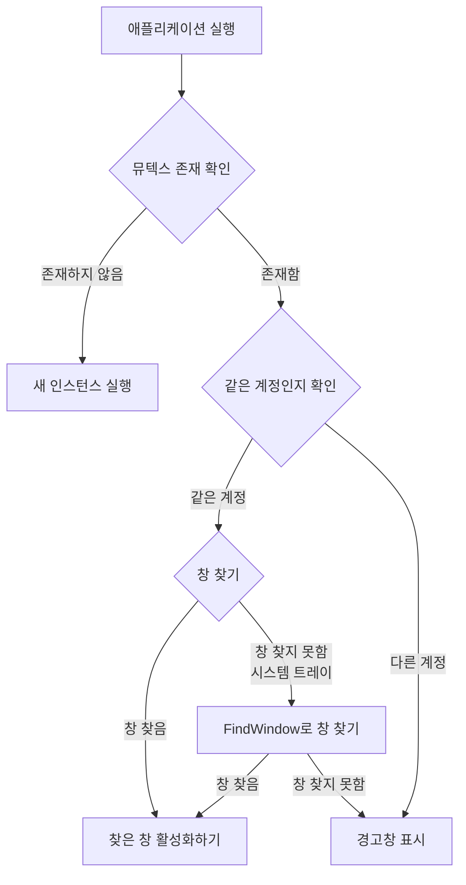

## Senario

```mermaid
flowchart TD
    A[애플리케이션 실행] --> B{뮤텍스 존재 확인}
    B -->|존재하지 않음| C[새 인스턴스 실행]
    B -->|존재함| D{같은 계정인지 확인}
    D -->|같은 계정| E{창 찾기}
    E -->|창 찾음| F[찾은 창 활성화하기]
    E -->|창 찾지 못함\n시스템 트레이| G[FindWindow로 창 찾기]
    G -->|창 찾음| F
    G -->|창 찾지 못함| I[경고창 표시]
    D -->|다른 계정| I
```
